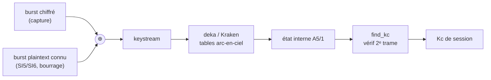
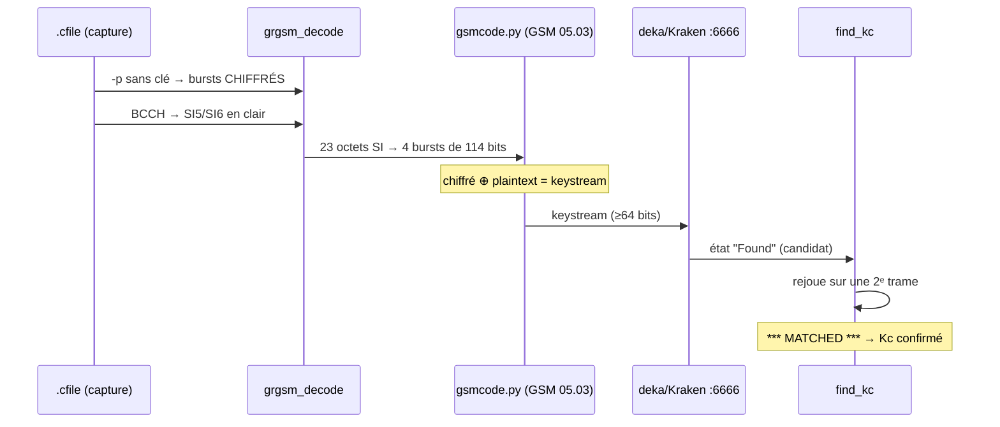

# Casser A5/1 — de la capture au Kc

> Récupérer le **Kc** de session d'une communication GSM chiffrée, à partir d'une
> simple capture `.cfile`, par **attaque à plaintext connu** + **tables arc-en-ciel**
> A5/1 (Kraken / deka).
> Outils : [github.com/bbaranoff/a51_tools](https://github.com/bbaranoff/a51_tools)

```danger

**Cadre légal.** A5/1 est le chiffrement de l'interface air 2G, cassé
publiquement depuis 2009. Ce module est à visée **pédagogique** et pour
**recherche / pentest autorisé / démonstration légale uniquement**. Intercepter
des communications d'autrui sans autorisation est illégal.

```

## Le principe

A5/1 est un **chiffrement par flot** : `chiffré = plaintext ⊕ keystream`, où le
keystream ne dépend que de `(Kc, numéro de trame)`. L'attaquant **ne calcule jamais
A5/1** — il lui suffit d'un segment de **keystream** (≥ 64 bits sans erreur), que
Kraken/deka retournent vers l'**état interne**, donc le **Kc**.

Or on obtient du keystream **sans la clé**, par XOR avec du **plaintext connu** :



**D'où vient le plaintext connu ?** De trames descendantes **prévisibles**,
lisibles **sans la clé** :

- le **bourrage LAPDm** (`0x2b`), omniprésent dès qu'il n'y a rien à transmettre ;
- **SI5 / SI6** sur la SACCH — contenu **fixe**, dont le LAI/cell est identique à
  celui diffusé en clair sur le **BCCH** (jamais chiffré).

---

## La chaîne complète



### 1. Extraire les bursts chiffrés (sans clé)

```bash
grgsm_decode -m TCHF -t 2 -a 514 -s 1083333 \
  -c slice_dl.cfile -p -o speech.gsm > my.bursts
```

`-p` imprime les bursts (`FN count: 114 bits`) ; **pas** de `-e/-k`, donc les bursts
restent chiffrés.

### 2. Retrouver le plaintext connu

Décoder le **BCCH** (jamais chiffré) livre SI5/SI6 et le bourrage. Une trame SACCH
fait 23 octets, ex. SI6 :

```
07 00 03 03 2d 06 1e 17 71 00 f1 10 00 01 27 ff 2b 2b 2b 2b 2b 2b 2b
```

### 3. Ré-encoder le plaintext en bursts (GSM 05.03)

`gsmcode.py` reproduit la chaîne **Fire (224,184) + tail + convolutif ½ (K=5) +
entrelacement 4 bursts**, validée au bit près (`msb_first=False, invert=True`).

### 4. XOR → keystream, puis 5. cracker sur deka

```bash
telnet 0 6666
crack 0011101000000011000100010101100011101000001011001111101100001000...
# -> Found 6FDDE217FE88D7A2 @ 2 #N (table:124)
```

### 6. Confirmer le Kc avec `find_kc`

```bash
DEC=$(python3 -c "print(int('6FDDE217FE88D7A2',16))")
/mnt/kraken/Utilities/find_kc ${DEC}x 2 <framecount1> <framecount2> <keystream2>
# KC(1): 9c d6 ed 7c ff d3 d0 00  *** MATCHED ***
```

```warning

**Une "Found" de deka n'est pas une preuve.** Seul `find_kc` avec une **2ᵉ trame**
confirme le Kc. Probabilité de hit ~22–24 % par table : il faut **cracker plusieurs
blocs**. Et tout burst bruité par la radio donne un keystream faux, donc aucun hit.

```

---

## Tout en un : `crack_all.py`

```bash
# deka doit tourner (paplon.py + oclvankus.py + delta_client.py, port 6666)
python3 crack_all.py slice_dl.cfile
```

Le script fait **tout depuis le `.cfile`** : auto-détection du sample-rate,
extraction des bursts chiffrés, dérivation du plaintext (SI en clair, TA=0),
groupement en blocs de 4 trames, soumission en masse à deka, puis croisement
`find_kc`.

### Un crack réel (rapport `crack_all.py`)

| Paramètre | Valeur |
|---|---|
| Source | `slice_dl_20260821180631.cfile` |
| ARFCN / sample-rate | 514 / 1 083 333 Hz |
| Mode / TS | SDCCH8 / 1 |
| Blocs crackés / keystreams | 24 / 53 |
| État crackeur | `12434AE706D27553` (bitpos 25, count 93190) |
| **✅ Kc trouvé** | **`9E B9 0C 45 8B D8 E0 00`** |

Le Kc en main, tout le trafic chiffré de la session se déchiffre — et la **signature
COMP128v1** se lit dans les derniers octets nuls du Kc (voir
[module 9, étape 7](9-GSM-etape-par-etape.md)).

---

## Scripts du dépôt

| fichier | rôle |
|---|---|
| `ciphereds.py` | charge `my.bursts` → bursts chiffrés, regroupés en blocs de 4 |
| `plaintexts.py` | catalogue de plaintext connu (fill / SI5 / SI6) ré-encodé |
| `gsmcode.py` | codeur GSM 05.03 (validé au bit près vs `GSMFrameCoder`) |
| `crack.py` | attaque un bloc précis : XOR → deka → find_kc |
| `crack_all.py` | de bout en bout depuis le `.cfile`, crack en masse + croisement |

---

*Modules liés : [8 — Émulation du baseband Calypso](8-QEMU-Calypso.md) ·
[9 — GSM étape par étape](9-GSM-etape-par-etape.md).*

<details>
<summary>🥚 <em>Un œuf de Pâques, pour qui lit jusqu'ici…</em></summary>

<blockquote>
<p>La documentation et les sources de <a href="https://github.com/bbaranoff/qemu-calypso"><code>qemu-calypso</code></a> +
<a href="https://github.com/bbaranoff/osmo_egprs"><code>osmo_egprs</code></a> forment un corpus qui, un jour de comptage
oisif, a été pesé au <code>wc</code> :</p>

<table>
<thead><tr><th></th><th>Mots</th></tr></thead>
<tbody>
<tr><td>La Bible (King James Version)</td><td>783 137</td></tr>
<tr><td><strong>Corpus Calypso + osmo_egprs</strong></td><td><strong>862 028</strong></td></tr>
</tbody>
</table>

<p>Soit <strong>110 % de la Bible, +78 891 mots</strong> — à peu près un livre de
l'Ancien Testament d'avance, ~2 900 pages contre ~1 200. Un apocryphe entier,
écrit en désassemblage TMS320C54x. 📖📡</p>

<p><small>Astérisque d'honnêteté : c'est un décompte au <code>wc</code>, docs +
sources confondues. La révélation n'engage que le corrélateur de FCCH.</small></p>
</blockquote>

</details>
