# Cours GSM — l'attachement d'un mobile, étape par étape

> De la **synchro radio** au **premier appel voix**, chaque étape que franchit un
> téléphone GSM pour s'attacher à un réseau. Pour chacune : ce qui est
> **nécessaire**, puis **deux cadres** — la version **`shunt_legit`** (l'hôte
> démodule) et la version **DSP natif** (le vrai baseband Calypso), telles que
> [qemu-calypso](8-QEMU-Calypso.md) les mesure.

```tip

Ce cours suit la séquence réelle mesurée sur le banc `shunt_legit` du 2026-08-24 :
`synchro FB → synchro SB → sysinfo → camp → RACH → canal dédié → authentification
→ chiffrement A5/1 → Location Update → appel voix → SMS`. À droite de chaque
étape, l'état du **mode natif**, où le DSP fait lui-même le travail.

```

<div class="gsmviz">
<style>
.gsmviz{--gv-bg0:#0c0e1a;--gv-bg1:#151a34;--gv-panel:#181d38;--gv-panel2:#212748;--gv-ink:#eef1ff;--gv-mut:#9aa0c8;--gv-mut2:#6f76a6;--gv-line:rgba(255,255,255,.09);--gv-cyan:#33e1d0;--gv-violet:#8b7cff;--gv-pink:#ff5d84;--gv-amber:#f5b74a;--gv-green:#5ce6a1;--gv-mono:ui-monospace,"JetBrains Mono",Menlo,Consolas,monospace;
  margin:26px 0 32px;padding:clamp(18px,2.6vw,30px);border-radius:20px;color:var(--gv-ink);
  background:radial-gradient(900px 480px at 88% -20%,rgba(139,124,255,.18),transparent 60%),radial-gradient(760px 420px at 4% 120%,rgba(51,225,208,.14),transparent 60%),linear-gradient(160deg,var(--gv-bg0),var(--gv-bg1));
  border:1px solid var(--gv-line);box-shadow:0 30px 90px -44px rgba(0,0,0,.75),inset 0 1px 0 rgba(255,255,255,.05);position:relative;overflow:hidden}
.gsmviz::before{content:"";position:absolute;inset:0;pointer-events:none;opacity:.45;background-image:linear-gradient(var(--gv-line) 1px,transparent 1px),linear-gradient(90deg,var(--gv-line) 1px,transparent 1px);background-size:38px 38px;mask:radial-gradient(120% 120% at 50% 0,#000 28%,transparent 76%)}
.gsmviz *{box-sizing:border-box}
.gsmviz .gv-head{display:flex;align-items:center;gap:12px;position:relative;margin-bottom:6px}
.gsmviz .gv-dot{width:11px;height:11px;border-radius:50%;background:var(--gv-cyan);box-shadow:0 0 18px var(--gv-cyan)}
.gsmviz .gv-eyebrow{font:600 10px/1 var(--gv-mono);letter-spacing:.3em;text-transform:uppercase;color:var(--gv-mut)}
.gsmviz .gv-title{font:800 clamp(20px,3.4vw,30px)/1.05 -apple-system,BlinkMacSystemFont,"Segoe UI",Roboto,sans-serif;letter-spacing:-.02em;margin:6px 0 2px;position:relative}
.gsmviz .gv-title b{background:linear-gradient(92deg,var(--gv-cyan),var(--gv-violet) 60%,var(--gv-pink));-webkit-background-clip:text;background-clip:text;color:transparent}
.gsmviz .gv-sub{color:var(--gv-mut);font:500 13px/1.5 -apple-system,sans-serif;max-width:70ch;position:relative}
.gsmviz .gv-bread{display:flex;flex-wrap:wrap;gap:7px;align-items:center;margin:20px 0 6px;position:relative}
.gsmviz .gv-pill{font:600 10px/1 var(--gv-mono);letter-spacing:.05em;color:var(--gv-mut);border:1px solid var(--gv-line);background:rgba(255,255,255,.02);border-radius:8px;padding:8px 11px;white-space:nowrap}
.gsmviz .gv-pill b{color:var(--gv-ink)}
.gsmviz .gv-pill.on{color:var(--gv-cyan);border-color:rgba(51,225,208,.4)}
.gsmviz .gv-arr{color:var(--gv-mut2);font:700 12px/1 var(--gv-mono)}
.gsmviz .gv-sec{margin-top:22px;position:relative}
.gsmviz .gv-lab{font:600 10px/1 var(--gv-mono);letter-spacing:.22em;text-transform:uppercase;color:var(--gv-mut);margin-bottom:11px}
.gsmviz .gv-frame{display:grid;grid-template-columns:repeat(8,1fr);gap:6px}
.gsmviz .gv-ts{border-radius:9px;padding:12px 6px 10px;text-align:center;background:linear-gradient(180deg,var(--gv-panel2),var(--gv-panel));border:1px solid var(--gv-line);transition:transform .18s}
.gsmviz .gv-ts:hover{transform:translateY(-3px)}
.gsmviz .gv-ts .n{font:700 12px/1 var(--gv-mono);color:var(--gv-mut)}
.gsmviz .gv-ts .t{font:600 8px/1.3 var(--gv-mono);color:var(--gv-mut2);margin-top:6px;letter-spacing:.04em}
.gsmviz .gv-ts.act{background:linear-gradient(180deg,rgba(139,124,255,.34),rgba(51,225,208,.10));border-color:rgba(139,124,255,.55)}
.gsmviz .gv-ts.act .n{color:var(--gv-ink)}.gsmviz .gv-ts.act .t{color:var(--gv-cyan)}
.gsmviz .gv-axis{display:flex;justify-content:space-between;color:var(--gv-mut2);font:500 10px/1 var(--gv-mono);margin-top:9px}
.gsmviz .gv-burst{display:flex;height:54px;border-radius:9px;overflow:hidden;border:1px solid var(--gv-line)}
.gsmviz .gv-seg{display:flex;flex-direction:column;align-items:center;justify-content:center;gap:2px;font:700 10px/1 var(--gv-mono);color:#0c0e1a;min-width:0;padding:2px;text-align:center}
.gsmviz .gv-seg small{font:600 8px/1 var(--gv-mono);opacity:.72}
.gsmviz .gv-seg.tail{background:#3a4170;color:var(--gv-mut)}
.gsmviz .gv-seg.data{background:linear-gradient(180deg,var(--gv-cyan),#1fb9ab)}
.gsmviz .gv-seg.steal{background:var(--gv-pink)}
.gsmviz .gv-seg.train{background:linear-gradient(180deg,var(--gv-violet),#6a5bff);color:#fff}
.gsmviz .gv-seg.guard{background:repeating-linear-gradient(45deg,#2a2f52,#2a2f52 6px,#232848 6px,#232848 12px);color:var(--gv-mut)}
.gsmviz .gv-cap{color:var(--gv-mut2);font:500 11px/1.5 var(--gv-mono);margin-top:10px}
.gsmviz .gv-cap b{color:var(--gv-pink)}
@media(max-width:620px){.gsmviz .gv-frame{grid-template-columns:repeat(4,1fr)}.gsmviz .gv-ts .t{display:none}.gsmviz .gv-seg small{display:none}.gsmviz .gv-seg{font-size:8px}}
</style>
<div class="gv-head"><span class="gv-dot"></span><span class="gv-eyebrow">Interface Um · couche physique</span></div>
<div class="gv-title">GSM <b>Timeslots &amp; Bursts</b></div>
<div class="gv-sub">Le temps est découpé en trames TDMA de 8 slots ; chaque slot porte un burst de 156,25 bits. C'est le terrain de jeu partagé par l'ARM et le DSP du baseband Calypso.</div>

<div class="gv-bread">
  <span class="gv-pill">Hyperframe <b>2 715 648</b></span><span class="gv-arr">›</span>
  <span class="gv-pill">Superframe <b>1326</b></span><span class="gv-arr">›</span>
  <span class="gv-pill">Multitrame <b>51 / 26</b></span><span class="gv-arr">›</span>
  <span class="gv-pill on">Trame TDMA <b>8 slots</b></span><span class="gv-arr">›</span>
  <span class="gv-pill">Timeslot <b>577 µs</b></span><span class="gv-arr">›</span>
  <span class="gv-pill">Burst <b>156,25 bits</b></span>
</div>

<div class="gv-sec">
  <div class="gv-lab">Trame TDMA · 8 timeslots · 4,615 ms</div>
  <div class="gv-frame">
    <div class="gv-ts act"><div class="n">TS0</div><div class="t">FCCH·SCH·BCCH</div></div>
    <div class="gv-ts"><div class="n">TS1</div><div class="t">SDCCH</div></div>
    <div class="gv-ts"><div class="n">TS2</div><div class="t">TCH/F</div></div>
    <div class="gv-ts"><div class="n">TS3</div><div class="t">TCH/F</div></div>
    <div class="gv-ts"><div class="n">TS4</div><div class="t">TCH/F</div></div>
    <div class="gv-ts"><div class="n">TS5</div><div class="t">TCH/F</div></div>
    <div class="gv-ts"><div class="n">TS6</div><div class="t">TCH/F</div></div>
    <div class="gv-ts"><div class="n">TS7</div><div class="t">PDCH</div></div>
  </div>
  <div class="gv-axis"><span>0 µs</span><span>1 burst = 577 µs</span><span>4615 µs</span></div>
</div>

<div class="gv-sec">
  <div class="gv-lab">Normal Burst · 156,25 bits</div>
  <div class="gv-burst">
    <div class="gv-seg tail" style="flex:3">3<small>tail</small></div>
    <div class="gv-seg data" style="flex:57">57<small>data</small></div>
    <div class="gv-seg steal" style="flex:1"></div>
    <div class="gv-seg train" style="flex:26">26<small>training</small></div>
    <div class="gv-seg steal" style="flex:1"></div>
    <div class="gv-seg data" style="flex:57">57<small>data</small></div>
    <div class="gv-seg tail" style="flex:3">3<small>tail</small></div>
    <div class="gv-seg guard" style="flex:8.25">8.25<small>guard</small></div>
  </div>
  <div class="gv-cap">tail 3 · data 57 · <b>stealing 1</b> · midamble 26 · <b>stealing 1</b> · data 57 · tail 3 · guard 8,25 — le <b>FCCH</b> (étape 1) est un burst de zéros ; le <b>SCH</b> (étape 2) porte le BSIC dans son midamble.</div>
</div>
</div>

## La chaîne complète, d'un coup d'œil

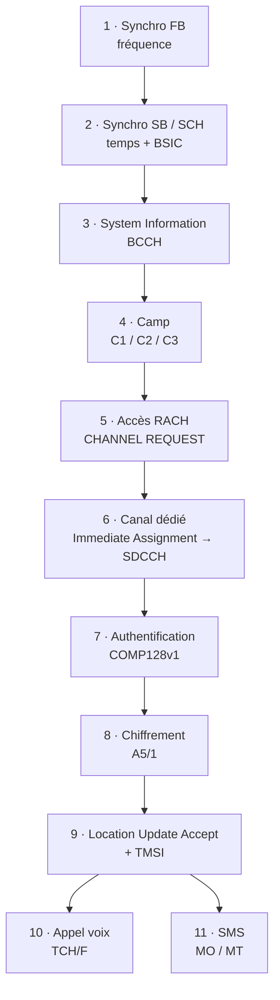

### État par étape — shunt vs natif

| # | Étape | `shunt_legit` | DSP natif |
|---|-------|:---:|:---:|
| 1 | Synchro FB | ✅ | ✅ *(résolu 2026-08-24)* |
| 2 | Synchro SB / SCH | ✅ | 🔧 *mur actuel* |
| 3 | System Information | ✅ | ⬜ |
| 4 | Camp (C3) | ✅ | ⬜ |
| 5 | Accès RACH | ✅ | ⬜ |
| 6 | Canal dédié (SDCCH) | ✅ | ⬜ |
| 7 | Authentification | ✅ | ⬜ |
| 8 | Chiffrement A5/1 | ✅ | ⬜ |
| 9 | Location Update Accept | ✅ | ⬜ |
| 10 | Appel voix TCH/F | ✅ | ⬜ |
| 11 | SMS MO / MT | ✅ | ⬜ |

✅ mesuré · 🔧 en cours · ⬜ bloqué en aval du mur SCH (natif)

---

## Rappels de couche physique GSM

Avant la première étape, le socle. Le GSM 900/1800 découpe le temps en **trames
TDMA** de 8 slots, et empile ces trames en multitrames.

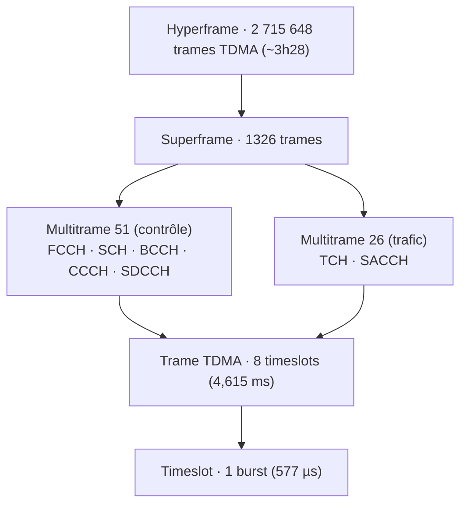

Chaque **timeslot** transporte un *burst* de 156,25 bits. Les canaux logiques
sont multiplexés sur ces slots :

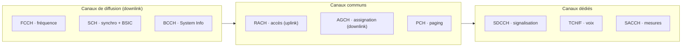

Dans le baseband Calypso, cette couche 1 est justement ce que se partagent l'**ARM**
(ordonnancement, protocole) et le **DSP** (démodulation, corrélation) :

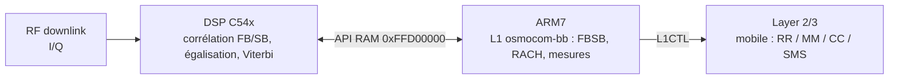

---

## Étape 1 — Synchro FB (Frequency Burst)

**Ce qui est nécessaire.** Le mobile ne connaît a priori ni la fréquence exacte de
la cellule ni sa base de temps. Le **FCCH** émet un *Frequency Burst* : un burst
de tout-zéros qui, après modulation GMSK, produit une **sinusoïde pure** à
`+67,7 kHz` de la porteuse. Le détecter cale l'**AFC** (correction de fréquence) et
donne un premier point d'ancrage temporel.

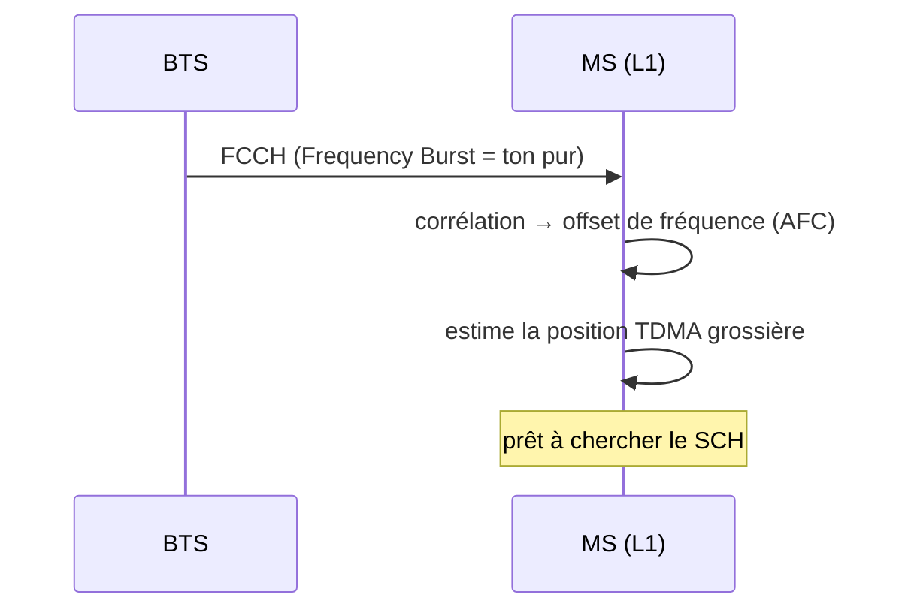

```note

**Cadre 1 — `shunt_legit` (l'hôte démodule).** ✅ Le FB est produit côté hôte et
présenté à l'ARM par intercept de lecture. Le corrélateur `corr_iq.py` doit
répondre `FCCH @1SPS PROPRE` (`dphi = +1,00 × π/2`). Compté **11** fois sur le run
de référence. Le firmware ARM tourne pour de vrai — mais le DSP est court-circuité.

```

```warning

**Cadre 2 — DSP natif.** ✅ **Résolu le 2026-08-24.** C'est désormais le **vrai DSP
mask-ROM** qui acquiert le FB : `FBDET-WR 0x0000 -> 0x0001` mesuré **437 fois**,
toutes écrites par la ROM à `PC=0x79e4`, **sans aucune injection**. L'ARM reçoit
des `FB1 (…): TOA=39, Power=-52dBm, Angle=-1Hz` réels et variables, calcule son
`fn_offset` et appelle `Synchronize_TDMA`.

```

---

## Étape 2 — Synchro SB / SCH (Synchronization Burst)

**Ce qui est nécessaire.** Une fois la fréquence calée, le **SCH** livre la synchro
**fine** : le numéro de trame (FN) réduit et le **BSIC** (Base Station Identity
Code). Sans SCH décodé, impossible de savoir *quand* on est dans l'hyperframe, donc
impossible de lire le BCCH.

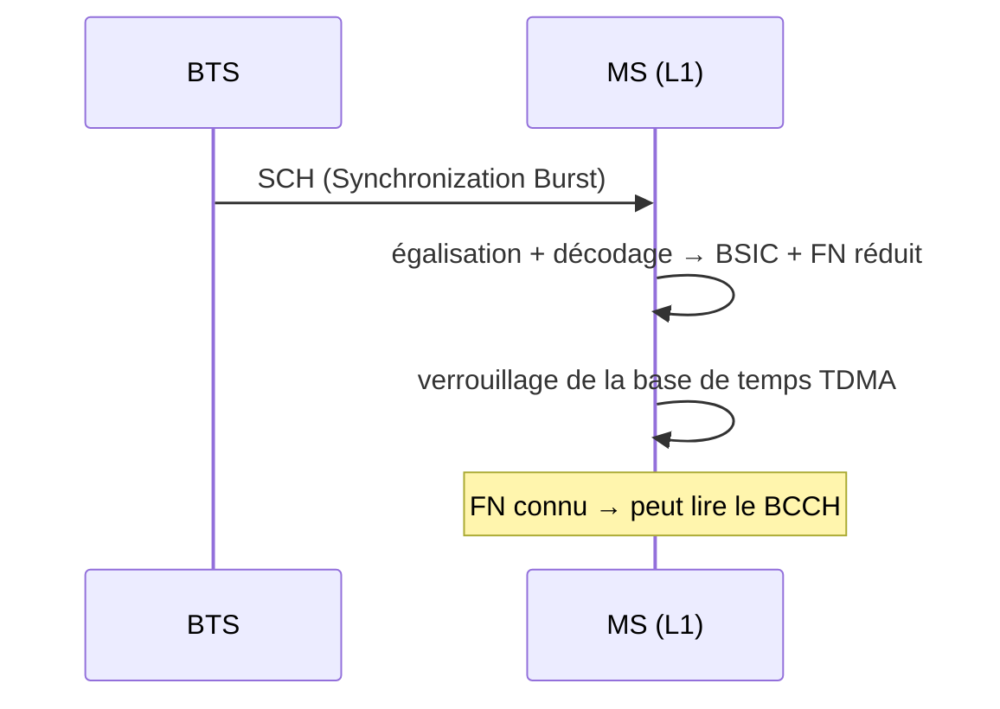

```note

**Cadre 1 — `shunt_legit`.** ✅ Le SB est décodé par gr-gsm côté hôte. Mesuré
**22** fois : `=> SB 0x0125011c: BSIC=7 fn=3805`. La base de temps est verrouillée,
la lecture du BCCH peut commencer.

```

```danger

**Cadre 2 — DSP natif.** 🔧 **C'est le mur actuel.** La tâche SB s'exécute, mesure
un TOA plausible, écrit ses slots — mais `a_sch[0] = 0x8100`
(`B_BLUD | B_SCH_CRC`), donc `prim_fbsb.c:181` abandonne, et surtout `a_sch[3]`
sort **`0xf8d8`, constant sur 21/21 écritures** alors que 10 contenus de burst
distincts lui ont été présentés. *Un décodeur dont la sortie ne dépend pas de
l'entrée ne décode pas.* Hypothèse principale : on alimente la **sortie** du
démodulateur (`data[0x2a00]`) au lieu de son **entrée**. Tant que cette étape n'est
pas franchie, tout ce qui suit reste ⬜ en natif.

```

---

## Étape 3 — System Information (BCCH)

**Ce qui est nécessaire.** Le **BCCH** diffuse en clair les *System Information*
(SI 1 à 4 notamment) : identité de cellule (LAI = MCC/MNC/LAC + CI), paramètres de
sélection (seuils C1/C2), organisation des canaux communs, voisines. Le mobile en a
besoin pour décider s'il peut camper.

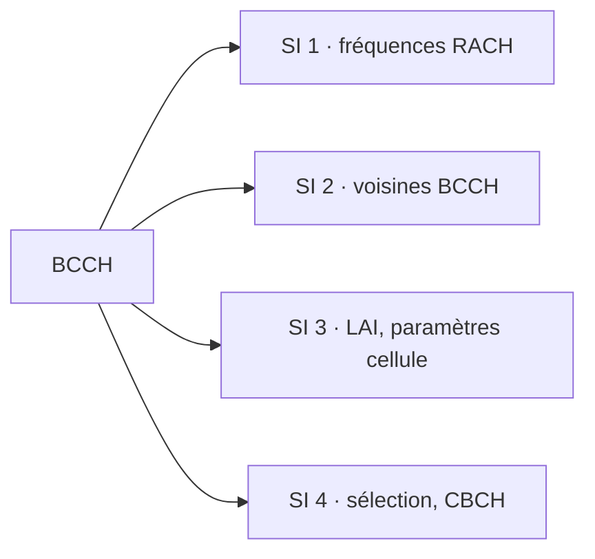

```note

**Cadre 1 — `shunt_legit`.** ✅ **16** System Information lues, dont
`New SYSTEM INFORMATION 4 (lai=001-01-1)`. Le mobile connaît la cellule.

```

```warning

**Cadre 2 — DSP natif.** ⬜ En attente : les SI transitent par le CCCH, dont le
décodage dépend de la synchro SCH (étape 2). Le test spécifique du natif est
`native_twl`, qui *donne* la synchro au DSP pour poser la seule question « le DSP
traite-t-il le SI ? » — critère : au moins une écriture `WATCH-ACD
DSP-opcode-write` de son propre opcode.

```

---

## Étape 4 — Camp (sélection de cellule C1 / C2 / C3)

**Ce qui est nécessaire.** Le mobile évalue la **qualité** de la cellule : `C1`
(critère de réception minimal, dérivé du RXLEV), `C2` (reselection) et vérifie
`C3`. Si le compte est bon, il **campe** — état `C3 camped normally` — et devient
joignable.

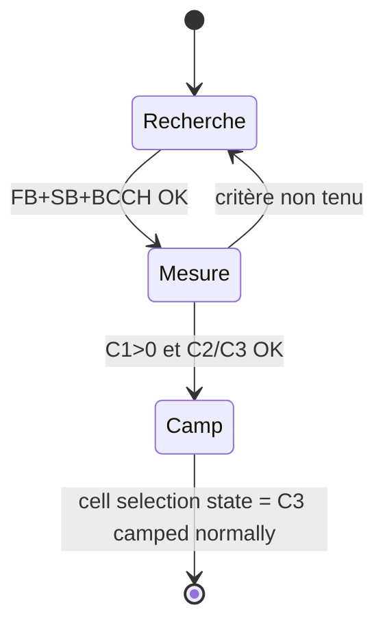

```note

**Cadre 1 — `shunt_legit`.** ✅ **15** — `Going to camping (normal) ARFCN
514(DCS)`, puis `cell selection state: C3 camped normally`. Le **RXLEV serving** est
mesuré (`RLA_C -53 dBm`, C1/C2 > 0).

```

```warning

**Cadre 2 — DSP natif.** ⬜ Le **RXLEV serving est déjà ✅ en natif**, mais le camp
(C3) reste bloqué tant que le SCH n'est pas décodé (étape 2). La brique manque en
amont, pas ici.

```

---

## Étape 5 — Accès RACH (CHANNEL REQUEST)

**Ce qui est nécessaire.** Pour parler au réseau, le mobile émet un burst d'accès
sur le **RACH** (uplink) : un `CHANNEL REQUEST` court, avec une cause
d'établissement (ici *Location Update*) et une référence aléatoire. Il applique le
**slotted-ALOHA** — retransmission après un délai aléatoire en cas de collision.

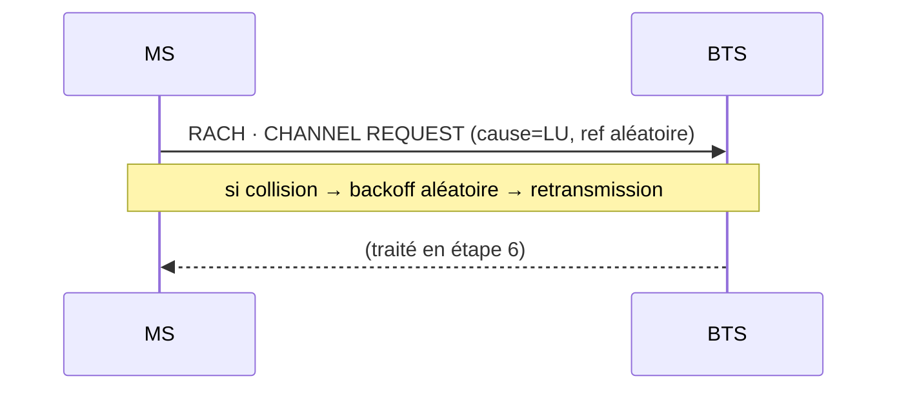

```note

**Cadre 1 — `shunt_legit`.** ✅ **3** — `CHANNEL REQUEST: 00 (Location Update with
NECI)`. L'uplink du mobile émulé atteint la BTS.

```

```warning

**Cadre 2 — DSP natif.** ⬜ En aval du mur SCH.

```

---

## Étape 6 — Canal dédié (Immediate Assignment → SDCCH)

**Ce qui est nécessaire.** La BTS répond sur l'**AGCH** par un `IMMEDIATE
ASSIGNMENT` qui déplace le mobile de l'accès commun vers un **SDCCH** — un canal
dédié où va se dérouler toute la signalisation (auth, chiffrement, LU).

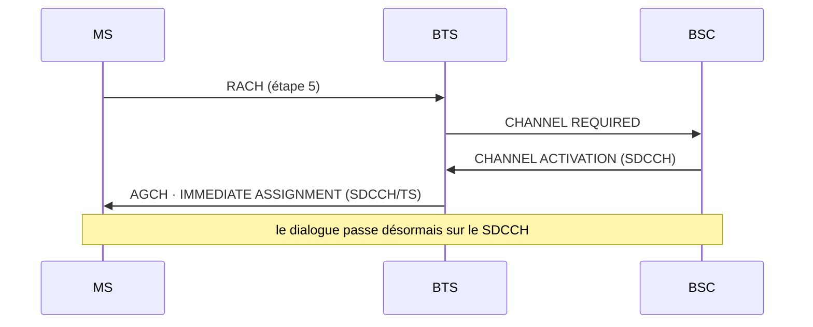

```note

**Cadre 1 — `shunt_legit`.** ✅ **7** établissements de canal dédié. Le SDCCH est
monté, la signalisation de couche 3 peut commencer.

```

```warning

**Cadre 2 — DSP natif.** ⬜ En aval du mur SCH.

```

---

## Étape 7 — Authentification (COMP128v1)

**Ce qui est nécessaire.** Le réseau défie le mobile : il envoie un `AUTHENTICATION
REQUEST` avec un **RAND** de 128 bits. La SIM calcule `A3/A8(RAND, Ki)` — ici
**COMP128v1** — et renvoie **SRES** (32 bits) dans `AUTHENTICATION RESPONSE`, tout
en dérivant la clé de session **Kc** (64 bits) utilisée ensuite pour le
chiffrement.

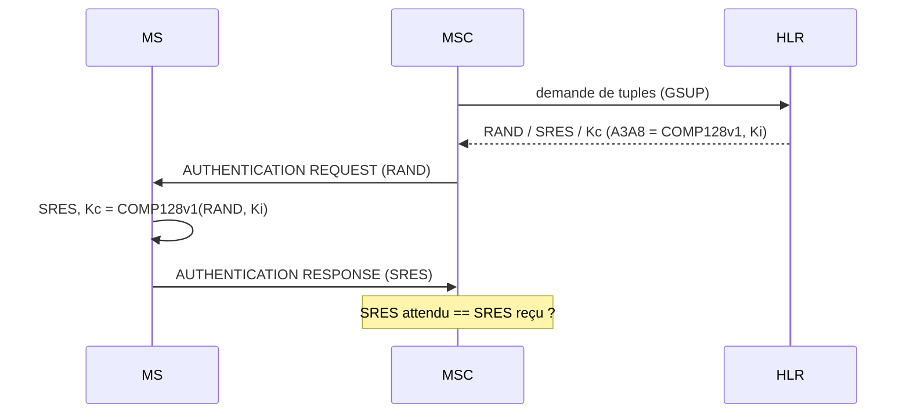

```note

**Cadre 1 — `shunt_legit`.** ✅ **3** cycles `AUTHENTICATION REQUEST/RESPONSE`,
`gsup:rx:auth_tuples = 10`, `algo 2G = COMP128v1`,
`Ki = 00112233445566778899aabbccdd0101`. La **signature COMP128v1 est lisible dans
le Kc** : `f7 3a 48 77 98 59 5c 00` — l'octet final nul et les deux bits de poids
faible du précédent à zéro trahissent les **54 bits utiles sur 64** (faiblesse
connue de COMP128v1).

```

```warning

**Cadre 2 — DSP natif.** ⬜ En aval du mur SCH.

```

---

## Étape 8 — Chiffrement A5/1

**Ce qui est nécessaire.** Muni de **Kc**, le réseau ordonne le chiffrement de la
voie radio : `CIPHERING MODE COMMAND (algo=A5/1)`. Le mobile bascule sa couche 1 en
A5/1 et confirme par `CIPHERING MODE COMPLETE`. À partir de là, l'air est chiffré.

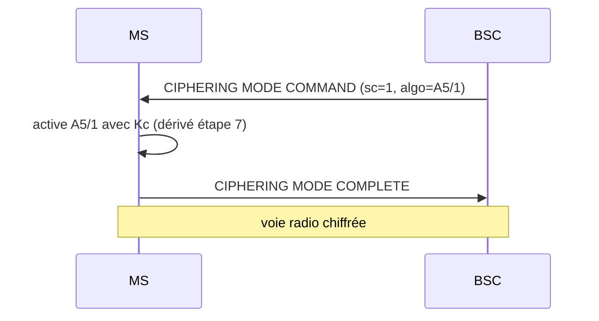

```note

**Cadre 1 — `shunt_legit`.** ✅ **7 × `CIPHERING MODE COMMAND (sc=1, algo=A5/1
cr=1)`** + 7 × `COMPLETE`. Côté BSC : `encryption a5 1`. Le chiffrement est bien
actif sur l'interface air.

```

```warning

**Cadre 2 — DSP natif.** ⬜ En aval du mur SCH.

```

---

## Étape 9 — Location Update Accept (+ TMSI)

**Ce qui est nécessaire.** Signalisation authentifiée et chiffrée, le réseau
accepte l'enregistrement : `LOCATION UPDATING ACCEPT`, met à jour le VLR/HLR et
réalloue un **TMSI** (identité temporaire) pour ne plus exposer l'IMSI en clair.

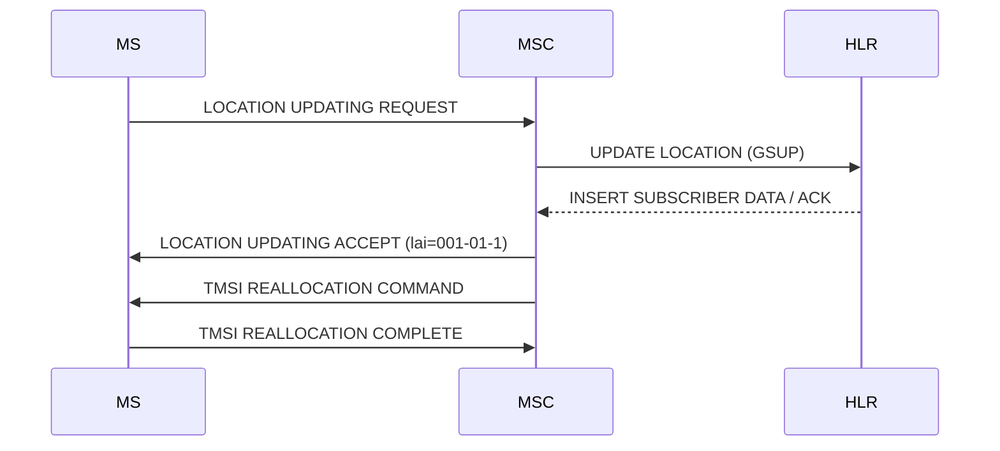

```note

**Cadre 1 — `shunt_legit`.** ✅ **1** — `LOCATION UPDATING ACCEPT (lai=001-01-1)`,
TMSI réalloué (ex. `0719E3FE`). Le mobile est **enregistré** et joignable.

```

```warning

**Cadre 2 — DSP natif.** ⬜ En aval du mur SCH. C'est l'étape charnière : en natif,
c'est elle qui **expire** (`T3211`) quand on lance par la mauvaise porte, faute de
la chaîne complète.

```

---

## Étape 10 — Appel voix (TCH/F)

**Ce qui est nécessaire.** Pour la voix, le réseau bascule le mobile sur un
**TCH/F** (Traffic Channel Full-rate). La signalisation d'appel **CC** (Call
Control) déroule `SETUP → CALL PROCEEDING → ALERTING → CONNECT`, puis le codec
plein débit (**FR**) transporte l'audio via RTP/MGW.

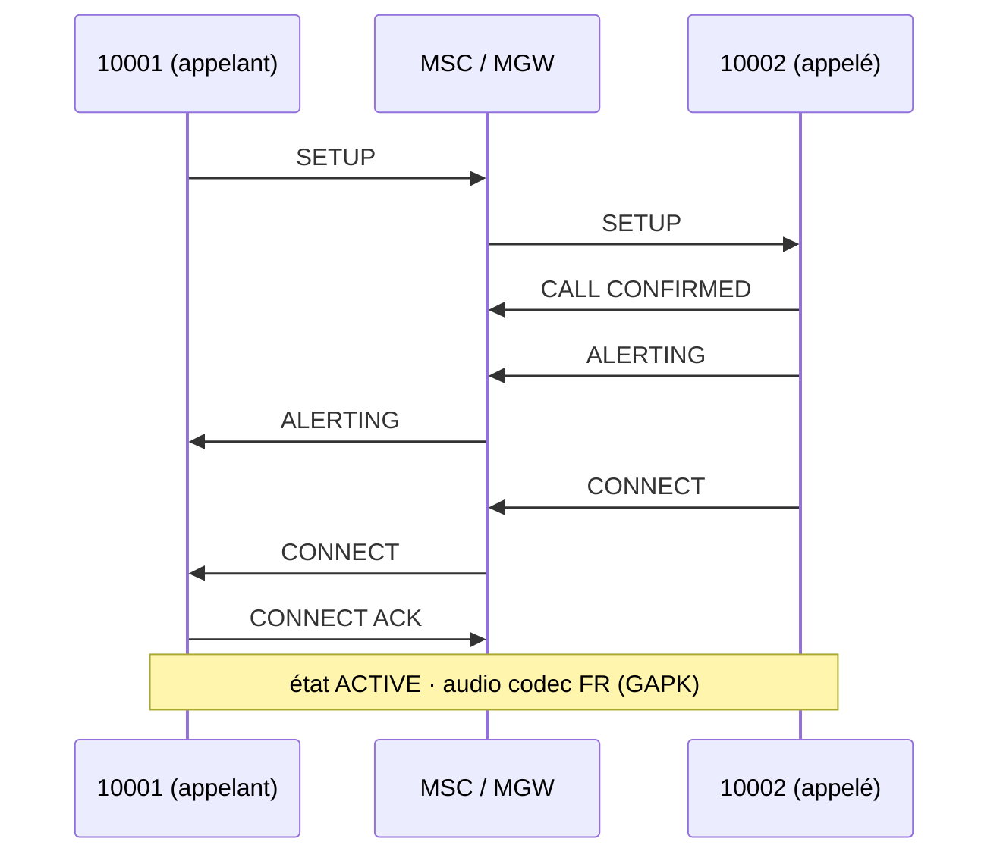

```note

**Cadre 1 — `shunt_legit`.** ✅ Appel **10001 ↔ 10002** abouti — les machines à
états CC des deux côtés atteignent `ACTIVE`, audio **GAPK codec `fr`** dans les
deux sens. Les deux abonnés sont sur **deux cellules distinctes** (un QEMU Calypso,
un faketrx) : c'est un vrai appel inter-cellules.

```

```warning

**Cadre 2 — DSP natif.** ⬜ En aval du mur SCH.

```

---

## Étape 11 — SMS (MO / MT)

**Ce qui est nécessaire.** Le SMS voyage sur la signalisation (SDCCH/SACCH), pas sur
un canal voix. **MO** (Mobile Originated) : le mobile émet un `SMS-SUBMIT` remonté
au SMSC ; **MT** (Mobile Terminated) : le SMSC pousse un `SMS-DELIVER` vers le
mobile. Chaque sens est acquitté (`CP-ACK`, `RP-ACK`).

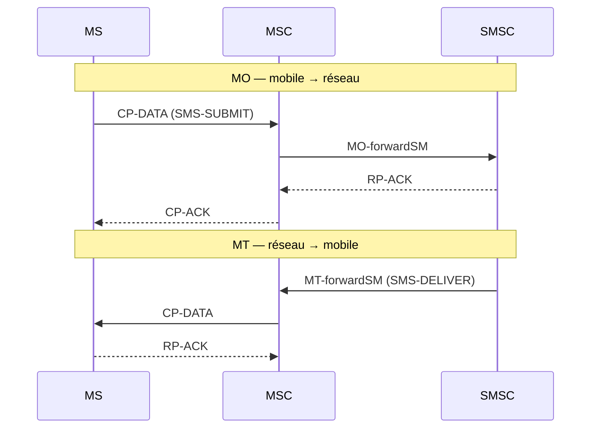

```note

**Cadre 1 — `shunt_legit`.** ✅ Les **deux sens, 0 erreur**. La boîte de réception
du mobile (`~/.osmocom/bb/sms.txt`) contient bien les messages MO et MT.

```

```warning

**Cadre 2 — DSP natif.** ⬜ En aval du mur SCH.

```

---

## Synthèse

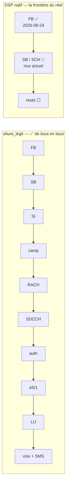

Le mode `shunt_legit` **prouve la pile complète** (le firmware ARM tourne
réellement), mais gr-gsm démodule : il ne dit rien du DSP. Le mode `native`
**dit la vérité sur l'acquisition** — et il vient de franchir le **FB**. La
prochaine victoire, c'est le **SCH**.

---

*Modules liés : [7 — Lab GSM multi-opérateur](7-Lab-GSM-multiPLMN.md) ·
[8 — Émulation du baseband Calypso](8-QEMU-Calypso.md).*
