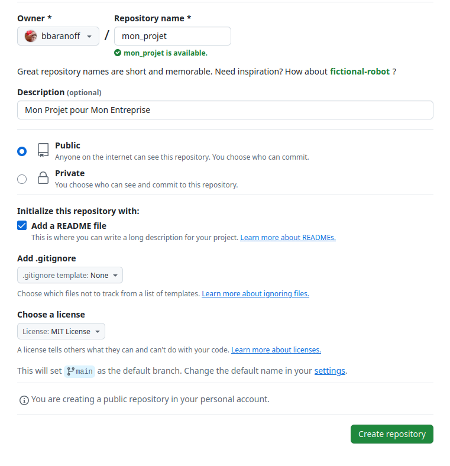
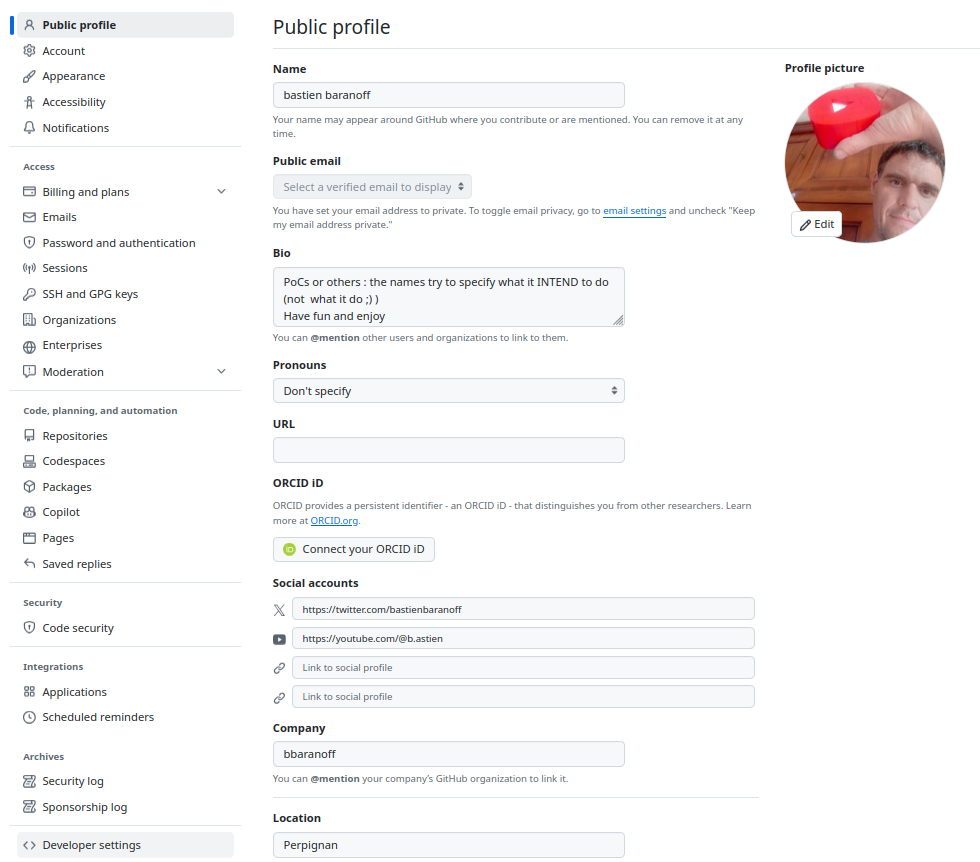
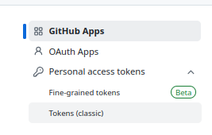
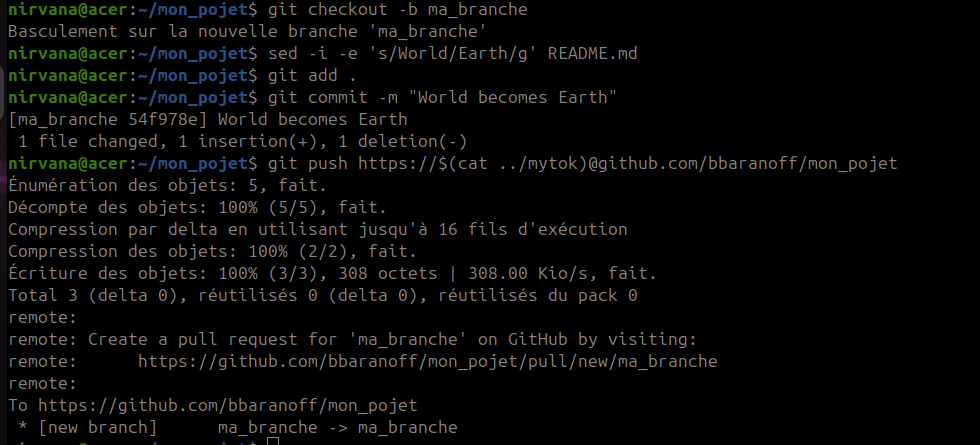
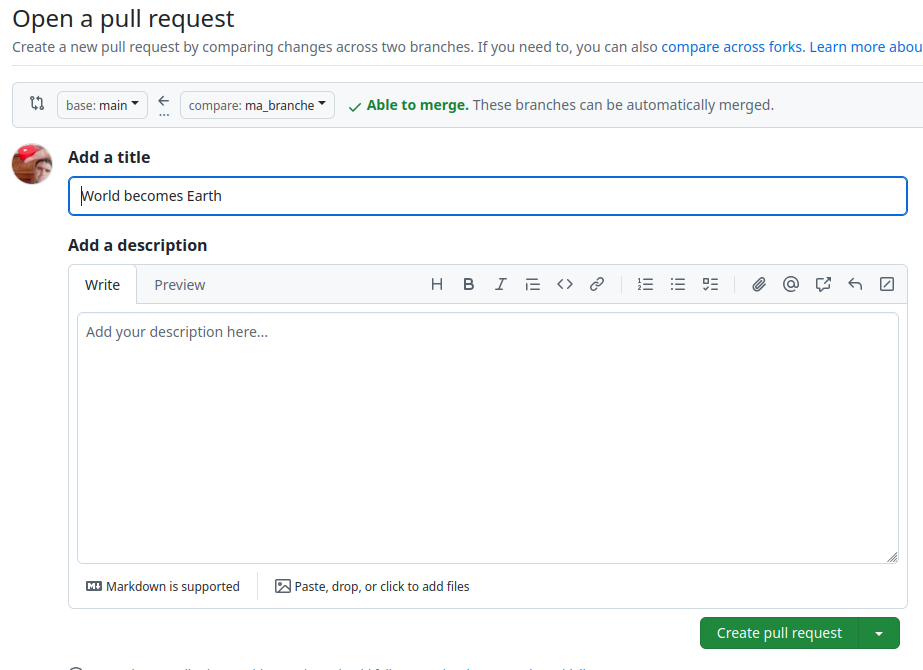

# TP Git

Vous avez un projet de développement logiciel avec votre entreprise :
Pour ce faire vous devez créer un compte github à votre nom avant de passer
en production.  

Inscription à un nouveau compte personnel

    Accédez à https://github.com/.
    Cliquez sur S’inscrire.
    Suivez les invites pour créer votre compte personnel.

Lors de l’inscription, vous êtes invité à vérifier votre adresse e-mail. Sans adresse e-mail vérifiée, vous ne pourrez pas effectuer certaines tâches de base GitHub, telles que la création d’un référentiel.

Si vous rencontrez des problèmes lors de la vérification de votre adresse e-mail, vous pouvez effectuer des étapes de dépannage. Pour plus d’informations, consultez « Vérification de votre adresse e-mail ».

Ensuite vous devez créer un dépot (repository) sur ce même compte que vous nommerez mon_projet  
 
- Appuyer sur New sur github et nommez le repository mon_projet vous y ajouterez la License MIT


---


---


Clonez ensuite le dépot (vide) localement sur votre machine.  

- ```git clone https://github.com/mon_user/mon_projet```  

Ajoutez un README.md qui décrira comment utiliser votre dépot Ajoutez un titre de niveau 1 : "Mon Projet" au README.md  

```
cd mon_projet
nano mon_projet
# Mon Projet  
```
---

Comment puis je récupérer mon token ?  

- Aller sur votre profil -> settings -> Developper Settings -> Personnal access tokens -> Token Classic  


---




---


---


---

Pourquoi puis-je cloner mon dépot sans l'utilisation du token et ne puis pas faire un push sans ?  

- Si le dépot est public il est accessible à tout le monde donc les utilisateurs n'ont pas à justifier de leur authentification.  

Pour un push même si le dépot est public on modifie le code du dépot donc seul les utilisateurs désignés doivent en avoir la possibilité  

Quelle sont les commande git qui permet une mise à jour du dépot via un push en ajoutant "Ajout de hello world au README" ?  

```bash
git add .
git commit -m "Ajout de hello world au README"
git push https://api_key@github.com/mon_user/mon_projet  
```

---

Maintenant si je rajoute Hello World directement sur le README.md sur github on reçoit l'erreur suivante lors d'un push en local :


puis-je pousser mes dépots locaux sur github.  

- cd mon_projet && git pull 

Mise à jour du dépot local pour intégrer les modifications distantes  

---


---

Ou on peut ignorer le commit distant pour l'écraser avec le commit local où la modification n'a pas eu lieu


Si on veut faire une branche ou à la place de Hello World on ait Hello Earth comment faire ?  

- git checkout -b ma_branche  
- sed -i -e 's/World/Earth/g' README.md  

---


---

On veut enfin que Hello Earth soit sur la branche main que faut t'il faire ?  

- git add .  
- git commit -m commit  
- git push https://api_key@github.com/mon_user/mon_projet  


remote: Create a pull request for 'ma_branche' on GitHub by visiting:  
remote:      https://github.com/bbaranoff/mon_projet/pull/new/ma_branche  

et enfin suivre les instructions sur github  
---  


---  


---  


---  


