# Introduction à l'UML
  
**Comprendre le langage de modélisation unifié**
  
## Introduction  
  
**Qu'est-ce que l'UML ?**  
  
L'UML, ou Unified Modeling Language, est un langage de modélisation graphique destiné à visualiser, spécifier, construire et documenter les artefacts d'un système. Il est largement utilisé dans le développement logiciel pour représenter la structure et le comportement d'un système de manière standardisée.

**Importance dans le développement logiciel**  
  
L'UML joue un rôle crucial dans le développement de logiciels modernes en facilitant la communication entre les différentes parties prenantes, telles que les développeurs, les analystes et les clients. En fournissant des représentations visuelles, il aide à la compréhension des systèmes complexes et permet de clarifier les exigences fonctionnelles et non fonctionnelles.

## Historique  

**Origines de l'UML**  
  
L'UML a été développé dans les années 1990 par trois pionniers de l'ingénierie logicielle : Grady Booch, Ivar Jacobson et James Rumbaugh. Ce langage est le fruit de la fusion de plusieurs méthodes de modélisation orientée objet existantes.

**Évolution et standardisation**  
  
Le premier standard UML 1.0 a été publié en 1997 par l'Object Management Group (OMG). Depuis lors, UML a évolué pour intégrer des améliorations, notamment avec l'introduction de UML 2.x, qui a élargi la notation et amélioré la sémantique, rendant le langage plus puissant et accessible.

## Objectifs de l'UML  
  
**Visualisation** 
  
L'un des principaux objectifs de l'UML est de permettre la création de représentations graphiques des systèmes. Ces visualisations rendent la structure et le comportement d'un système plus clairs et compréhensibles pour tous les intervenants.
  
**Spécification** 
  
UML fournit également un moyen précis de définir les composants d'un système et leurs interactions. Cela permet de s'assurer que toutes les parties prenantes ont une compréhension commune des exigences et des fonctionnalités.
  
**Documentation**  
  
Enfin, UML offre une documentation standardisée qui peut être utilisée tout au long du cycle de vie du développement. Cette documentation facilite la maintenance et l'évolution des systèmes logiciels.

## Types de diagrammes UML  

**Présentation des 14 types de diagrammes**  

  UML comprend 14 types de diagrammes, divisés en deux catégories principales :  
  
- **Diagrammes structurels** :  
  
  - Diagramme de classes  
  
  - Diagramme d'objets  
  
  - Diagramme de composants  
  
  - Diagramme de déploiement  

  - Diagramme de package
  
  - Diagramme de profil

- **Diagrammes comportementaux** :
  
  - Diagramme de cas d'utilisation
  
  - Diagramme de séquence
  
  - Diagramme de collaboration
  
  - Diagramme d'activités
  
  - Diagramme d'états
  
  - Diagramme de timing
  
  - Diagramme d'interaction

  - Diagramme d'interaction générale
  
  Ces diagrammes offrent différentes perspectives sur le système et sont utilisés en fonction des besoins spécifiques du projet.  

### Diagrammes structurels  
  
#### Description générale des diagrammes structurels  
  
Les diagrammes structurels jouent un rôle fondamental dans la modélisation d'un système en mettant l'accent sur sa structure statique. Contrairement aux diagrammes comportementaux qui se concentrent sur les interactions et les dynamiques, les diagrammes structurels se focalisent sur les composants et leurs relations à un moment donné.   
  
#### Principales caractéristiques des diagrammes structurels
  
1. **Représentation des composants :** Ils permettent de visualiser les différents composants d'un système, tels que les classes, les objets, les modules, et comment ils s'assemblent.  
   
2. **Relations :** Les diagrammes montrent les relations entre les composants, comme l'héritage, l'association et la composition. Cela permet de comprendre comment les différentes parties d'un système sont interconnectées.  
   
3. **Statique vs. dynamique :** Ils fournissent une vue statique du système, en opposant les interactions qui peuvent se produire à un moment donné. Cela est essentiel pour la conception et l'analyse des systèmes.  
  
4. **Architecture du système :** Les diagrammes structurels aident à décrire l'architecture d'un système, en mettant en lumière la disposition physique des objets et leur organisation.  

#### Types de diagrammes structurels  
  
Les diagrammes structurels comprennent principalement :  
  
  - **Diagrammes de classes :** Montrent les classes du système et leurs relations. 
  
  - **Diagrammes d'objets :** Illustrent des instances de classes à un moment donné.  
  
  - **Diagrammes de composants :** Représentent les composants logiciels et leurs interfaces.  
  
  - **Diagrammes de déploiement :** Dépeignent l'architecture physique d'un système, y compris le matériel et les logiciels.  
  
#### Diagramme de Classes

Description du Diagramme

Dans cet exemple :

- **Classe "Personne"** : 
  - Attributs : `nom`, `âge`
  - Méthodes : `sePresenter()`
  
- **Classe "Étudiant"** (qui hérite de "Personne") :
  - Attributs : `numéroEtudiant`
  - Méthodes : `s'inscrire()`
  
- **Relation d'héritage** : L'étudiant est une spécialisation de la classe Personne, ce qui signifie qu'il hérite des attributs et méthodes de la classe Personne.

Exemple de Diagramme de Classes

Imaginons un système de gestion de bibliothèque avec les classes suivantes : **Livre**, **Auteur**, et **Emprunteur**.

Description des classes :

- **Classe "Livre"**
  - Attributs :
    - `titre: String`
    - `isbn: String`
    - `annéePublication: int`
  - Méthodes :
    - `emprunter(emprunteur: Emprunteur): void`
    - `retourner(): void`

  - **Classe "Auteur"**
  - Attributs :
    - `nom: String`
    - `dateNaissance: Date`
  - Méthodes :
    - `écrireLivre(titre: String): Livre`

- **Classe "Emprunteur"**
  - Attributs :
    - `nom: String`
    - `numéroEmprunteur: String`
  - Méthodes :
    - `demanderLivre(livre: Livre): void`
    - `retournerLivre(livre: Livre): void`

Relations :  

- Un **Livre** peut avoir un ou plusieurs **Auteurs**.
  
- Un **Emprunteur** peut emprunter plusieurs **Livres**.  

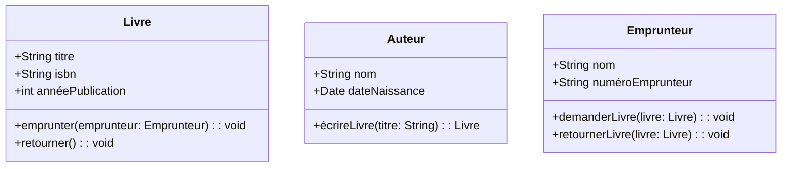

Explication de la syntaxe :  

- **[Livre| ...]** : Représentation de la classe Livre avec ses attributs et méthodes.  

- **[Auteur| ...]** : Représentation de la classe Auteur avec ses attributs et méthodes.  

- **[Emprunteur| ...]** : Représentation de la classe Emprunteur avec ses attributs et méthodes.  
  
- **[Livre] \*-- [Auteur]** : Indique qu'un Livre peut avoir plusieurs Auteurs (association).  

- **[Emprunteur] \*-- [Livre]** : Indique qu'un Emprunteur peut emprunter plusieurs Livres. 

Pour créer un diagramme d'objets à partir du diagramme de classes fourni, nous allons représenter des instances spécifiques des classes `Livre`, `Auteur`, et `Emprunteur`. Un diagramme d'objets montre des objets réels (instances de classes) avec leurs valeurs d'attributs actuelles et les liens entre eux.

Voici comment cela peut être traduit :

  
   
#### Diagramme d'Objets  
  
Instances (Objets) :  

- **Livre** :  

  - Objet : `livre1` 
  
    - `titre: "Les Misérables"`  
    - `isbn: "978-2-07-040933-1"`  
    - `annéePublication: 1862`  
    
  - Objet : `livre2`  
  
    - `titre: "1984"`  
    - `isbn: "978-0-452-28423-4"`  
    - `annéePublication: 1949`  
  
- **Auteur** :  
  
  - Objet : `auteur1`  
    - `nom: "Victor Hugo"`  
    - `dateNaissance: 1802-02-26`  
    
  - Objet : `auteur2`  
    - `nom: "George Orwell"`  
    - `dateNaissance: 1903-06-25`  

- **Emprunteur** :  
  - Objet : `emprunteur1`  
    - `nom: "Jean Dupont"`  
    - `numéroEmprunteur: "E1234"`  
  
  - Objet : `emprunteur2`  
    - `nom: "Marie Curie"`  
    - `numéroEmprunteur: "E5678"`  

Relations :  

- **`livre1`** est écrit par **`auteur1`**.  
  
- **`livre2`** est écrit par **`auteur2`**.  
  
- **`emprunteur1`** a emprunté **`livre1`**.  

- **`emprunteur2`** a emprunté **`livre2`**.  

Représentation du Diagramme d'Objets en UML :  
  
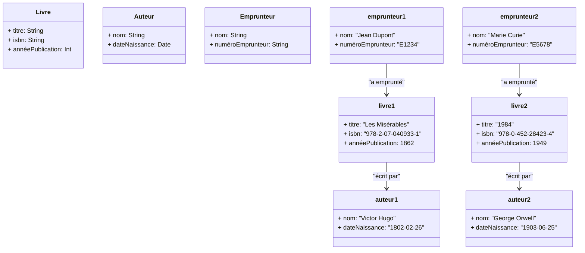

Ce diagramme montre des objets particuliers (les instances `livre1`, `livre2`, etc.) avec leurs relations concrètes, tels que l'emprunt de livres par des emprunteurs et les liens entre auteurs et livres.

Pour créer le diagramme de composants correspondant, nous allons représenter les différents composants logiciels impliqués dans le système de gestion de bibliothèque et leurs interactions. Un diagramme de composants en UML décrit la structure physique d'un système, y compris les fichiers, bibliothèques ou services que le système utilise.

  
#### Diagramme de Composants
  
1. **Système de gestion de bibliothèque** : 
   - Principal composant qui orchestre les opérations du système.
  
2. **Composant "Base de Données"** :  

   - Gère les informations stockées, telles que les livres, les auteurs, et les emprunteurs.  

3. **Composant "Service Emprunt"** :  

   - Gestion des opérations liées à l'emprunt et au retour de livres.

4. **Composant "Service Livres"** :  

   - Gestion des informations relatives aux livres, telles que la recherche de livres, et les détails comme le titre et l'ISBN.  

5. **Composant "Service Auteurs"** :  

   - Gestion des informations relatives aux auteurs, y compris la création et la recherche d'auteurs.  

6. **Composant "Service Emprunteurs"** :  

   - Gestion des informations liées aux emprunteurs (enregistrement et gestion des emprunts).  

  

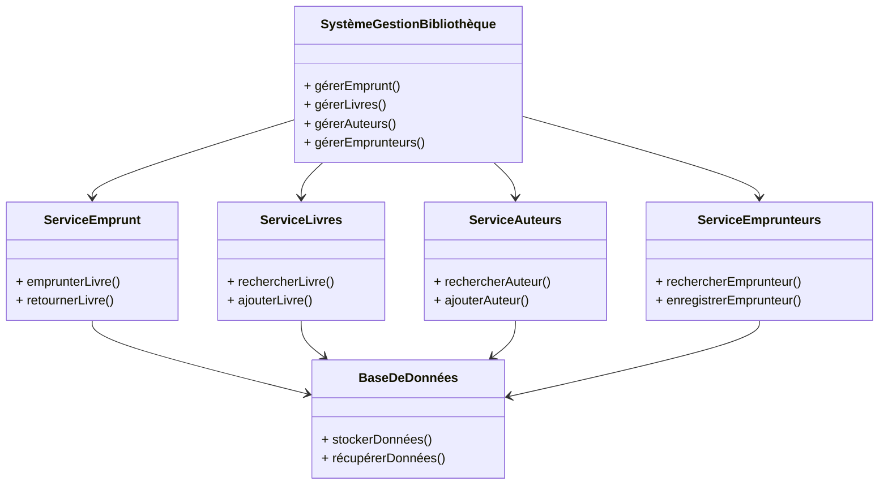

Explication du Diagramme :  
  
- **SystèmeGestionBibliothèque** : C'est le composant principal qui gère les différentes fonctionnalités de la bibliothèque.  

- **ServiceEmprunt** : Ce composant gère toutes les actions liées aux emprunts et aux retours de livres.  

- **ServiceLivres** : Il gère les informations sur les livres (ajout, recherche, etc.).  

- **ServiceAuteurs** : Il s'occupe des informations relatives aux auteurs.  

- **ServiceEmprunteurs** : Gère les données des emprunteurs, y compris leur enregistrement et la gestion des emprunts.  

- **BaseDeDonnées** : Le composant qui stocke et gère les données des livres, auteurs, et emprunteurs. Chaque service interagit avec la base de données pour récupérer ou stocker des informations.  

Ce diagramme montre comment les différents composants logiciels interagissent pour fournir les fonctionnalités nécessaires au système de gestion de bibliothèque.

  
#### Diagramme de deploiement
Voici une reformulation de l'explication du diagramme de déploiement pour le système de gestion de bibliothèque :

Explication du Diagramme de Déploiement

1. **Client Web** : 
   - Représente un utilisateur qui accède au système de gestion de bibliothèque via un navigateur web ou une application mobile. 
   - Il interagit avec le système à travers une **interface utilisateur**.

2. **Internet** : 
   - Symbolise le réseau qui permet la communication entre le client web et le serveur d'application. 
   - C'est le canal par lequel les données transitent.

3. **Serveur d'Application** : 
   - Héberge les divers composants du système, y compris :
     - **Service Emprunt** : Gère les emprunts et retours de livres.
     - **Service Livres** : Responsable de la gestion et de la recherche de livres.
     - **Service Auteurs** : S'occupe des informations relatives aux auteurs.
     - **Service Emprunteurs** : Gère les emprunteurs et leurs demandes.

4. **Serveur de Base de Données** : 
   - Contient le composant **Base de Données**, qui stocke toutes les informations du système, y compris les livres, les auteurs, les emprunteurs et les emprunts.

Scénario de Fonctionnement

- Les utilisateurs interagissent avec le système via le **Client Web**. Les requêtes sont transmises à travers le **réseau Internet** pour atteindre le **Serveur d'Application**, où se trouvent les services métiers comme le **Service Emprunt** et le **Service Livres**.

- Le **Serveur d'Application** traite ces requêtes et les envoie au **Serveur de Base de Données**, qui renvoie les informations demandées (telles que les livres disponibles et les détails des emprunteurs) à l'application.

Conclusion

Ce diagramme de déploiement illustre comment les composants du système de gestion de bibliothèque sont répartis entre différents nœuds matériels et logiciels. Il met en évidence leur communication et leur interconnexion au sein de l'infrastructure, offrant une vue d'ensemble de la manière dont le système fonctionne.

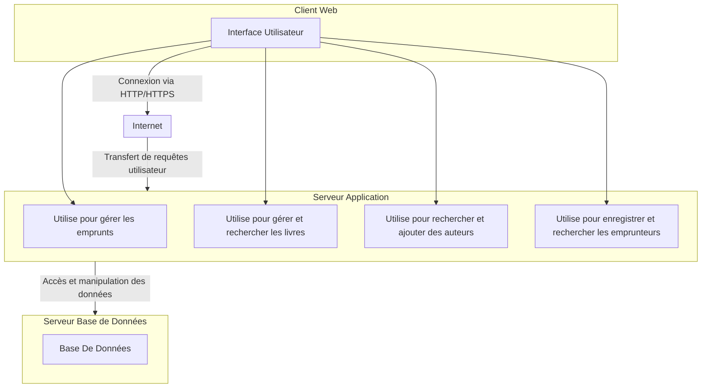

#### Diagramme de packages

Voici un exemple de code Mermaid pour le système de gestion d'une bibliothèque que nous avons décrit précédemment :

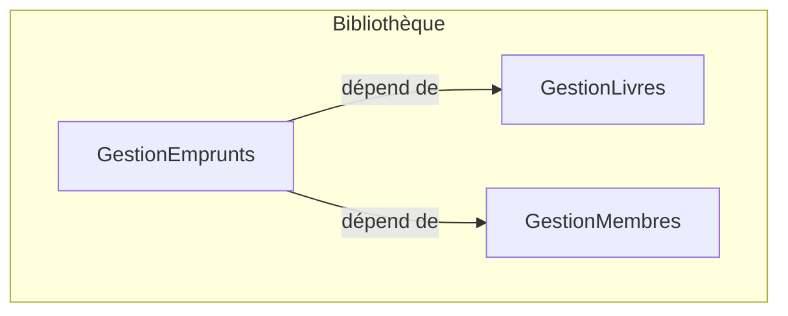

Explication du Code

- **graph TD** : Indique que le diagramme est orienté de haut en bas (Top Down).
- **subgraph Bibliothèque** : Crée un sous-graph qui représente le package principal "Bibliothèque".
- **A[GestionLivres], B[GestionMembres], C[GestionEmprunts]** : Représentent les différents packages au sein du sous-graph.
- `C -->|dépend de| A` : Indique une dépendance du package "GestionEmprunts" vers "GestionLivres".
- `C -->|dépend de| B` : Indique une dépendance du package "GestionEmprunts" vers "GestionMembres".

#### Diagramme de Profil

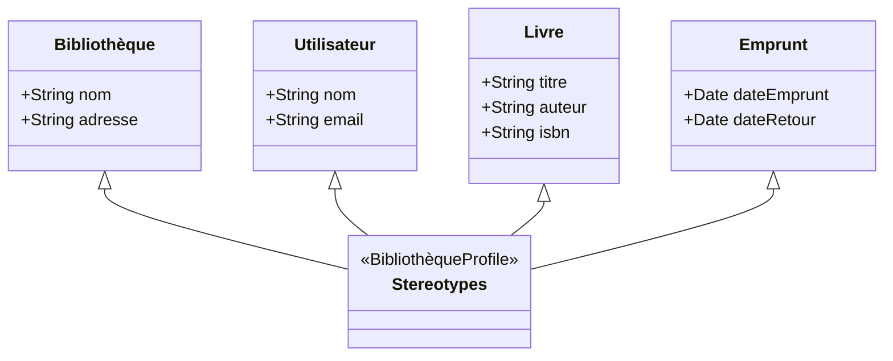

Explication du Diagramme

1. **Classes** :
   - **Bibliothèque** : Représente la bibliothèque avec des attributs comme `nom` et `adresse`.
   - **Utilisateur** : Représente les utilisateurs du système avec des attributs tels que `nom` et `email`.
   - **Livre** : Contient des informations sur les livres, avec des attributs comme `titre`, `auteur`, et `isbn`.
   - **Emprunt** : Représente les emprunts de livres avec des attributs comme `dateEmprunt` et `dateRetour`.

2. **Stereotypes** :
   - Des stéréotypes comme `<<BibliothèqueProfile>>`, `<<UtilisateurProfile>>`, `<<LivreProfile>>`, et `<<EmpruntProfile>>` sont ajoutés pour chaque classe afin de montrer qu'elles font partie d'un profil spécifique à ce système.

3. **Relations** :
   - Les flèches indiquent que chaque classe est associée au diagramme de profil, montrant que ces classes peuvent être stéréotypées pour le système de gestion de bibliothèque.

  
### Diagramme comportementaux

#### Diagramme de cas d'utilisation

Le diagramme de cas d'utilisation représente les interactions entre les acteurs (utilisateurs ou systèmes externes) et le système de gestion de bibliothèque. Il décrit les fonctionnalités principales du système sous forme de cas d'utilisation, illustrant ce que les utilisateurs peuvent faire dans le système.

Acteurs dans le Système :  
  
1. **Emprunteur** : Représente une personne qui peut emprunter ou retourner des livres.  

2. **Bibliothécaire** : Gère les livres, les emprunteurs, et les auteurs dans le système.  

3. **Système de Paiement** (acteur externe) : Gère les paiements pour les amendes ou les retards d'emprunt.  
  

Cas d'utilisation principaux :  

1. **Emprunter un Livre** : L'emprunteur peut emprunter un livre disponible.  

2. **Retourner un Livre** : L'emprunteur peut retourner un livre emprunté. 

3. **Rechercher un Livre** : L'emprunteur peut rechercher un livre dans la bibliothèque.  

4. **Gérer les Livres** : Le bibliothécaire peut ajouter, supprimer, ou modifier des informations sur les livres.  

5. **Gérer les Emprunteurs** : Le bibliothécaire peut enregistrer un nouvel emprunteur ou mettre à jour les informations d'un emprunteur.  

6. **Gérer les Auteurs** : Le bibliothécaire peut ajouter ou mettre à jour les informations sur un auteur.  

7. **Payer une Amende** : L'emprunteur peut payer une amende via un système de paiement externe.  

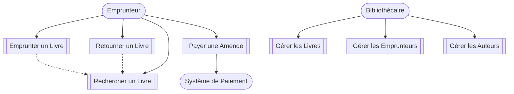

Explication du Diagramme :

1. **Emprunteur** :
   - Peut **Emprunter un Livre** : L'utilisateur doit d'abord **Rechercher un Livre** avant de l'emprunter.
   - Peut **Retourner un Livre** qu'il a emprunté.
   - Peut **Rechercher un Livre** dans la base de données pour vérifier sa disponibilité.
   - Peut **Payer une Amende** s'il a des frais de retard. Cette action est connectée au **Système de Paiement**, un acteur externe.

2. **Bibliothécaire** :
   - Peut **Gérer les Livres** : Ajouter de nouveaux livres, modifier les informations existantes, ou supprimer des livres.
   - Peut **Gérer les Emprunteurs** : Ajouter de nouveaux emprunteurs ou modifier leurs informations.
   - Peut **Gérer les Auteurs** : Ajouter ou mettre à jour des informations sur les auteurs.

3. **Système de Paiement** : C'est un système externe utilisé pour gérer les paiements effectués par les emprunteurs lorsqu'ils paient une amende.

Scénarios :

- Un **Emprunteur** peut rechercher un livre, puis l'emprunter s'il est disponible. Il doit le retourner avant une date limite pour éviter une amende.
- Le **Bibliothécaire** gère les opérations de gestion des livres, des auteurs, et des emprunteurs dans le système.
- Lorsqu'un emprunteur a une amende à payer, il interagit avec le **Système de Paiement** externe.

Ce diagramme de cas d'utilisation montre les principales fonctionnalités du système de gestion de bibliothèque et les interactions entre les acteurs et le système. Il aide à visualiser les tâches possibles et les relations entre les différents utilisateurs et les services fournis par le système.

  

#### Diagramme de séquence  

Le diagramme de séquence montre les interactions entre les objets ou composants du système sous forme de messages échangés dans le temps. Il met en lumière l'ordre d'exécution des opérations et la manière dont les différents acteurs interagissent avec le système.

Scénario du Diagramme de Séquence :

Prenons le cas d'un **Emprunteur** qui souhaite **emprunter un livre**.

Acteurs et Objets :

1. **Emprunteur** : L'utilisateur du système.
2. **Interface Utilisateur** : Le front-end ou l'interface avec laquelle interagit l'emprunteur.
3. **Système de Gestion de Bibliothèque** : Le système principal qui orchestre les actions.
4. **Service Livres** : Service qui gère les opérations sur les livres.
5. **Service Emprunt** : Service qui gère les emprunts et les retours de livres.
6. **Base de Données** : Système de stockage d'informations sur les livres et emprunteurs.

  

Scénario :

1. L'**Emprunteur** cherche un livre à emprunter en passant par l'**Interface Utilisateur**.
2. L'interface demande au **Système de Gestion de Bibliothèque** de rechercher le livre.
3. Le **Système de Gestion** interroge le **Service Livres**, qui va chercher le livre dans la **Base de Données**.
4. Une fois trouvé, l'**Emprunteur** choisit d'emprunter le livre.
5. Le **Système de Gestion** demande au **Service Emprunt** de créer l'emprunt pour cet utilisateur.
6. Le **Service Emprunt** met à jour la **Base de Données** avec les informations sur l'emprunt.
7. Un message de confirmation est renvoyé à l'**Emprunteur** via l'**Interface Utilisateur**.

Représentation du Diagramme de Séquence en UML :

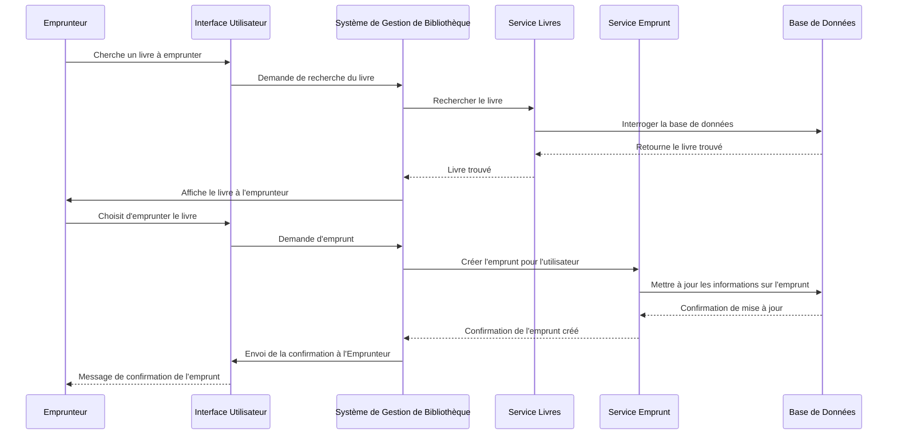

Explication du Diagramme de Séquence :

1. **Interaction entre l'Emprunteur et l'Interface Utilisateur** :
   - L'emprunteur recherche un livre via l'interface utilisateur. Cette demande est transmise au **Système de Gestion de Bibliothèque**.

2. **Recherche du livre dans le système** :
   - Le **Système de Gestion** demande au **Service Livres** de rechercher le livre dans la **Base de Données**.
   - Une fois le livre trouvé, cette information est transmise de retour à l'interface utilisateur, qui l'affiche à l'emprunteur.

  

3. **Emprunt du livre** :
   - L'emprunteur choisit d'emprunter le livre. L'interface utilisateur envoie cette demande au **Système de Gestion**.
   - Le **Système de Gestion** demande au **Service Emprunt** de créer un nouvel emprunt pour cet utilisateur.
   - Le **Service Emprunt** met à jour la **Base de Données** pour enregistrer l'emprunt et confirme que l'emprunt a été créé.

4. **Confirmation de l'emprunt** :
   - La confirmation de l'emprunt est renvoyée au **Système de Gestion**, puis à l'interface utilisateur, qui informe l'emprunteur que le livre a bien été emprunté.

Ce diagramme de séquence illustre le flux des messages entre les différents acteurs et composants lors de la réalisation d'un emprunt de livre. Il met en avant la chronologie des événements et les interactions entre le front-end, le back-end, et la base de données du système.

#### Diagramme de Collaboration (UML)  

Le **diagramme de collaboration** (ou **diagramme de communication**) montre les relations et les connexions entre les objets ou acteurs impliqués dans un scénario. Contrairement au diagramme de séquence, il ne met pas l'accent sur la chronologie des événements, mais sur **les liens entre les objets**.  
  
Scénario : **Emprunter un Livre**  

1. **Emprunteur** interagit avec **InterfaceUtilisateur** pour rechercher et emprunter un livre.
2. **InterfaceUtilisateur** communique avec le **SystèmeGestion** pour rechercher et emprunter un livre.
3. **SystèmeGestion** demande des informations au **ServiceLivres** et au **ServiceEmprunt** pour gérer le processus.
4. Le **ServiceEmprunt** met à jour la **BaseDeDonnées**.
  
Représentation en UML pour le Diagramme de Collaboration :

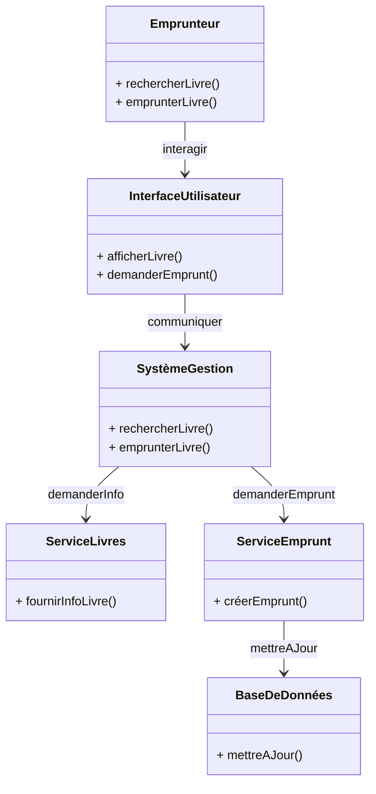

Explication du Diagramme :

- **Emprunteur** : Initie la recherche et l'emprunt d'un livre en interagissant avec l'**Interface Utilisateur**.
- **Interface Utilisateur** : Transmet les requêtes de l'emprunteur au **Système de Gestion**, qui est responsable de coordonner les différents services.
- **Système de Gestion** : Envoie les requêtes spécifiques aux services concernés, comme le **Service Livres** et le **Service Emprunt**.
- **Service Livres** : Vérifie la disponibilité du livre en consultant la **Base de Données**.
- **Service Emprunt** : Crée un nouvel emprunt pour l'utilisateur et met à jour la **Base de Données** avec les informations de l'emprunt.

Ce diagramme montre les relations et les interactions entre les différents acteurs et services lorsqu'un emprunteur effectue une opération d'emprunt dans le système de gestion de bibliothèque.

#### Diagramme d'Activité

Introduction

Le diagramme d'activité est un outil essentiel dans le domaine de la modélisation des systèmes, en particulier dans le cadre de l'analyse et du design de systèmes logiciels. Il permet de représenter les flux de contrôle et d'information au sein d'un système à travers une série d'activités et de décisions. Ce type de diagramme est souvent utilisé pour modéliser des processus métier, des algorithmes, et des workflows, fournissant ainsi une vue claire et structurée des interactions au sein d'un système.

Définition et Objectifs

Un diagramme d'activité est une représentation graphique qui décrit le déroulement d'un processus ou d'une activité en utilisant des éléments visuels standardisés. Les objectifs principaux de ce type de diagramme incluent :

1. **Visualisation des processus** : Permet de visualiser le flux d'activités, facilitant la compréhension des interactions entre les différentes parties du système.
2. **Identification des étapes** : Aide à identifier les différentes étapes d'un processus, y compris les points de décision et les activités parallèles.
3. **Facilitation de la communication** : Sert de langage commun entre les différentes parties prenantes d'un projet, incluant les développeurs, les analystes métier et les clients.
4. **Documentation des processus** : Fournit une documentation claire et précise des processus d'affaires ou des algorithmes, utile pour les audits et les améliorations continues.

Éléments du Diagramme d'Activité

Les diagrammes d'activité utilisent plusieurs symboles pour représenter les différentes composantes d'un processus. Voici les éléments clés :

1. **Activité** : Représentée par un rectangle arrondi, elle décrit une tâche ou une action à réaliser dans le processus.
   
2. **Flèche de contrôle** : Indique le flux d'exécution entre les activités. Les flèches montrent la direction du flux de travail.

3. **Point de décision** : Représenté par un losange, il indique un point où le flux peut se diviser en plusieurs chemins en fonction d'une condition.

4. **État initial** : Symbolisé par un cercle noir, il marque le début du processus.

5. **État final** : Représenté par un cercle avec un cercle concentrique, il indique la fin du processus.

6. **Activités parallèles** : Représentées par des barres de synchronisation, elles indiquent des activités qui peuvent être exécutées simultanément.

7. **Sous-activités** : Un diagramme d'activité peut inclure d'autres diagrammes d'activité, permettant de décomposer des processus complexes en parties plus simples.

Exemple d'un Diagramme d'Activité

Prenons l'exemple d'un processus d'emprunt de livre dans une bibliothèque. Un diagramme d'activité typique pourrait inclure les étapes suivantes :

1. **État Initial** : L'emprunteur se connecte à l'interface utilisateur.
2. **Activité 1** : Rechercher un livre.
3. **Décision** : Le livre est-il disponible ?
   - **Oui** : L'emprunteur peut procéder à l'emprunt.
   - **Non** : Afficher un message indiquant que le livre n'est pas disponible.
4. **Activité 2** : L'emprunteur choisit d'emprunter le livre.
5. **Activité 3** : Confirmer l'emprunt et mettre à jour la base de données.
6. **État Final** : Un message de confirmation est envoyé à l'emprunteur.

Le diagramme illustrerait visuellement ces étapes, facilitant ainsi la compréhension du processus par toutes les parties prenantes.

Utilisation et Avantages

Les diagrammes d'activité sont particulièrement utiles dans les phases d'analyse et de conception d'un projet. Ils permettent de :

- **Clarifier les exigences** : En visualisant le processus, les équipes peuvent mieux comprendre et définir les exigences du système.
- **Identifier les goulets d'étranglement** : En analysant le flux d'activités, il est possible d'identifier les points de friction ou d'inefficacité dans un processus.
- **Faciliter l'automatisation** : Un diagramme d'activité bien conçu peut servir de guide pour l'automatisation des processus métier.

Voici un exemple de diagramme d'activité représentant le processus d'emprunt d'un livre dans une bibliothèque, écrit en syntaxe Mermaid :

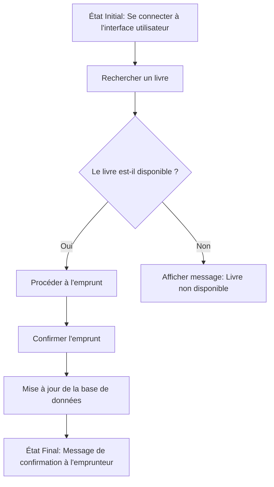

Explication du Diagramme

1. **État Initial** : L'emprunteur se connecte à l'interface utilisateur.
2. **Recherche** : L'emprunteur effectue une recherche pour un livre.
3. **Décision** : Vérifie la disponibilité du livre.
   - Si le livre est **disponible**, il passe à l'étape d'emprunt.
   - Si le livre n'est **pas disponible**, un message est affiché.
4. **Confirmer l'emprunt** : Si l'emprunteur choisit d'emprunter le livre, le système confirme l'emprunt.
5. **Mise à jour** : La base de données est mise à jour avec les informations d'emprunt.
6. **État Final** : Un message de confirmation est envoyé à l'emprunteur.

Un diagramme d'états (ou diagramme d'état-transitions) est utilisé pour représenter les différents états d'un objet dans un système et les transitions entre ces états. Il est particulièrement utile pour modéliser des comportements dynamiques où les objets changent d'état en réponse à des événements.

#### Diagramme d'États pour un Emprunt de Livre

Voici un exemple de diagramme d'états représentant le cycle de vie d'un livre dans un système de gestion de bibliothèque, incluant des états comme "Disponible", "Emprunté", "Réservé", et "Retourné".

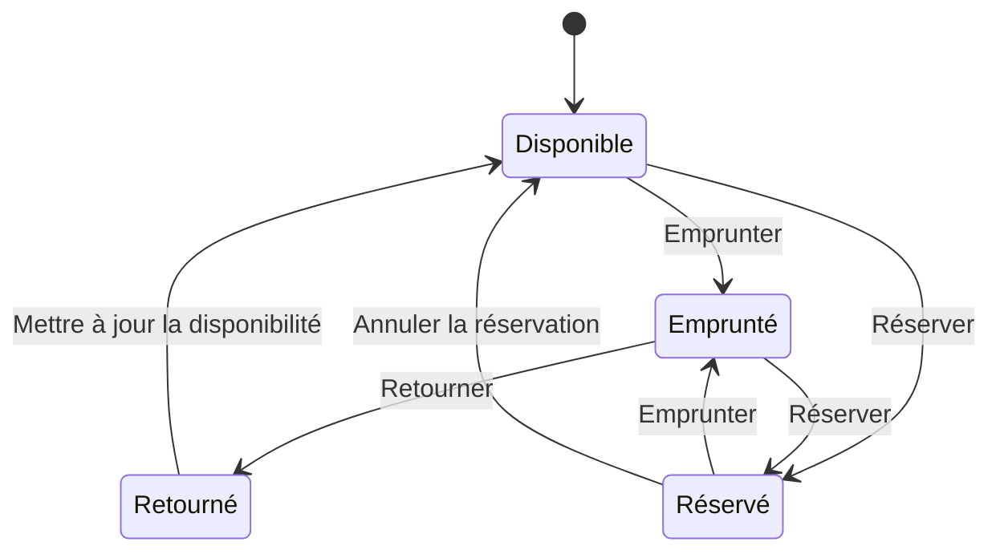

Explication des États et Transitions

1. **[Initial State]** : Représente l'état initial avant qu'un livre ne soit disponible.
2. **Disponible** : L'état où le livre est prêt à être emprunté ou réservé.
   - **Transition "Emprunter"** : Un emprunteur peut emprunter le livre, ce qui le déplace à l'état "Emprunté".
   - **Transition "Réserver"** : Un emprunteur peut également réserver le livre s'il est disponible.
3. **Emprunté** : L'état où le livre est actuellement emprunté par un emprunteur.
   - **Transition "Retourner"** : L'emprunteur retourne le livre, ce qui le ramène à l'état "Retourné".
   - **Transition "Réserver"** : Pendant qu'il est emprunté, un autre utilisateur peut réserver le livre, en attendant son retour.
4. **Réservé** : L'état où le livre est réservé par un emprunteur.
   - **Transition "Emprunter"** : Une fois que le livre est retourné, l'emprunteur peut l'emprunter.
   - **Transition "Annuler la réservation"** : Si l'emprunteur décide de ne plus vouloir le livre, la réservation peut être annulée, et le livre redevient "Disponible".
5. **Retourné** : L'état après qu'un livre a été retourné par l'emprunteur, où il doit être mis à jour dans le système.
   - **Transition "Mettre à jour la disponibilité"** : Après le traitement du retour, le livre revient à l'état "Disponible".

Le diagramme de timing est un type de diagramme de séquence qui se concentre sur le timing des événements au fil du temps. Il montre les interactions entre les objets, ainsi que le moment précis où ces interactions se produisent. Ce type de diagramme est particulièrement utile pour représenter les systèmes réactifs où le timing des messages est crucial.

#### Diagramme de Timing pour le Processus d'Emprunt d'un Livre

Voici un exemple de diagramme de timing illustrant le processus d'emprunt d'un livre dans un système de gestion de bibliothèque.

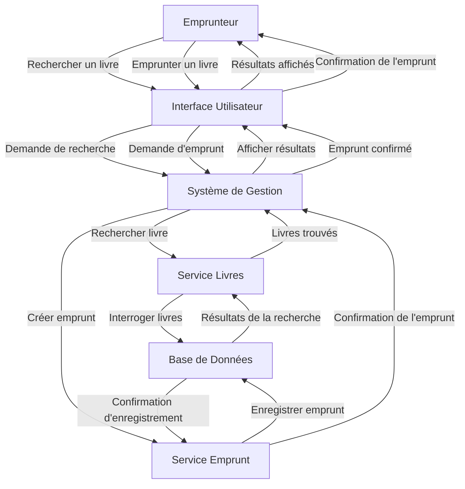

Explication du Diagramme

1. **Acteurs** : Le diagramme représente plusieurs participants dans le processus : l'Emprunteur, l'Interface Utilisateur, le Système de Gestion, le Service des Livres, le Service d'Emprunt et la Base de Données.
   
2. **Événements Chronologiques** :
   - **Recherche d'un livre** : L'emprunteur initie une recherche via l'interface utilisateur, qui transmet la demande au système de gestion.
   - **Interrogation de la Base de Données** : Le système de gestion interroge le service des livres, qui à son tour interroge la base de données pour obtenir des résultats.
   - **Affichage des Résultats** : Les résultats sont retournés à l'interface utilisateur et affichés à l'emprunteur.

3. **Emprunt d'un Livre** :
   - L'emprunteur sélectionne un livre à emprunter et envoie une demande via l'interface utilisateur.
   - Le système de gestion crée l'emprunt en interrogeant le service d'emprunt, qui enregistre les informations d'emprunt dans la base de données.
   - Une fois l'enregistrement effectué, une confirmation est renvoyée à l'emprunteur via l'interface utilisateur.

#### Diagramme d'Interaction

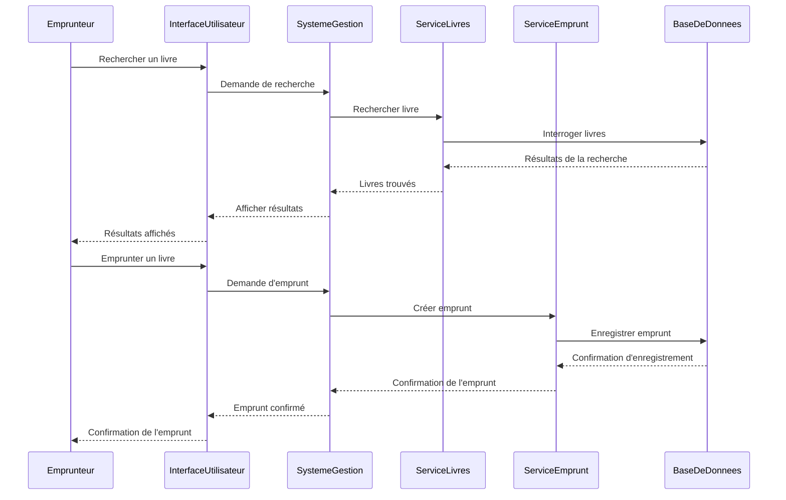

### Explication du Diagramme

1. **Participants** :
   - **Emprunteur** : L'utilisateur qui souhaite emprunter un livre.
   - **Interface Utilisateur** : L'interface par laquelle l'emprunteur interagit avec le système.
   - **Système de Gestion** : Le système principal qui gère les demandes et les opérations.
   - **Service Livres** : Le service qui gère les livres disponibles.
   - **Service Emprunt** : Le service responsable de la gestion des emprunts.
   - **Base de Données** : Le système de stockage où les informations sur les livres et les emprunteurs sont conservées.

2. **Flux d'Interactions** :
   - L'emprunteur effectue une recherche de livre via l'interface utilisateur.
   - La demande est transmise au système de gestion, qui interroge le service des livres.
   - Le service des livres interroge la base de données pour récupérer les informations sur les livres.
   - Une fois les résultats trouvés, ils sont renvoyés à l'emprunteur via l'interface.
   - Si l'emprunteur souhaite emprunter un livre, une nouvelle demande est envoyée au système de gestion.
   - Le service d'emprunt enregistre l'emprunt dans la base de données et renvoie une confirmation à l'emprunteur.

#### Diagramme d'Interaction Générale

Voici un exemple d'un diagramme d'interaction générale utilisant Mermaid pour le système de gestion d'une bibliothèque :

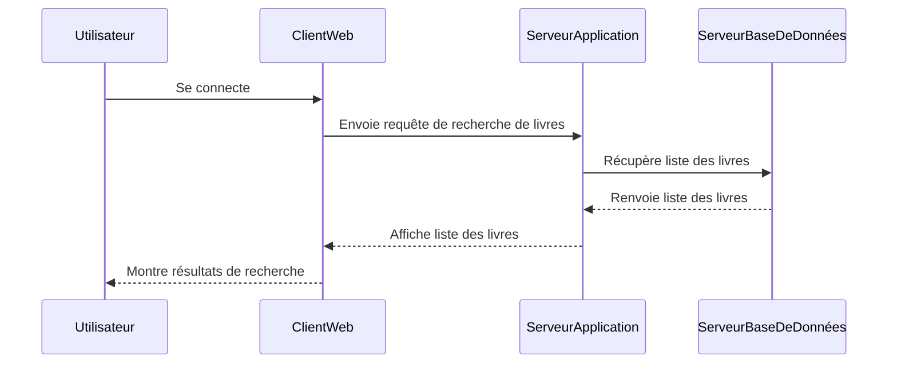

### Explication du Diagramme

1. **Participants** :
   - **Utilisateur** : L'utilisateur du système qui effectue des actions.
   - **ClientWeb** : L'interface à partir de laquelle l'utilisateur interagit avec le système.
   - **ServeurApplication** : Le serveur qui traite les requêtes de l'utilisateur et gère la logique métier.
   - **ServeurBaseDeDonnées** : Le serveur qui stocke les données et les informations de la bibliothèque.

2. **Flux d'Interactions** :
   - **Se connecte** : L'utilisateur se connecte via le client web.
   - **Envoie requête de recherche de livres** : Le client web envoie une requête au serveur d'application pour rechercher des livres.
   - **Récupère liste des livres** : Le serveur d'application demande la liste des livres au serveur de base de données.
   - **Renvoie liste des livres** : Le serveur de base de données renvoie la liste des livres au serveur d'application.
   - **Affiche liste des livres** : Le serveur d'application envoie la liste des livres au client web pour affichage.
   - **Montre résultats de recherche** : Le client web montre les résultats à l'utilisateur.

