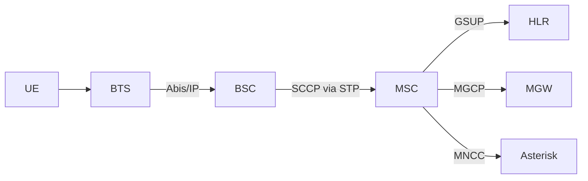
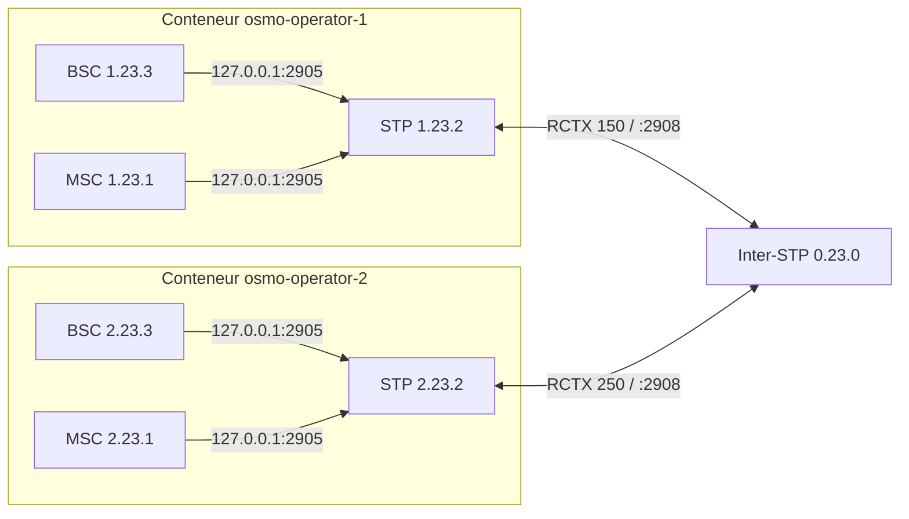

# Lab GSM multi-opérateur — `osmo_egprs`

> Module pratique : monter un **réseau GSM multi-opérateur complet**, interconnecté
> en **SS7 sur IP**, entièrement conteneurisé avec Docker.
> Code : [github.com/bbaranoff/osmo_egprs](https://github.com/bbaranoff/osmo_egprs)

```tip

Ce lab reproduit ce qu'un opérateur mobile 2G fait réellement : cœur de réseau
Osmocom (BTS/BSC/MSC/HLR/MGW), signalisation SS7 entre opérateurs, SMS et voix —
et même un **baseband émulé** (voir [module 8](2-QEMU-Calypso.md)). Aucun matériel
radio n'est nécessaire.

```

## Objectifs pédagogiques

- Comprendre l'architecture d'un **PLMN** (Public Land Mobile Network) 2G.
- Câbler la **signalisation SS7/M3UA** entre plusieurs opérateurs.
- Provisionner des abonnés (IMSI, MSISDN, Ki) dans un **HLR**.
- Observer une **Location Update**, une **authentification COMP128v1**, un
  **chiffrement A5/1**, des **SMS** et un **appel voix** de bout en bout.
- Lire la signalisation dans **Wireshark** (M3UA, SCCP, GSM MAP, GSMTAP).

---

## 1. Architecture d'un PLMN

Chaque opérateur simulé repose sur la pile Osmocom standard, tous les composants
dans un seul conteneur Docker, communiquant par `127.0.0.1`.



Le **STP** local sert de hub de signalisation intra-PLMN.

## 2. Interconnexion multi-opérateur

C'est le cœur du projet : *N* opérateurs (1 à 9), chacun avec son cœur de réseau
dans un conteneur dédié, reliés par un **Inter-STP central** qui route la
signalisation M3UA/SCCP entre eux. Le projet automatise ce qui se fait
habituellement à la main — l'auteur le résume comme un **« DHCP pour SS7 »**.



Toutes les valeurs qui dépendent de *N* (point codes, routing contexts, ARFCN,
adresses IP, trunks SIP, tables SMS) sont **générées au démarrage** — aucun
fichier n'est écrit en dur pour un nombre fixe d'opérateurs.

### Plan d'adressage SS7 (ITU 14 bits `zone.network.node`)

| Nœud | Point Code | Formule |
|------|-----------|---------|
| Inter-STP | `0.23.0` | fixe |
| MSC opérateur *N* | `N.23.1` | zone = *N* |
| STP opérateur *N* | `N.23.2` | zone = *N* |
| BSC opérateur *N* | `N.23.3` | zone = *N* |

Le routing context **inter** `N×100+50` est le plus critique : il relie le STP de
chaque opérateur à l'Inter-STP.

---

## 3. Mise en route

```bash
git clone https://github.com/bbaranoff/osmo_egprs
cd osmo_egprs
sudo ./tools/make-docker-image.sh    # build de l'image Docker (une seule fois)
sudo ./start.sh                      # choisir "bridge", saisir N opérateurs
sudo ./provision_hlr.sh              # provisionner les abonnés de test
```

Arrêt : `sudo ./start.sh stop`.

### Séquence de démarrage (ordre critique)

```
./start.sh  [bridge]
 ├── saisie N opérateurs + MCC/MNC/nom
 ├── création du réseau gsm-inter (172.20.0.0/24)
 ├── génération osmo-stp-interop.cfg
 ├── lancement de l'Inter-STP  (DOIT écouter :2908 AVANT les opérateurs)
 └── pour chaque opérateur N :
      ├── substitution des templates (point codes, RCTX, ARFCN…)
      ├── docker run sur gsm-inter @ 172.20.0.(10+N)
      └── services via run.sh + tmux
```

L'Inter-STP doit être à l'écoute **avant** que les STP opérateurs tentent de s'y
connecter, sinon on obtient une route `PROHIB` (voir Diagnostic).

---

## 4. Explorer le réseau

### Accès aux conteneurs (tmux)

```bash
sudo docker exec -ti osmo-operator-1 tmux attach        # STP/MSC/HLR/BSC/BTS/SMSC
sudo docker exec -ti osmo-inter-stp  tmux attach -t stp # l'Inter-STP
```

### Interfaces VTY (telnet dans le conteneur)

| Port | Composant | | Port | Composant |
|------|-----------|-|------|-----------|
| 4239 | OsmoSTP | | 4254 | OsmoMSC |
| 4242 | OsmoBSC | | 4258 | OsmoHLR |
| 4243 | OsmoMGW | | | |

### Commandes VTY essentielles

```
# STP (4239) — diagnostic SS7
show cs7 instance 0 asp        # état des ASP (ACTIVE / DOWN)
show cs7 instance 0 route      # table de routage — PROHIB ?

# HLR (4258)
subscriber imsi 001010000000001 show
show gsup-clients

# MSC (4254) — envoyer un SMS de test
subscriber msisdn 10001 sms sender msisdn 10002 send Bonjour
```

### Wireshark

Lancé automatiquement sur le bridge Docker. Filtres utiles :

```
m3ua                  # trafic M3UA
sccp                  # messages SCCP
gsm_map               # messages MAP
gsmtap                # trafic radio (interface Um)
sctp.srcport == 2908  # vers/depuis l'Inter-STP
```

---

## 5. SMS et voix

**SMS inter-opérateur** : `sms-interop-relay.py` surveille le log MO du SMSC,
parse le TPDU GSM 03.40, consulte `sms-routing.conf` (longest-prefix match) et
relaie en TCP:7890 vers l'opérateur cible, qui résout le MSISDN → IMSI par le VTY
du HLR avant de délivrer le SMS MT.

**Voix inter-opérateur** : chaque MSC parle MNCC à un Asterisk local ; les
Asterisk des opérateurs sont reliés par des **trunks SIP** sur le backbone Docker.
Le dialplan route sur le premier chiffre du numéro composé (convention : chiffre
*N* = opérateur *N*).

---

## 6. RAN virtuel : brancher un baseband émulé

Le lab intègre un **mode PHY `qemu`** qui remplace le SDR par un **baseband
Calypso entièrement émulé** — le [module 8](2-QEMU-Calypso.md) lui est consacré.

| `PHY_MODE` | Pile | Usage |
|------------|------|-------|
| `faketrx` (défaut) | `fake_trx` → `trxcon` → `mobile` | multi-MS, rapide |
| `virtphy` | `osmo-bts-virtual` ↔ `virtphy` ↔ `mobile` | multi-MS via multicast |
| `qemu` | `osmo-bts-trx` ↔ `bridge.py` ↔ QEMU Calypso ↔ `mobile` | **baseband émulé (ARM7 + DSP)** |

---

## 7. Diagnostic — résoudre les `PROHIB`

| Symptôme | Cause probable | Correctif |
|----------|----------------|-----------|
| Route `0.0.0/0` en `PROHIB` | Inter-STP pas démarré / mauvaise IP | vérifier `INTER_STP_IP` et l'IP backbone |
| Pas de routes dynamiques | MSC/BSC ne se connectent pas au STP | les ASP doivent pointer sur `127.0.0.1` |
| ASP `DOWN` sur l'Inter-STP | race condition Docker | `docker restart` de l'opérateur |

```warning

L'ordre de démarrage est la première cause d'échec : l'Inter-STP écoute sur
`127.0.0.1:2905` immédiatement, mais le lien inter-conteneur n'existe qu'après
`docker network connect`. En cas de doute, redémarrer l'opérateur fautif.

```

---

*Suite du module : [8 — Émulation du baseband Calypso (QEMU-Calypso)](2-QEMU-Calypso.md).*
