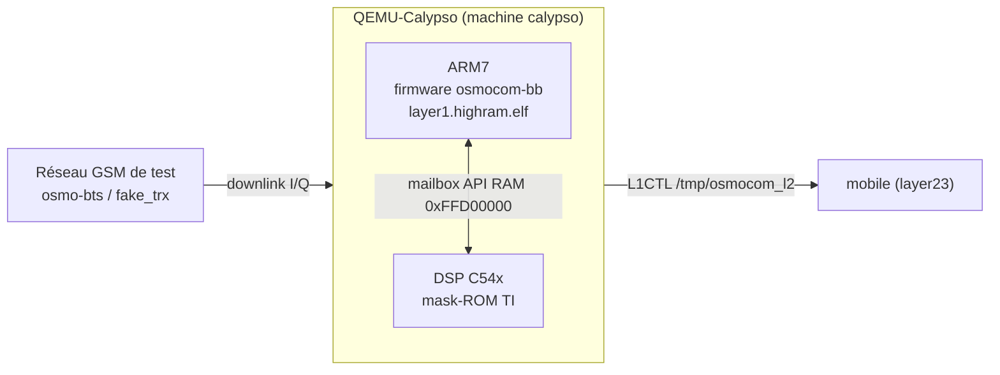
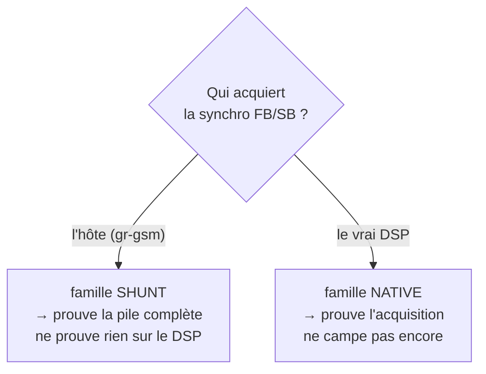

# Émulation du baseband Calypso — `qemu-calypso`

> Faire tourner le **vrai firmware GSM** d'un téléphone (Motorola C1xx / Compal E88)
> **sans aucun matériel**, en émulant son baseband **TI Calypso** dans QEMU.
> Code : [github.com/bbaranoff/qemu-calypso](https://github.com/bbaranoff/qemu-calypso)
> — Quick Start : [`QUICK_START.md`](https://github.com/bbaranoff/qemu-calypso/blob/main/QUICK_START.md)

```danger

**Le point d'avancement (campagne du 2026-08-24)**

- **Mode `shunt_legit` (défaut)** : la pile GSM complète fonctionne **de bout en
  bout** — synchro, camp, Location Update, authentification COMP128v1, chiffrement
  **A5/1**, **SMS** dans les deux sens et **appel voix avec audio** entre deux
  abonnés. Le firmware ARM osmocom-bb **non patché** tourne réellement ; c'est
  gr-gsm, côté hôte, qui démodule.
- **Mode `native` (le vrai DSP)** : **avancée majeure — le Frequency Burst (FB) est
  désormais acquis par le vrai DSP mask-ROM** (437 transitions mesurées, écrites
  par la ROM elle-même à `PC=0x79e4`, sans aucune injection). Le **mur actuel** est
  le **décodage du SCH** : la tâche tourne mais son décodeur sort une valeur
  constante (`0xf8d8`) indépendante de l'entrée — donc il ne décode pas encore.

```

## Ce que fait ce projet, en une phrase

QEMU-Calypso émule le SoC GSM **TI Calypso** en faisant tourner **deux cœurs en
même temps**, exactement comme le silicium réel :

- un **ARM** qui exécute le firmware [osmocom-bb](https://osmocom.org/projects/baseband)
  **d'origine, non patché** (la Layer 1 temps réel) ;
- un **DSP TMS320C54x** qui exécute la **vraie mask-ROM DSP de TI**.

Les deux communiquent par la **mailbox API RAM** à l'adresse `0xFFD00000`, comme
sur la puce. À la connaissance de l'auteur, aucun autre émulateur ne fait tourner
*à la fois* le firmware constructeur intact *et* le DSP de couche 1.



```tip

**Le firmware est interchangeable.** N'importe quel `layer1.highram.elf` construit
depuis n'importe quel commit d'osmocom-bb boote sans adaptation ni patch. C'est le
test qui distingue « j'émule la plateforme » de « j'ai fait marcher *ce* binaire ».

```

---

**🎥 PoC — qemu-calypso**

<iframe src="https://www.youtube.com/embed/gwXdmwdqZqs" title="PoC qemu-calypso" width="560" height="315" style="width:min(560px,100%);aspect-ratio:16/9;height:auto;border:0;border-radius:10px;margin:.4rem 0" allow="accelerometer; autoplay; clipboard-write; encrypted-media; gyroscope; picture-in-picture; web-share" allowfullscreen loading="lazy"></iframe>

## 1. Les deux familles de modes

C'est le concept central. Un mode répond à une seule question : **qui fait quoi ?**

| profil | FB / SB | SI | ce qu'il prouve |
|--------|---------|----|----------------|
| `shunt_legit` | **hôte** | gr-gsm | **le défaut** — la pile de bout en bout, jusqu'à la voix. *Rien sur le DSP.* |
| `native_twl` | hôte / TWL | **DSP** | le DSP traite-t-il le SI ? On lui donne la synchro pour poser la question |
| `native` | **DSP** | **DSP** | la vérité sur l'acquisition. **FB acquis**, SCH pas encore décodé |
| `native_helped` | DSP, entrée reroutée | DSP | ⚠️ sous béquille — toute mesure ici est à citer comme telle |
| `empty` | rien | rien | banc gate par gate |



```warning

**Frontière à ne jamais franchir sans changer de nom** : dès que les System
Information viennent de gr-gsm, on court-circuite le DSP — c'est `shunt_legit`,
pas un mode natif. La seule source de vérité sur ce qu'un run a réellement obtenu
est le **manifeste** imprimé par le modèle (`qemu-manifest.log`), **jamais** la
ligne de commande.

```

---

## 2. Piloter le lab

Tout vit dans le conteneur `osmo-operator-1`. **Chaque mode a sa porte d'entrée —
elles ne sont pas interchangeables**, et c'est pourquoi les journaux atterrissent
à deux endroits différents.

```bash
# shunt_legit (le défaut) — la pile complète, jusqu'à l'appel voix
cd /opt/GSM/osmo_egprs && CALYPSO_BRIDGE=pont ENCRYPTION='a5 1' ./start-direct.sh

# native — le vrai DSP à la manœuvre
cd /opt/GSM/qemu-src && CALYPSO_MODE=native ./run.sh
```

Arrêt : la même porte avec `--stop`. **Si une relance coince** (port pris, pile à
moitié morte), faire le `--stop` puis tuer les python restants, qui survivent au
teardown et retiennent les FIFO I/Q :

```bash
pkill -f python3 ; pkill -f python ; sleep 2 ; pgrep -af 'python|qemu-system-arm'
```

```warning

**Le lancement n'est pas cosmétique.** `shunt_legit` démarré par `run.sh` sans
`CALYPSO_BRIDGE=pont` **ne monte pas** : la BTS n'atteint pas le transceiver
(`send() failed on TRXD … Connection refused` ×1268 mesuré), le réseau ne répond
jamais, et la Location Update **expire** (`T3211` ×74). Par la bonne porte : 3
erreurs BTS, LU acceptée.

```

### Où sont les journaux — le piège n°1

| lanceur | `LOG_DIR` |
|---------|-----------|
| `run.sh` (native) | `/tmp/calypso/logs` |
| `start-direct.sh` (shunt_legit) | **`/tmp/osmo-nitb/logs`** |

Analyser le mauvais répertoire donne des compteurs périmés qui **ressemblent à des
pannes**.

### L'instrument à dégainer en premier

```bash
tools/rapport-run.sh          # état complet du run courant, lecture seule
```

Sa règle de conception : **un compteur nul n'est jamais une absence prouvée**. Il
affiche pour chaque grandeur une ligne témoin et annonce un zéro comme « motif
jamais vu ».

---

## 3. La discipline anti-illusion

Ce qui distingue ce projet, c'est une **méthode de rétro-ingénierie vérifiable** —
chaque affirmation est présentée pour être cassée :

- **MESURE** (relevé, avec sa commande) / **HYPOTHÈSE** (déduite du code) /
  **INVALIDE** (affirmation retirée, à ne pas réintroduire).
- Les sondes de diagnostic sont **inertes par défaut** et en **lecture seule**.
- Un système de « sas » (`CALYPSO_FIX_*`) met en quarantaine les correctifs non
  encore validés.
- Toute sonde muette doit s'accompagner d'un **contrôle armé** sur un site dont on
  sait qu'il s'exécute — sans lui, « la sonde n'a rien vu » et « le code ne tourne
  pas » sont indiscernables.

```tip

**Vérifier soi-même** que le FB natif vient bien du DSP (aucune injection posée) :
compter les écritures faites par la mask-ROM elle-même, et confirmer qu'elles
sortent toutes du même PC.

```

```bash
grep -c 'FBDET-WR .*0x0000 -> 0x0001' /tmp/calypso/logs/qemu.log   # ~437
grep    'FBDET-WR .*0x0000 -> 0x0001' /tmp/calypso/logs/qemu.log | \
  grep -oE 'PC=0x[0-9a-f]+' | sort -u                              # PC=0x79e4
```

---

## 4. Pour aller plus loin

- **[Cours GSM étape par étape](3-GSM-etape-par-etape.md)** — chaque étape de
  l'attachement d'un mobile, avec sa version *shunt_legit* et sa version *DSP natif*.
- **[Lab GSM multi-opérateur](1-Lab-GSM-multiPLMN.md)** — le réseau dans lequel ce
  baseband émulé s'attache.
- La **source de vérité par mode** est
  [`run_results.md`](https://github.com/bbaranoff/qemu-calypso/blob/main/run_results.md).
