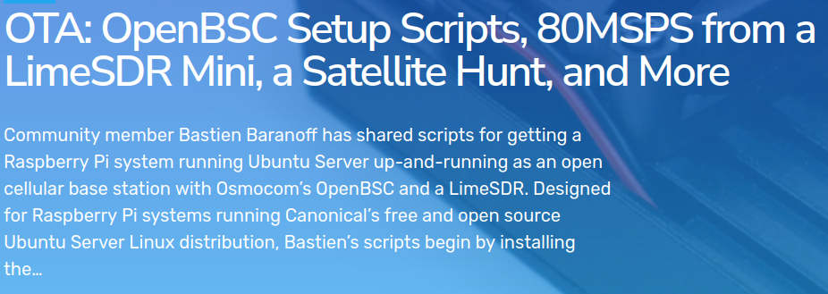

---

> | "The quieter you become the most you are able to hear"

---

---
## Experience  

### Developer  

  

### Junior Researcher 
  
  

### CyberSecurity Analyst  
  
  
  
---

---

## Quoted :

Second Time :  

First TIme :  

---

---

## Stuff

---
