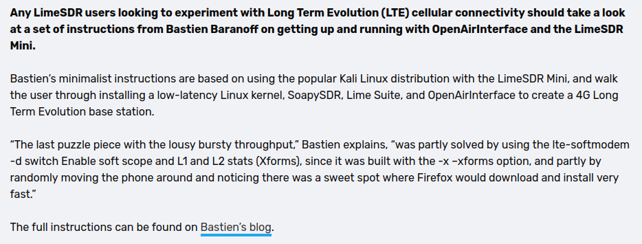

# Specific to this theme
site_author: Carlos Pereira Atencio
repo_url: 'https://github.com/carlosperate/jekyll-theme-rtd'
edit_on_github: true
github_docs_folder: true
logo: 'https://your.url/image.png'
site_favicon: 'https://your.url/here.ico'
sticky_navigation: true
prev_next_buttons_location: None
prev_next_buttons_location: top
prev_next_buttons_location: bottom
prev_next_buttons_location: both
search_enabled: true
google_analytics: UA-XXXXX-Y
google_analytics_anonymize_ip: true
# The highlight.js library provides 79 different colours for their syntax highlighting. The default is github-gist.
hljs_style: github-gist

---
layout: home
title: Resume
nav_order: 1
---

---

> | "The quieter you become the most you are able to hear"

---

---
## Experience  

### Developer  

  

### Junior Researcher 
  
  

### CyberSecurity Analyst  
  
  
  
---

---

## Quoted :

Second Time :  

First TIme :  

---

---

## Stuff

---
