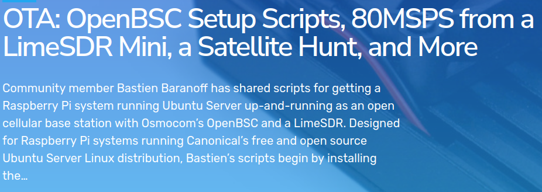
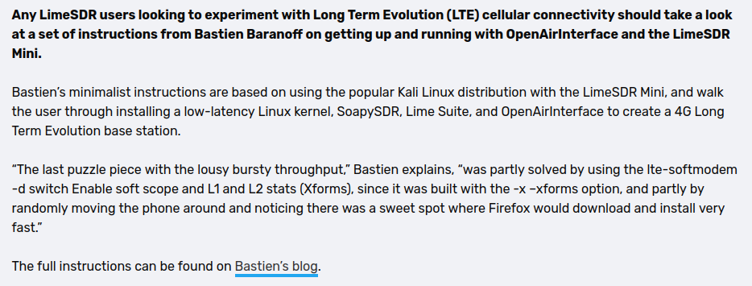

# Resume

```tip

The quieter you become the most you are able to hear

```


## 🛰️ À la une — GSM de A à Z, sans matériel

Deux projets open-source qui, ensemble, montent **un réseau GSM complet** et **émulent le baseband d'un vrai téléphone** — puis un cours qui déroule chaque étape.

- **[`qemu-calypso`](https://github.com/bbaranoff/qemu-calypso)** — émule le baseband **TI Calypso** (Motorola C1xx / Compal E88) dans QEMU : un **ARM** exécute le firmware osmocom-bb *non patché* et un **DSP TMS320C54x** exécute la *vraie mask-ROM TI*, reliés par la mailbox `0xFFD00000`.
- **[`osmo_egprs`](https://github.com/bbaranoff/osmo_egprs)** — un réseau GSM **multi-opérateur** interconnecté en **SS7/IP**, entièrement conteneurisé (« un DHCP pour SS7 »).

```danger

**Point d'avancement (2026-08-24).** En mode `shunt_legit`, la pile GSM tourne **de bout en bout** — camp, Location Update, auth COMP128v1, **A5/1**, SMS et **appel voix avec audio**. En mode `native`, **le Frequency Burst est désormais acquis par le vrai DSP** (437 transitions mesurées, sans injection) ; le mur suivant est le décodage du SCH.

```

👉 **Cours associés :** [Lab GSM multi-opérateur](cours/telco/1-Lab-GSM-multiPLMN.md) · [Émulation du baseband Calypso](cours/telco/2-QEMU-Calypso.md) · [GSM étape par étape](cours/telco/3-GSM-etape-par-etape.md) · [Casser A5/1](cours/telco/4-A5-1-cracking.md)


## Profile information
    
name | Bastien Baranoff
tagline | Cybersecurity in Software Defined Radio
email | bastienbaranoff@gmail.com
timezone | Paris/France
website | https://bbaranoff.github.io/
linkedin | Bastien Baranoff
github | bbaranoff
twitter | '@bastienbaranoff'
    
## Languages:

```note

French: Native |  English: Professional

```


## Career Profile:

```warning

Physics -> Electronics -> Computer -> Embedded -> Software Defined Radio

```


## Education:

|
degree |  MSc in Electronics Computers 
university | University of Perpignan via Domitia
time | 2011 - 2013

|
degree | Licence In Computer Science
university | University of Perpignan via Domitia
time | 2020-2021

## Experience

- CyberSecurity Research
  - time: 2024
  - company: Penthertz

- Former
  - time: 2024
  - company: University of Perpignan via Domitia

- Developper
  - time: 2021
  - company: PROMES-CNRS
  - details: LoRa(WAN) connection testing

- Developper
  - time: 2020
  - company: Tata Advanced System Limited
  - details: Mobile Security Assesment

- Former
  - time: 2017
  - company: Lycée Déodat de Séverac

- Electrical Engenering
  - time: 2013
  - company: PROMES-CNRS
  - details: Junior Research

### Developer  

<a href="https://www.tataadvancedsystems.com/"></a> 

### Junior Researcher 
  
<a href="https://www.promes.cnrs.fr/"></a>

### CyberSecurity Analyst  
  
<a href="https://penthertz.com/"></a>    
  
### Former  
  
<a href="https://univ-perp.fr/"></a>  
  
### Former (Education Nationale)  
  
<a href="https://www.education.gouv.fr/"></a>


## Quoted :

Second Time :  

[](https://myriadrf.org/news/ota-openbsc-setup-scripts-80msps-from-a-limesdr-mini-a-satellite-hunt-and-more/)

First TIme :  

[](https://myriadrf.org/news/ota-openbsc-setup-scripts-80msps-from-a-limesdr-mini-a-satellite-hunt-and-more/)


## Cited in Academic Research

```note

My open-source work on LTE redirection attacks is referenced in peer-reviewed academic research.

```

**M. Gronau, A. Bysewski, K. Kobierzyński, A. Trzebiatowski, J. Filipiak**, *"Evaluation of 4G-LTE security and realization of a test stand for redirection attack"*, Gdańsk University of Technology (Politechnika Gdańska), Department of Radio Communication Systems and Networks, 2021.

> The team built a 4G-LTE simulation test stand and used my published Docker image and tooling to carry out the LTE redirection attack, citing my GitHub as reference **[29]**.

[Project page](https://projektgrupowy.eti.pg.gda.pl/editions/16/projects/4170/presentations/109) — supervised by Dr. Eng. Piotr Rajchowski.

### Community & Technical Write-ups

- **Osmocom Forum** — [Porting QEMU to Layer1 highram ELF in a no-RF Osmocom Network-in-the-Box environment](https://discourse.osmocom.org/t/porting-qemu-to-layer1-highram-elf-in-a-no-rf-osmocom-network-in-the-box-environment/) — running the Calypso Layer 1 firmware under QEMU emulation, with no RF hardware, inside an Osmocom network-in-the-box. Related work: [qemu-calypso](https://github.com/bbaranoff/qemu-calypso).


## Stuff

[](https://x.com/i/status/1763577169865826734)


## Projects:


```danger

Curious about A5/1 in the 2010s I searched around the internet and found a lot of interesting resources

```


## Open-Source Contributions

```tip

A selection of my public repositories, grouped by field. Full list on [github.com/bbaranoff](https://github.com/bbaranoff).

```

### 📡 LTE / 5G — Downgrade & Redirection Attacks

Forcing a target UE from a modern network down to an insecure GSM/EDGE layer.

| Project | ★ | Description |
| --- | --- | --- |
| [LTE-Redirection_Attack](https://github.com/bbaranoff/LTE-Redirection_Attack) | 33 | Force a target victim onto an unsafe network (the tool cited in academic research above). |
| [openlte](https://github.com/bbaranoff/openlte) | 18 | OpenLTE stack used as a base for redirection research. |
| [srslte_to_gsm](https://github.com/bbaranoff/srslte_to_gsm) | 11 | Downgrade path from srsLTE-based LTE to GSM. |
| [openLTE2GSM](https://github.com/bbaranoff/openLTE2GSM) | 8 | LTE → GSM redirection workflow. |
| [redir5Gted2Gsm](https://github.com/bbaranoff/redir5Gted2Gsm) | 7 | Redirect from 5G-NSA down to GSM. |
| [redirect0r](https://github.com/bbaranoff/redirect0r) | 4 | Dockerized redirection attack LTE/5G-NSA → EDGE/GSM. |
| [NSA_LTE_redirect_to_EDGE](https://github.com/bbaranoff/NSA_LTE_redirect_to_EDGE) | 4 | The long-awaited full 5G-NSA → EDGE workflow. |
| [LTE-Cell-ScannerBladeRF2](https://github.com/bbaranoff/LTE-Cell-ScannerBladeRF2) | 3 | LTE cell scanner for BladeRF 2.0. |

### 📶 2G / GSM — Osmocom, BTS & IMSI Catchers

Standing up rogue base stations and Calypso-based mobile stations.

| Project | ★ | Description |
| --- | --- | --- |
| [telco_install_sh](https://github.com/bbaranoff/telco_install_sh) | 19 | One-shot install scripts for a full 2G network-in-the-box. |
| [srsran_4G_RTE](https://github.com/bbaranoff/srsran_4G_RTE) | 11 | IMSI catcher, reloaded. |
| [osmo-GUI](https://github.com/bbaranoff/osmo-GUI) | 9 | Graphical front-end for Osmocom and `osmocon` scripting. |
| [osmocombb-ansible](https://github.com/bbaranoff/osmocombb-ansible) | 7 | Ansible automation for OsmocomBB / CalypsoBTS. |
| [HeArTbReAkEr](https://github.com/bbaranoff/HeArTbReAkEr) | 6 | Exploration of subscriber impersonation with Osmocom. |
| [calypsogprs](https://github.com/bbaranoff/calypsogprs) | 5 | GPRS support files for CalypsoBTS. |
| [osmo_egprs](https://github.com/bbaranoff/osmo_egprs) | 5 | EGPRS on Osmocom. |
| [OpBTS-LimeMini](https://github.com/bbaranoff/OpBTS-LimeMini) | 4 | OpenBTS on a LimeSDR Mini. |
| [qemu-calypso](https://github.com/bbaranoff/qemu-calypso) | 4 | QEMU emulation of the Calypso baseband ("Calypso Machine" test). |

### 🔐 Cryptography & Cracking

| Project | ★ | Description |
| --- | --- | --- |
| [A53](https://github.com/bbaranoff/A53) | — | CUDA-accelerated A5/3 cracker. |
| [a51_tools](https://github.com/bbaranoff/a51_tools) | — | Tooling around A5/1 rainbow tables. |
| [dst80](https://github.com/bbaranoff/dst80) / [dst80_reversing](https://github.com/bbaranoff/dst80_reversing) | 3 | Reversing the DST80 automotive keyless cipher. |
| [tea1-cracker](https://github.com/bbaranoff/tea1-cracker) | — | Experiments against the TETRA TEA1 cipher. |

### 🐞 Vulnerability Research & Exploits

| Project | ★ | Description |
| --- | --- | --- |
| [CVE-2022-0847](https://github.com/bbaranoff/CVE-2022-0847) | 50 | "Dirty Pipe" Linux local privilege escalation PoC. |
| [CVE-2023-4863](https://github.com/bbaranoff/CVE-2023-4863) | 6 | libwebp heap buffer overflow PoC. |
| [brute_ubuntu_lpe](https://github.com/bbaranoff/brute_ubuntu_lpe) | — | Ubuntu local-privilege-escalation brute forcing. |

### ☎️ Signaling & Fraud

| Project | ★ | Description |
| --- | --- | --- |
| [callerid_spoofing](https://github.com/bbaranoff/callerid_spoofing) | 10 | Methodology to spoof caller ID. |
| [2RFA](https://github.com/bbaranoff/2RFA) | 1 | Proof of concept for catching 2FA codes over RF. |

### 🛰️ SDR, IoT & Misc

| Project | ★ | Description |
| --- | --- | --- |
| [software-defined-radio](https://github.com/bbaranoff/software-defined-radio) | 1 | General SDR utilities. |
| [ttn-gps](https://github.com/bbaranoff/ttn-gps) | 2 | LoRaWAN / The Things Network GPS tracker. |
| [llm-bridge](https://github.com/bbaranoff/llm-bridge) | — | Bridge between telco tooling and a local LLM (Ollama). |
| [telco_story](https://github.com/bbaranoff/telco_story) | 3 | A written story of the telecommunications journey. |


