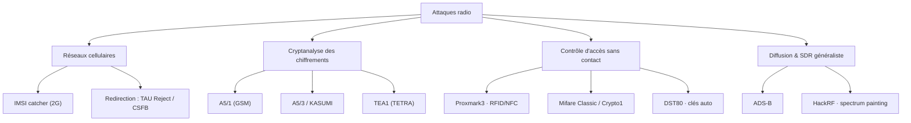

# Abstract — Attaques sur les protocoles radio

```danger

Panorama **général** à visée pédagogique et défensive. Aucune procédure
opérationnelle : uniquement la nature de chaque attaque, pourquoi elle est
possible, et une référence de code. À réserver à la recherche, au pentest autorisé
et à la démonstration légale.

```

Vue d'ensemble des attaques radio « classiques » et de celles développées dans mon
cadre (réseaux cellulaires, cryptanalyse, contrôle d'accès sans contact, SDR
généraliste). Chaque entrée reste au niveau de la **description générale**, avec
son dépôt de référence.



---

## Réseaux cellulaires — identité & interception

### IMSI catcher (2G)

Fausse station de base exploitant l'**authentification unilatérale** du GSM : le
mobile s'accroche à la cellule au signal le plus fort **sans vérifier** le réseau.
En diffusant les valeurs publiques d'un opérateur (MCC/MNC) avec une puissance
supérieure, la fausse BTS provoque la divulgation de l'**IMSI/IMEI** et peut
forcer un downgrade ou l'interception.
→ [`osmo_egprs`](https://github.com/bbaranoff/osmo_egprs) ·
[`srsran_4G_RTE`](https://github.com/bbaranoff/srsran_4G_RTE) ·
[`telco_install_sh`](https://github.com/bbaranoff/telco_install_sh)

### Redirection — TAU Reject / CSFB

Downgrade d'un réseau moderne vers une couche plus faible. En LTE/5G-NSA, les
messages RRC/NAS **antérieurs à l'authentification** ne sont pas protégés en
intégrité : un faux eNB peut émettre une redirection (`RRCConnectionRelease` avec
`redirectedCarrierInfo`) ou un **TAU Reject** poussant l'UE vers la 2G/3G. Le
**CSFB** (repli circuit-switched pour la voix) offre un levier analogue en
ramenant l'UE sur GSM, où l'interception (IMSI catcher, A5/1) redevient possible.
→ [`LTE-Redirection_Attack`](https://github.com/bbaranoff/LTE-Redirection_Attack) ·
[`redir5Gted2Gsm`](https://github.com/bbaranoff/redir5Gted2Gsm) ·
[`redirect0r`](https://github.com/bbaranoff/redirect0r) ·
[`NSA_LTE_redirect_to_EDGE`](https://github.com/bbaranoff/NSA_LTE_redirect_to_EDGE)

---

## Cryptanalyse des chiffrements radio

### A5/1 (GSM)

Chiffrement par flot de l'interface air GSM. Cassé par **compromis
temps-mémoire** (tables arc-en-ciel, Kraken/deka) : du **plaintext connu** (trames
LAPDm prévisibles) donne du keystream, d'où l'état interne puis la clé de session
**Kc**.
→ [`a51_tools`](https://github.com/bbaranoff/a51_tools)

### A5/3 / KASUMI

Le chiffrement « renforcé » de la 2G/3G (GSM/GPRS/UMTS). Cassé académiquement
(attaque *sandwich* / related-key de Dunkelman–Keller–Shamir) ; l'attaque pratique
se parallélise sur GPU.
→ [`A53`](https://github.com/bbaranoff/A53) (accéléré CUDA)

### TEA1 (TETRA)

Un des chiffrements de la radio professionnelle **TETRA**. Les travaux
*TETRA:BURST* ont révélé que TEA1 a un **espace de clé effectif volontairement
réduit** — faiblesse de classe *backdoor* rendant la clé récupérable par force
brute.
→ [`tea1-cracker`](https://github.com/bbaranoff/tea1-cracker)

---

## Contrôle d'accès sans contact & clés

### Proxmark3 — RFID/NFC

Plateforme matérielle/logicielle de référence pour la recherche RFID/NFC (LF
125 kHz & HF 13,56 MHz) : sniffer, lire, rejouer, émuler et cloner des cartes
sans contact.
→ [`RfidResearchGroup/proxmark3`](https://github.com/RfidResearchGroup/proxmark3)

### Mifare Classic / Crypto1

Carte 13,56 MHz très répandue dont le chiffrement propriétaire **Crypto1** a été
rétro-conçu. Les attaques *darkside* et *nested* récupèrent les clés de secteur en
quelques secondes à minutes, permettant le clonage.
→ [`nfc-tools/mfoc`](https://github.com/nfc-tools/mfoc) ·
[`nfc-tools/mfcuk`](https://github.com/nfc-tools/mfcuk)

### DST80 — clés automobiles

Le chiffre **DST80** de Texas Instruments équipe de nombreux immobiliseurs et
clés mains-libres (Toyota, Kia/Hyundai, Tesla Model S). La rétro-ingénierie du
chiffre et la faiblesse de dérivation de clé permettent, en principe, le clonage
de télécommande.
→ [`dst80`](https://github.com/bbaranoff/dst80) ·
[`dst80_reversing`](https://github.com/bbaranoff/dst80_reversing)

---

## Diffusion & SDR généraliste

### ADS-B (aviation)

Surveillance aéronautique diffusée en clair à 1090 MHz, **ni authentifiée ni
chiffrée** : n'importe quel SDR la reçoit, et l'absence d'authentification rend
l'**injection d'aéronefs fantômes** possible en principe.
→ [ADS-B (projet)](6-Adsb.md) ·
[`flightaware/dump1090`](https://github.com/flightaware/dump1090)

### HackRF — spectrum painting

Émettre, avec un SDR large bande (**HackRF**), un signal dont la répartition
temps-fréquence **dessine une image** visible dans le waterfall d'un récepteur :
démonstration d'émission large bande arbitraire.
→ [`greatscottgadgets/hackrf`](https://github.com/greatscottgadgets/hackrf) ·
[`portapack-mayhem/mayhem-firmware`](https://github.com/portapack-mayhem/mayhem-firmware)

---

## Références GitHub

| Attaque | Dépôt(s) |
|---------|----------|
| IMSI catcher (2G) | [osmo_egprs](https://github.com/bbaranoff/osmo_egprs) · [srsran_4G_RTE](https://github.com/bbaranoff/srsran_4G_RTE) · [telco_install_sh](https://github.com/bbaranoff/telco_install_sh) |
| Redirection TAU Reject / CSFB | [LTE-Redirection_Attack](https://github.com/bbaranoff/LTE-Redirection_Attack) · [redir5Gted2Gsm](https://github.com/bbaranoff/redir5Gted2Gsm) · [redirect0r](https://github.com/bbaranoff/redirect0r) · [NSA_LTE_redirect_to_EDGE](https://github.com/bbaranoff/NSA_LTE_redirect_to_EDGE) |
| A5/1 | [a51_tools](https://github.com/bbaranoff/a51_tools) |
| A5/3 / KASUMI | [A53](https://github.com/bbaranoff/A53) |
| TEA1 (TETRA) | [tea1-cracker](https://github.com/bbaranoff/tea1-cracker) |
| DST80 | [dst80](https://github.com/bbaranoff/dst80) · [dst80_reversing](https://github.com/bbaranoff/dst80_reversing) |
| Proxmark3 | [RfidResearchGroup/proxmark3](https://github.com/RfidResearchGroup/proxmark3) |
| Mifare Classic / Crypto1 | [nfc-tools/mfoc](https://github.com/nfc-tools/mfoc) · [nfc-tools/mfcuk](https://github.com/nfc-tools/mfcuk) |
| ADS-B | [flightaware/dump1090](https://github.com/flightaware/dump1090) |
| HackRF painting | [greatscottgadgets/hackrf](https://github.com/greatscottgadgets/hackrf) · [portapack-mayhem/mayhem-firmware](https://github.com/portapack-mayhem/mayhem-firmware) |

---

*Approfondissement : [cours Télécom & SDR](../cours/telco/) · [projets](index.md).*
