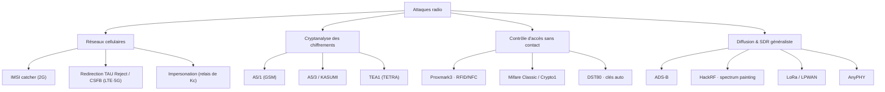

# Abstract — Attaques sur les protocoles radio

```danger

Panorama à visée **pédagogique et défensive** : la nature de chaque attaque,
pourquoi elle est possible, le **cours/projet** qui la détaille, le **dépôt** de
code et une **démo (PoC)**. À réserver à la recherche, au pentest autorisé et à la
démonstration légale.

```

Vue d'ensemble des attaques radio « classiques » et de celles développées dans mon
cadre. Chaque entrée renvoie au **cours ou projet correspondant** et embarque sa
**preuve de concept**.



---

## Réseaux cellulaires — identité & interception

### IMSI catcher (2G)

Le GSM n'authentifie le réseau **que dans un sens** : le mobile prouve son identité
à la BTS (SRES = A3/A8(Ki, RAND)), mais **ne vérifie jamais** que la BTS est
légitime. Une fausse station de base qui rejoue les valeurs publiques d'un opérateur
(MCC/MNC, LAC) avec un signal plus fort capte donc les mobiles alentour, force la
**divulgation de l'IMSI/IMEI** (via un *Identity Request*), et peut désactiver le
chiffrement (A5/0) pour intercepter — ou pousser un downgrade. C'est la brique de
base de toute la chaîne d'interception 2G.
→ Cours : [Lab GSM multi-opérateur](../cours/telco/1-Lab-GSM-multiPLMN.md) ·
[GSM étape par étape](../cours/telco/3-GSM-etape-par-etape.md) ·
Dépôts : [`osmo_egprs`](https://github.com/bbaranoff/osmo_egprs) ·
[`srsran_4G_RTE`](https://github.com/bbaranoff/srsran_4G_RTE) ·
[`telco_install_sh`](https://github.com/bbaranoff/telco_install_sh)

**🎥 PoC — osmo_egprs (réseau 2G complet)**

<iframe src="https://www.youtube.com/embed/wDtq5AQ6RM8" title="PoC osmo_egprs" width="560" height="315" style="width:min(560px,100%);aspect-ratio:16/9;height:auto;border:0;border-radius:10px;margin:.4rem 0" allow="accelerometer; autoplay; clipboard-write; encrypted-media; gyroscope; picture-in-picture; web-share" allowfullscreen loading="lazy"></iframe>

### Redirection — TAU Reject / CSFB (LTE · 5G-NSA)

En 4G/5G l'eNodeB doit s'authentifier mutuellement : impossible d'usurper le réseau
comme en 2G. Mais les messages **RRC/NAS antérieurs à l'authentification** ne sont
**pas protégés en intégrité**. Un faux eNB peut donc émettre une redirection
(`RRCConnectionRelease` + `redirectedCarrierInfo` désignant une cellule GERAN) ou un
**TAU Reject** (« pas de 4G ici »), et forcer l'UE à **redescendre en 2G/EDGE** ; le
**CSFB** (repli circuit-switched pour la voix) offre le même levier. En 5G-NSA, le
plan de contrôle reste ancré sur LTE, donc **la même faiblesse s'applique**. Une
fois l'UE en 2G sans authentification réseau, l'IMSI catcher et le cassage A5/1
prennent le relais — les deux leviers forment **une seule chaîne**.
→ Projet : [Telco Stuff — redirection](telco.md) · Dépôts :
[`LTE-Redirection_Attack`](https://github.com/bbaranoff/LTE-Redirection_Attack) ·
[`redir5Gted2Gsm`](https://github.com/bbaranoff/redir5Gted2Gsm) ·
[`redirect0r`](https://github.com/bbaranoff/redirect0r) ·
[`NSA_LTE_redirect_to_EDGE`](https://github.com/bbaranoff/NSA_LTE_redirect_to_EDGE)

**🎥 PoC — redirection LTE → 2G**

<iframe src="https://www.youtube.com/embed/o_UBszip8LA" title="PoC redirection" width="560" height="315" style="width:min(560px,100%);aspect-ratio:16/9;height:auto;border:0;border-radius:10px;margin:.4rem 0" allow="accelerometer; autoplay; clipboard-write; encrypted-media; gyroscope; picture-in-picture; web-share" allowfullscreen loading="lazy"></iframe>

**🎥 PoC — 5G-NSA (srsRAN)**

<iframe src="https://www.youtube.com/embed/ZR0HsDPNGxs" title="PoC 5G srsRAN" width="560" height="315" style="width:min(560px,100%);aspect-ratio:16/9;height:auto;border:0;border-radius:10px;margin:.4rem 0" allow="accelerometer; autoplay; clipboard-write; encrypted-media; gyroscope; picture-in-picture; web-share" allowfullscreen loading="lazy"></iframe>

### Impersonation — relais de l'authentification (Kc)

On usurpe l'identité d'un abonné **sans jamais extraire son Ki**. Le Ki ne sort pas
de la SIM ; on ne le casse donc pas, on **relaie** le défi : la vraie BTS envoie
`RAND/key_seq` à un *Evil-MS*, qui le transmet (par socket) à un *Evil-BTS*, qui le
présente au **vrai téléphone** ; celui-ci calcule `SRES = A3/A8(Ki, RAND)` et le
**Kc**, qui remontent la même chaîne jusqu'à la vraie BTS. L'attaquant est alors
**authentifié comme la victime**, la vraie SIM ayant fait le calcul à son insu.
→ Projet : [Telco Stuff — impersonation](telco.md) · Dépôt :
[`HeArTbReAkEr`](https://github.com/bbaranoff/HeArTbReAkEr)

**🎥 PoC — impersonation (Kc relayé)**

<iframe src="https://www.youtube.com/embed/LPRLLKoSKKY" title="PoC impersonation" width="560" height="315" style="width:min(560px,100%);aspect-ratio:16/9;height:auto;border:0;border-radius:10px;margin:.4rem 0" allow="accelerometer; autoplay; clipboard-write; encrypted-media; gyroscope; picture-in-picture; web-share" allowfullscreen loading="lazy"></iframe>

---

## Cryptanalyse des chiffrements radio

### A5/1 (GSM)

Chiffrement par flot à état interne de 64 bits (3 LFSR) protégeant l'interface air
GSM. On ne l'attaque pas frontalement : avec un fragment de **plaintext connu** (les
System Information 5/6 de la SACCH, au contenu fixe et répété toutes les 102 trames)
on isole du **keystream** par simple XOR. Un **compromis temps-mémoire** (tables
arc-en-ciel Kraken/deka, ~8 To) remonte 64 bits de keystream à l'**état interne**,
puis `find_kc` en tire la clé de session **Kc** — vérifiée sur une seconde trame.
Cassé publiquement depuis 2009 (Nohl/Munaut, 27C3).
→ Cours : [Casser A5/1, à la main](../cours/telco/4-A5-1-cracking.md) · Dépôt :
[`a51_tools`](https://github.com/bbaranoff/a51_tools)

**🎥 PoC — A5/1 de bout en bout**

<iframe src="https://www.youtube.com/embed/GOt0Hav3Np8" title="PoC A5/1" width="560" height="315" style="width:min(560px,100%);aspect-ratio:16/9;height:auto;border:0;border-radius:10px;margin:.4rem 0" allow="accelerometer; autoplay; clipboard-write; encrypted-media; gyroscope; picture-in-picture; web-share" allowfullscreen loading="lazy"></iframe>

### A5/3 / KASUMI

Le chiffrement « renforcé » de la 2G/3G (GEA/UMTS), fondé sur KASUMI. Cassé
**académiquement** par l'attaque *sandwich* / related-key de Dunkelman–Keller–Shamir
(2010) — pratique en complexité mais nécessitant des relations de clés difficiles à
réunir sur un réseau réel. L'implémentation ici parallélise la recherche sur **GPU**
(CUDA) pour la démonstration.
→ Dépôt : [`A53`](https://github.com/bbaranoff/A53) (accéléré CUDA)

### TEA1 (TETRA)

Un des chiffrements de la radio professionnelle **TETRA** (secours, industrie,
forces de l'ordre). Les travaux **TETRA:BURST** (Midnight Blue, 2023) ont révélé que
TEA1 réduit **volontairement** son espace de clé effectif à ~**32 bits** — une
faiblesse de classe *backdoor*. Avec un fragment de clair connu (en-têtes LLC/IP),
un GPU parcourt tout l'espace en **quelques minutes** via OpenCL, avec validation
sur 64 bits de keystream pour éliminer les collisions.
→ Projet : [Cryptanalyse — TEA1](cryptanalyse.md) · Dépôt :
[`tea1-cracker`](https://github.com/bbaranoff/tea1-cracker)

**🎥 PoC — TEA1 (OpenCL)**

<iframe src="https://www.youtube.com/embed/39nY4-2f3ts" title="PoC TEA1" width="560" height="315" style="width:min(560px,100%);aspect-ratio:16/9;height:auto;border:0;border-radius:10px;margin:.4rem 0" allow="accelerometer; autoplay; clipboard-write; encrypted-media; gyroscope; picture-in-picture; web-share" allowfullscreen loading="lazy"></iframe>

---

## Contrôle d'accès sans contact & clés

### Proxmark3 — RFID/NFC

Plateforme matérielle/logicielle de référence pour la recherche RFID/NFC — LF
125 kHz (EM410x, HID, Hitag) et HF 13,56 MHz (ISO 14443/15693). Elle **sniffe**
l'échange lecteur↔carte, **rejoue** et **émule** des tags, et **clone** des cartes
sans contact ; c'est l'outil pivot pour auditer badges d'accès et transpondeurs.
→ Dépôt : [`RfidResearchGroup/proxmark3`](https://github.com/RfidResearchGroup/proxmark3)

### Mifare Classic / Crypto1

La carte 13,56 MHz la plus déployée (transports, contrôle d'accès) repose sur le
chiffrement propriétaire **Crypto1**, rétro-conçu en 2008. Ses faiblesses (LFSR de
48 bits, PRNG prévisible, fuite de parité) permettent aux attaques **darkside** puis
**nested** de récupérer les clés de secteur en **secondes à minutes** à partir d'une
seule carte — ouvrant au **clonage** intégral. Crypto1 est aujourd'hui totalement
cassé ; seules les Mifare Plus/DESFire (AES) résistent.
→ Dépôts : [`nfc-tools/mfoc`](https://github.com/nfc-tools/mfoc) ·
[`nfc-tools/mfcuk`](https://github.com/nfc-tools/mfcuk)

**🎥 PoC — Mifare Classic (brute-force Crypto1)**

<iframe src="https://www.youtube.com/embed/okvXoV0f5P8" title="PoC Mifare" width="560" height="315" style="width:min(560px,100%);aspect-ratio:16/9;height:auto;border:0;border-radius:10px;margin:.4rem 0" allow="accelerometer; autoplay; clipboard-write; encrypted-media; gyroscope; picture-in-picture; web-share" allowfullscreen loading="lazy"></iframe>

### DST80 — clés automobiles

Le chiffre **DST80** de Texas Instruments équipe immobiliseurs et clés mains-libres
(Toyota, Kia/Hyundai, Tesla Model S). Sa clé de 80 bits est en pratique bien plus
faible : **symétrie** `KR = complément inversé de KL` (÷2) et ~**32 bits** de
**constantes constructeur** fixes ramènent la recherche à ~2³² — épuisée en **~26 s**
sur un GPU haut de gamme via OpenCL. Une fois les constantes d'un constructeur
connues, toute clé du même parc se calcule directement depuis le numéro de série.
→ Projet : [Cryptanalyse — DST80](cryptanalyse.md) · Dépôts :
[`dst80`](https://github.com/bbaranoff/dst80) ·
[`dst80_reversing`](https://github.com/bbaranoff/dst80_reversing)

**🎥 PoC — DST80 (récupération de clé)**

<iframe src="https://www.youtube.com/embed/aXoWpTccLAk" title="PoC DST80" width="560" height="315" style="width:min(560px,100%);aspect-ratio:16/9;height:auto;border:0;border-radius:10px;margin:.4rem 0" allow="accelerometer; autoplay; clipboard-write; encrypted-media; gyroscope; picture-in-picture; web-share" allowfullscreen loading="lazy"></iframe>

---

## Diffusion & SDR généraliste

### ADS-B (aviation)

Surveillance aéronautique diffusée en clair à **1090 MHz** (Mode S extended
squitter), **ni authentifiée ni chiffrée**. N'importe quel SDR la reçoit
(`dump1090`) et décode identifiant ICAO, indicatif, altitude et **position** (CPR).
L'absence totale d'authentification rend l'**injection d'aéronefs fantômes**
possible en principe — d'où les efforts de sécurisation (ADS-B v2, multilatération).
→ Projet : [Radio Stuff — ADS-B](radio_stuff.md) · Dépôt :
[`flightaware/dump1090`](https://github.com/flightaware/dump1090)

### HackRF — spectrum painting

Émettre, avec un SDR large bande (**HackRF**), un signal dont la répartition
temps-fréquence **dessine une image** visible dans le waterfall d'un récepteur.
Au-delà du gadget, c'est une démonstration d'**émission large bande arbitraire** :
maîtrise fine de la phase/amplitude sur toute la bande.
→ Dépôts : [`greatscottgadgets/hackrf`](https://github.com/greatscottgadgets/hackrf) ·
[`portapack-mayhem/mayhem-firmware`](https://github.com/portapack-mayhem/mayhem-firmware)

**🎥 PoC — spectrum painting**

<video controls preload="metadata" playsinline width="560" style="width:min(560px,100%);height:auto;border-radius:10px;margin:.4rem 0"><source src="assets/paint_spectrum.mp4" type="video/mp4">Votre navigateur ne lit pas la vidéo — <a href="assets/paint_spectrum.mp4">télécharger</a>.</video>

### LoRa / LPWAN

Réseau bas-débit longue portée (LPWAN) pour l'IoT, diffusé sur bandes ISM
(868 MHz en Europe) et reçu par n'importe quel SDR. La sécurité repose **entièrement**
sur les clés **LoRaWAN** (AppKey/NwkKey) : une provision faible, la réutilisation de
nonces, ou le mode **ABP** (clés statiques) ouvrent au **rejeu** et à l'**usurpation
de nœud**.
→ Projet : [Radio Stuff — LoRa](radio_stuff.md) · Dépôts :
[`ttn-gps`](https://github.com/bbaranoff/ttn-gps) · [`lora`](https://github.com/bbaranoff/lora)

### AnyPHY

Démonstration d'une **couche physique SDR flexible** : porter, mesurer ou injecter
sur une PHY arbitraire depuis un logiciel radio, sans matériel dédié. Le socle
générique qui permet de rejouer/instrumenter les couches basses présentées plus
haut.

**🎥 PoC — AnyPHY**

<iframe src="https://www.youtube.com/embed/Wt3Up5A56ns" title="PoC AnyPHY" width="560" height="315" style="width:min(560px,100%);aspect-ratio:16/9;height:auto;border:0;border-radius:10px;margin:.4rem 0" allow="accelerometer; autoplay; clipboard-write; encrypted-media; gyroscope; picture-in-picture; web-share" allowfullscreen loading="lazy"></iframe>

<iframe src="https://www.youtube.com/embed/FLUPr-bv35w" title="PoC AnyPHY (short)" width="315" height="560" style="width:min(315px,100%);aspect-ratio:9/16;height:auto;border:0;border-radius:10px;margin:.4rem 0" allow="accelerometer; autoplay; clipboard-write; encrypted-media; gyroscope; picture-in-picture; web-share" allowfullscreen loading="lazy"></iframe>

---

## Références GitHub

| Attaque | Cours / Projet | Dépôt(s) |
|---------|----------------|----------|
| IMSI catcher (2G) | [Lab GSM](../cours/telco/1-Lab-GSM-multiPLMN.md) | [osmo_egprs](https://github.com/bbaranoff/osmo_egprs) · [srsran_4G_RTE](https://github.com/bbaranoff/srsran_4G_RTE) |
| Redirection TAU/CSFB | [Telco Stuff](telco.md) | [LTE-Redirection_Attack](https://github.com/bbaranoff/LTE-Redirection_Attack) · [redirect0r](https://github.com/bbaranoff/redirect0r) · [NSA_LTE_redirect_to_EDGE](https://github.com/bbaranoff/NSA_LTE_redirect_to_EDGE) |
| Impersonation | [Telco Stuff](telco.md) | [HeArTbReAkEr](https://github.com/bbaranoff/HeArTbReAkEr) |
| A5/1 | [Casser A5/1](../cours/telco/4-A5-1-cracking.md) | [a51_tools](https://github.com/bbaranoff/a51_tools) |
| A5/3 / KASUMI | — | [A53](https://github.com/bbaranoff/A53) |
| TEA1 (TETRA) | [Cryptanalyse](cryptanalyse.md) | [tea1-cracker](https://github.com/bbaranoff/tea1-cracker) |
| Mifare Classic / Crypto1 | — | [nfc-tools/mfoc](https://github.com/nfc-tools/mfoc) · [nfc-tools/mfcuk](https://github.com/nfc-tools/mfcuk) |
| DST80 | [Cryptanalyse](cryptanalyse.md) | [dst80_reversing](https://github.com/bbaranoff/dst80_reversing) |
| Proxmark3 | — | [RfidResearchGroup/proxmark3](https://github.com/RfidResearchGroup/proxmark3) |
| ADS-B | [Radio Stuff](radio_stuff.md) | [flightaware/dump1090](https://github.com/flightaware/dump1090) |
| HackRF painting | — | [greatscottgadgets/hackrf](https://github.com/greatscottgadgets/hackrf) |
| LoRa / LPWAN | [Radio Stuff](radio_stuff.md) | [ttn-gps](https://github.com/bbaranoff/ttn-gps) · [lora](https://github.com/bbaranoff/lora) |

---

*Approfondissement : [cours Télécom & SDR](../cours/telco/) · [projets](index.md).*
