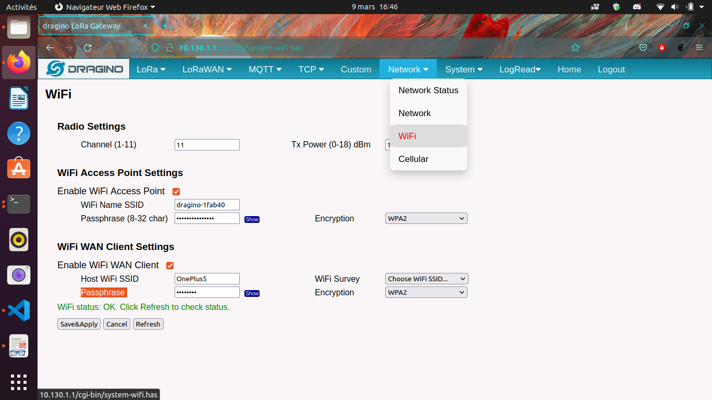
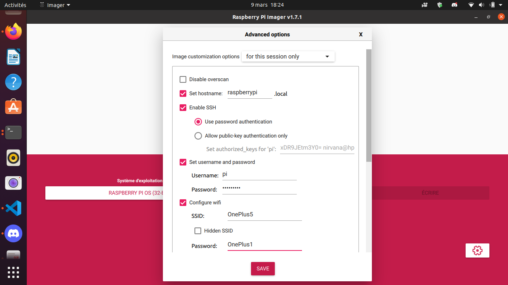
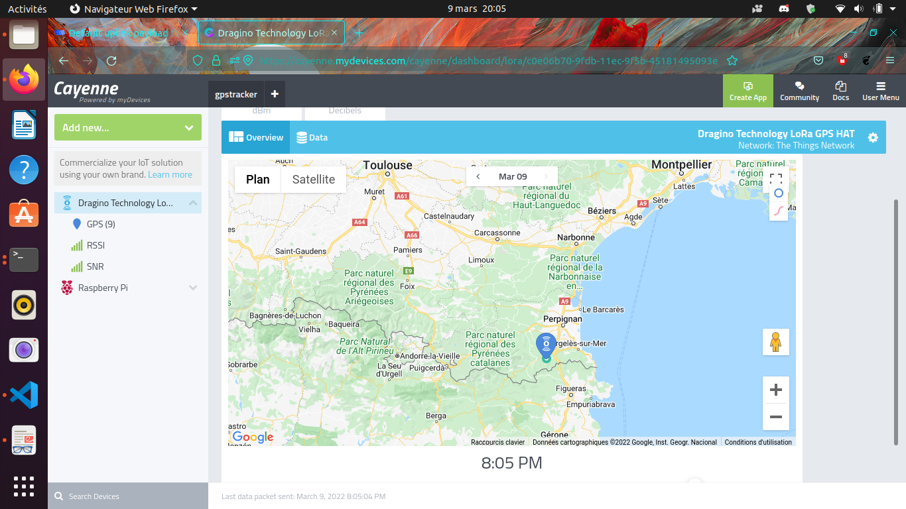

# **Lora :**

# **GPS tracker via LoraWAN**

[](assets/uml.png)

ISO :
<https://drive.google.com/file/d/1YTdmb8JlvePSKiniwBKYyqXx-m-NhzIe/view?usp=sharing>

**Installation du routeur sur Internet (via WiFi)**

N.B. : Pourquoi via WiFi ? Dans le cas particulier de l'Université de
Perpignan Via Domitia, le FireWall "n'aime" pas les connections sur le
port 1700 nécessaire à l'établissement de la connection routeur -\>
TheThingsNetwork.

-   Plug on sector the gateway with USB-C 5V-2A a WiFi network
dragino-XXXXXX apparait.
-   Connect to it via the password "dragino+dragino"
-   Go on the webbrowser on IP 10.130.1.1 an Id/Pwd is asked by the
dragino (by default) "root" / "dragino"
-   Connect via the WiFi Mesh the dragino as a client to your smartphone
or your box for example

[](assets/WiFi_Dragino.png)

**Routage des paquets LoRa vers TheThingsNetwork**

-   Create a thethingsnetwork account (free, need email)
-   We can see the Gateway EUI on the LoRa tab of the network interface
-   We have to choose now TheThingsNetwork v3 on the defilant menu
beside (the thingsnetwork v is avaible but not deserved for new
gateways on TTN)
-   On the second defilant menu choose eu1.cloud.thethings.network

[](assets/config_gw_ttn.png)

On thethingsnetwork :

Fill the Gateway EUI same as precedent configuration on the dragino. Le
GatewayID is free but must be unique and available on TTN. The gateway
name is totally free of choice. Enfin les Gateway Server Address doit
correspondre au précedent soit pour l'Europe :
eu1.cloud.thethings.network

The last option can be let as it is.

You have now your gateway connected to LoRaWAN

[](assets/config_ttn_gw.png)

**Preparation of the RaspberryPi (the connected object) :** A raspberry
is a minicomputer of the height approximatively of a Bank card with the
power of a smartphone et a I/O electrical pinout. The Operationnal
System of this hardware is often (and in this study) on a micro-SD card
(it can be Netboot, USB/HDD, eMMC). We gonna greate the SD card with
this methodology :

**The SD-Card :**

Download Raspi-Imager from <https://www.raspberrypi.com/software/>

To install it on Ubuntu \> 20.04 you just have to do (Ctrl-Alt-t) and
type

``` sourceCode
sudo snap install rpi-imager
```

Then we download the Debian Bullseye OS

[](assets/choose_os.png)

we select the following options ssh : username/password (advice :
"pi"/"raspberry") Wifi : from the phone or any you have available
optional : set hostname = raspberry.local

[](assets/options_sd_rpi.png)

We the the media that will be written on Then we put the SD-Card on the
raspberry and monitor it via HDMI. Or if you don't have HDMI hardware
you can access through SSH. For example if the local network is
192.168.1.0/24 youinstall.packages(‘readr’) can do (on the host)

``` sourceCode
nmap 192.168.1.1-254 -p 22
```

to know RPi IP adress or you can try

``` sourceCode
sudo arp -a
```

Then to spawn a shell on the RPi

``` sourceCode
ssh pi@ip_found_previously
```

or

``` sourceCode
ssh pi@raspberrypi.local
```

Then on the shell

``` sourceCode
sudo apt update && sudo apt upgrade
```

Now we install necessary packages

``` sourceCode
sudo apt install git device-tree-compiler git python3-crypto python3-nmea2 python3-rpi.gpio python3-serial python3-spidev python3-configobj gpsd libgps-dev gpsd-clients python3-pip
pip3 install simplecayennelpp
git clone https://github.com/bbaranoff/libgps
cd libgps
make 
sudo make install
sudo ldconfig
nano /etc/default/gpsd
```

\`\`\` {.sourceCode .} \# Default settings for the gpsd init script and
the hotplug wrapper.

# Start the gpsd daemon automatically at boot time

START_DAEMON=“true”

# Use USB hotplugging to add new USB devices automatically to the daemon

USBAUTO=“false”

# Devices gpsd should collect to at boot time.

# They need to be read/writeable, either by user gpsd or the group dialout.

DEVICES=“/dev/ttyAMA0”

# Other options you want to pass to gpsd

GPSD_OPTIONS=“-n”


Now we add to /boot/config.txt those lines at the end

``` {.sourceCode .}
enable_uart=1
dtoverlay=miniuart-bt
dtoverlay=spi-gpio-cs

We modify /boot/cmdline.txt to make it looks like

`{.sourceCode .} dwc_otg.lpm_enable=0 console=tty1 root=/dev/mmcblk0p2 rootfstype=ext4 elevator=deadline fsck.repair=yes rootwait`

Then /home/pi

``` sourceCode
git clone https://github.com/computenodes/dragino
cd dragino/overlay
dtc -@ -I dts -O dtb -o spi-gpio-cs.dtbo spi-gpio-cs-overlay.dts
sudo cp spi-gpio-cs.dtbo /boot/overlays/
sudo reboot
```

Then in /home/pi we create gpscron like :

``` sourceCode
#!/bin/bash
sudo python3 /home/pi/dragino/test_cayenne.py
```

It will be called par cron. (Advice ! Set `sudo chmod 644 gpscorn` to
avoid privilege escalation)

Then we write in /home/pi/dragino : test_cayenne.py like

``` sourceCode
#!/usr/bin/env python3
"""
Test harness for dragino module - sends hello world out over LoRaWAN 5 times
"""
import logging
from datetime import datetime
from time import sleep
import RPi.GPIO as GPIO
from dragino import Dragino
#import subprocess
import gpsd
from simplecayennelpp import CayenneLPP # import the module required to pack th$
import binascii
# importing the module
# Connect to the local gpsd
gpsd.connect()
packet = gpsd.get_current()
# See the inline docs for GpsResponse for the available data
print(packet.position())
lat = packet.lat
lon = packet.lon
alt = packet.alt

print (lat, lon, alt)
lpp = CayenneLPP()
lpp.addGPS( 1, lat, lon, alt)
text=binascii.hexlify(lpp.getBuffer()).decode()
sent=list(binascii.unhexlify(text))
print(text)
logLevel=logging.DEBUG
logging.basicConfig(filename="test.log", format='%(asctime)s - %(funcName)s - %(lineno)d - %(levelname)s - %(message)s', level=logLevel)
D = Dragino("/home/pi/dragino/dragino.ini", logging_level=logLevel)
D.join()
while not D.registered():
print("Waiting for JOIN ACCEPT")
sleep(2)
for i in range(0, 2):
D.send_bytes(sent)
start = datetime.utcnow()
while D.transmitting:
pass
end = datetime.utcnow()
print("Sent GPS coordinates ({})".format(end-start))
sleep(1)
```

We take now /home/pi/dragino/dragino.ini.default to rewrite it to
/home/pi/dragino/dragino.ini like

\`\`\` {.sourceCode .} gps_baud_rate = 9600 gps_serial_port = /dev/ttyS0
gps_serial_timeout = 1 gps_wait_period = 10

#LoRaWAN configuration spreading_factor = 7 max_power = 0x0F
output_power = 0x0E sync_word = 0x34 rx_crc = True #Where to store the
frame count fcount_filename = .lora_fcount

##Valid auth modes are ABP or OTAA ##All values are hex arrays eg
devaddr = 0x01, 0x02, 0x03, 0x04 #auth_mode = “abp” #devaddr = #nwskey =
#appskey =

auth_mode = otaa deveui = 0xFF, 0xFE, 0xFD, 0xFC, 0xFC, 0xFD, 0xFE, 0xFF
appeui = 0x70, 0xB3, 0xD5, 0x00, 0x00, 0xD5, 0xB3, 0x70 appkey = 0x3D,
0x83, 0xC3, 0x16, 0x2C, 0xAD, 0x44, 0xB7, 0xB0, 0x50, 0x6C, 0x3C, 0xA1,
0x54, 0x36, 0xB7


By choosing DevEUI, AppEUI (unique on TTN), and AppKey with enough
entropy that it can\'t be cracked (beware of MSB, LSB writing between
dragin\_cayenne.py and TTN) Enfin pour executer le script python toutes
les minutes :

``` {.sourceCode .bash}
sudo crontab -e

We select our favorite editor to add

`{.sourceCode .} * * * * * /home/pi/gpscron`

at the endfile. For the raspberry we are now ready to go. Lets see from
the network side

**LoraWan Conection (TheThingsNetwork)**

Go to application -\> Create then in EndDevices -\> + Add Endevice

[](assets/add_enddevice.png)

Then with previous parameters set on the RPi (AppEUI, DevEUI, AppKey) in
/home/pi/dragino/dragino.ini we put them on TTN

So in this study example :

`{.sourceCode .} deveui = 0xFF, 0xFE, 0xFD, 0xFC, 0xFC, 0xFD, 0xFE, 0xFF appeui = 0x70, 0xB3, 0xD5, 0x00, 0x00, 0xD5, 0xB3, 0x70 appkey = 0x3D, 0x83, 0xC3, 0x16, 0x2C, 0xAD, 0x44, 0xB7, 0xB0, 0x50, 0x6C, 0x3C, 0xA1, 0x54, 0x36, 0xB7`

[](assets/register_enddevice.png)

Power On the Pi (Trick to make GPS work (on RPi) !!!!!)

Sur le shell du pi :

``` sourceCode
sudo ntpdate fr.pool.ntp.org
```

Put the RPi outside Pull off the Tx Jumper of the dragino and wait for
3D Fix (the green blinking light of the dragino). Then hotplug the
jumper Tx.

You should have (your first ?) connected object

**Payload Format**

In this study we have choose the CayenneLPP format like

[](assets/format_cayenne.png)

In the created application you should see your device

[](assets/coordonnees_ttn.png)

**Data monitoring (Cayenne Integration)**

Go to <https://mydevices.com/>

Create a Cayenne Account

Select TheThingsNetwork

[](assets/add_new_cayenne.png)

Sélection Dragino RPi Hat et mettre le DevEUI

[](assets/dragino_cayenne.png)

[](assets/gps_live.png)

Live Data from GPS tracker !

newpage

# **ADSB**

Automatic Dependent Surveillance Broadcast (ADS-B)

Definition

A means by which aircraft, aerodrome vehicles and other objects can
automatically transmit and/or receive data such as identification,
position and additional data, as appropriate, in a broadcast mode via a
data link.

<https://github.com/antirez/dump1090>

To run the program in interactive mode, with networking support, and
connect with your browser to <http://localhost:8080> to see live
traffic:

./dump1090 --interactive --net

[](assets/avion.png)
