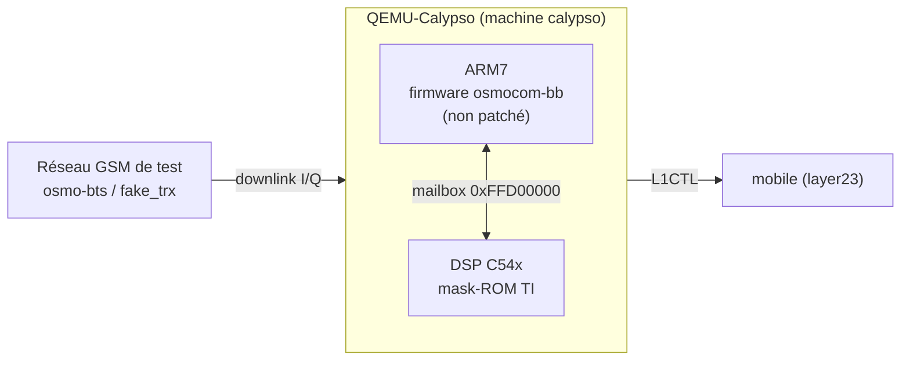

# QEMU-Calypso

> Émuler le **baseband GSM TI Calypso** (Motorola C1xx / Compal E88) dans QEMU, en
> faisant tourner **deux cœurs à la fois** comme le vrai silicium : un **ARM** qui
> exécute le firmware [osmocom-bb](https://osmocom.org/projects/baseband) *non
> patché*, et un **DSP TMS320C54x** qui exécute la **vraie mask-ROM de TI**.
> Dépôt : [`qemu-calypso`](https://github.com/bbaranoff/qemu-calypso) · Cours
> pas-à-pas : [Émulation du baseband Calypso](../cours/telco/2-QEMU-Calypso.md).

## En une phrase

Les deux cœurs se parlent par la **mailbox API RAM** à `0xFFD00000`, exactement
comme sur la puce. À la connaissance de l'auteur, **aucun autre émulateur de
baseband ne fait tourner à la fois le firmware constructeur intact *et* le DSP de
couche 1** : FirmWire (Shannon, MediaTek) émule l'applicatif et bouchonne la L1 ;
`virt_phy` d'osmocom-bb n'exécute aucun code ARM. Ici, les deux cœurs sont réels.



```tip

**Le firmware est interchangeable.** N'importe quel `layer1.highram.elf` construit
depuis n'importe quel commit d'osmocom-bb boote sans adaptation ni patch — c'est le
test qui distingue « j'émule la plateforme » de « j'ai fait marcher *ce* binaire ».

```

## Où en est le projet, honnêtement

Le statut **dépend entièrement du mode** — c'est le point central du projet.

| Famille | qui acquiert FB/SB | qui décode les SI | ce que ça prouve |
|---|---|---|---|
| **shunt** | hôte (gr-gsm) | gr-gsm | la pile de bout en bout, jusqu'à l'audio. *Rien sur le DSP.* |
| **natif** | le vrai DSP | le DSP | la vérité sur l'acquisition. *Ne campe pas encore.* |

En **shunt_legit** (le défaut), la chaîne GSM entière tourne : camp, **Location
Update**, authentification **COMP128v1**, chiffrement **A5/1**, **SMS** dans les
deux sens, et **appel voix avec audio** entre deux abonnés (10001 ↔ 10002). Le
firmware ARM tourne pour de vrai — mais c'est gr-gsm, côté hôte, qui démodule.

```danger

**Avancée majeure (2026-08-24) — en mode `native`, le Frequency Burst est acquis
par le vrai DSP mask-ROM.** `d_fb_det` passe à 1 : mesuré **437 fois**, toutes
écrites par la ROM à `PC=0x79e4`, **sans aucune injection**. Le **mur actuel** est
le décodage du **SCH** : la tâche tourne mais son décodeur sort une valeur
constante (`0xf8d8`) indépendante de l'entrée — donc il ne décode pas encore.

```

### Matrice par mode

| Étape | shunt | natif |
|---|:---:|:---:|
| FB (synchro fréquence) | ✅ | ✅ *(2026-08-24)* |
| SB / SCH | ✅ | 🔧 *mur courant* |
| RXLEV serving | ✅ | ✅ |
| Camp · LU · Auth · A5/1 · SMS · Voix TCH/F | ✅ | ⬜ *(en aval du SCH)* |
| DMA du DSP | — | ⚠️ `DSP_ERR_DMA_PROG` (gaté, défaut OFF) |

Source de vérité par mode :
[`run_results.md`](https://github.com/bbaranoff/qemu-calypso/blob/main/run_results.md).

## Démarrer

**Chaque mode a sa porte d'entrée — elles ne sont pas interchangeables.**

```bash
# shunt_legit (le défaut) : la pile complète, jusqu'à l'appel voix
cd /opt/GSM/osmo_egprs && CALYPSO_BRIDGE=pont ENCRYPTION='a5 1' ./start-direct.sh

# native : le vrai DSP à la manœuvre
cd /opt/GSM/qemu-src && CALYPSO_MODE=native ./run.sh
```

Arrêt : la même porte avec `--stop`. **Si une relance coince** (port pris, pile à
moitié morte), faire le `--stop` puis tuer les python restants — ils survivent au
teardown et retiennent les FIFO I/Q :

```bash
pkill -f python3 ; pkill -f python ; sleep 2 ; pgrep -af 'python|qemu-system-arm'
```

```warning

**Deux pièges de lancement.** (1) `shunt_legit` sans `CALYPSO_BRIDGE=pont` ne monte
pas : la BTS n'atteint pas le transceiver (`Connection refused` ×1268) et la LU
**expire** (`T3211`). (2) Les journaux diffèrent : `run.sh` → `/tmp/calypso/logs`,
`start-direct.sh` → **`/tmp/osmo-nitb/logs`**. Analyser le mauvais répertoire donne
des compteurs périmés qui ressemblent à des pannes.

```

## Vérifier soi-même

Le projet cultive une **discipline anti-illusion** : un compteur nul n'est jamais
une preuve d'absence, et la vérité d'un run est le **manifeste** imprimé par le
modèle, pas la ligne de commande. Les affirmations sont faites pour être cassées :

- **Le firmware est le vrai, non modifié** — remplacez le `layer1.highram.elf` par
  un build osmocom-bb quelconque ; s'il ne boote pas, l'affirmation tombe.
- **Le FB natif vient bien du DSP, pas d'une injection** — en `native` :

```bash
grep -c 'FBDET-WR .*0x0000 -> 0x0001' /tmp/calypso/logs/qemu.log   # ~437
grep    'FBDET-WR .*0x0000 -> 0x0001' /tmp/calypso/logs/qemu.log | \
  grep -oE 'PC=0x[0-9a-f]+' | sort -u                              # PC=0x79e4
```

## Aller plus loin

- **[Cours — Émulation du baseband Calypso](../cours/telco/2-QEMU-Calypso.md)** :
  profils, pilotage du lab, vérifications, le mur SCH en détail.
- **[Cours — GSM étape par étape](../cours/telco/3-GSM-etape-par-etape.md)** :
  chaque étape *shunt* vs *DSP natif*.
- **[Lab GSM multi-opérateur](../cours/telco/1-Lab-GSM-multiPLMN.md)** (`osmo_egprs`)
  — le réseau dans lequel ce baseband s'attache.
- Fork QEMU support : [`qemu`](https://github.com/bbaranoff/qemu) (machine `calypso`).
