# LoRa — Traqueur GPS via LoRaWAN

> Un objet connecté **Raspberry Pi + GPS + HAT LoRa Dragino** qui remonte sa
> position en **LoRaWAN** jusqu'à **The Things Network (TTN)**, visualisée en direct
> sur **Cayenne** — portée kilométrique, consommation minime.

[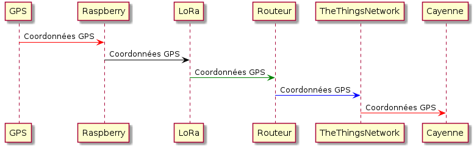](assets/uml.png)

## Architecture

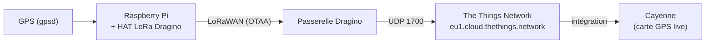

Image ISO prête à l'emploi :
[Google Drive](https://drive.google.com/file/d/1YTdmb8JlvePSKiniwBKYyqXx-m-NhzIe/view).

## 1. La passerelle Dragino → TTN

```note

**Astuce réseau (UPVD).** Le port **1700** (passerelle → TTN) est souvent bloqué
par les pare-feux d'établissement. La passerelle Dragino est donc connectée à
Internet **via WiFi** (partage de connexion smartphone), qui laisse passer le 1700.

```

1. Alimenter la passerelle (USB-C 5 V / 2 A) → un réseau WiFi `dragino-XXXXXX`
   apparaît ; s'y connecter (mot de passe `dragino+dragino`).
2. Ouvrir `http://10.130.1.1` (identifiants par défaut `root` / `dragino`) et
   connecter la Dragino, en **client WiFi**, à votre box ou partage smartphone.
3. Relever le **Gateway EUI** (onglet LoRa), choisir **TTN v3** et le serveur
   **`eu1.cloud.thethings.network`**.

[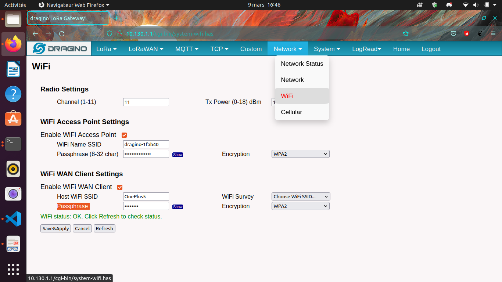](assets/WiFi_Dragino.png)
[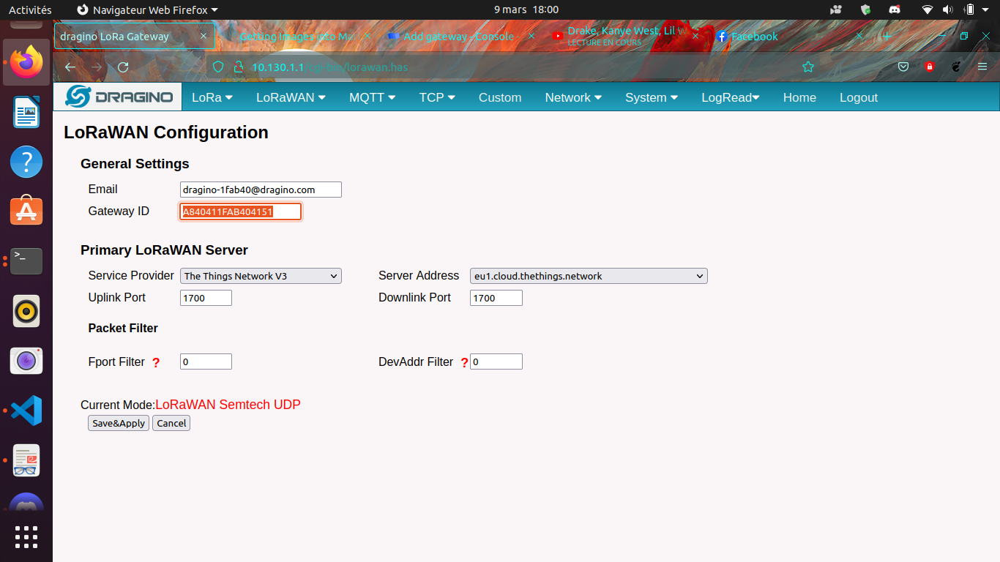](assets/config_gw_ttn.png)

Côté TTN, créer la passerelle avec ce **Gateway EUI**, un ID unique, et le serveur
`eu1.cloud.thethings.network`. La passerelle est alors connectée au réseau LoRaWAN.

[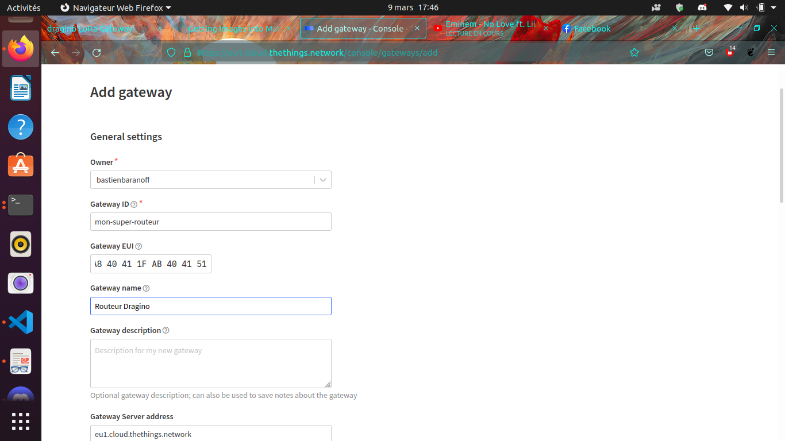](assets/config_ttn_gw.png)

## 2. L'objet connecté — Raspberry Pi

### 2.1 Carte SD

Avec **Raspberry Pi Imager** (`sudo snap install rpi-imager`), écrire **Debian
Bullseye** ; dans les options, activer **SSH** (`pi` / `raspberry`), le **WiFi** et
le hostname `raspberry.local`.

[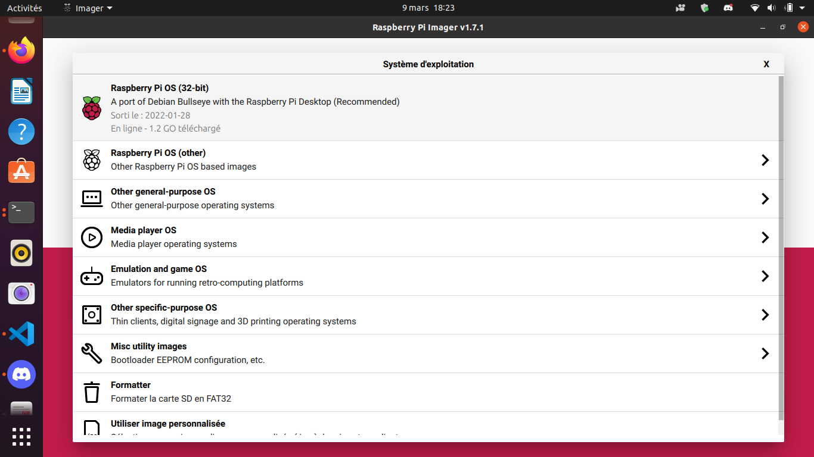](assets/choose_os.png)
[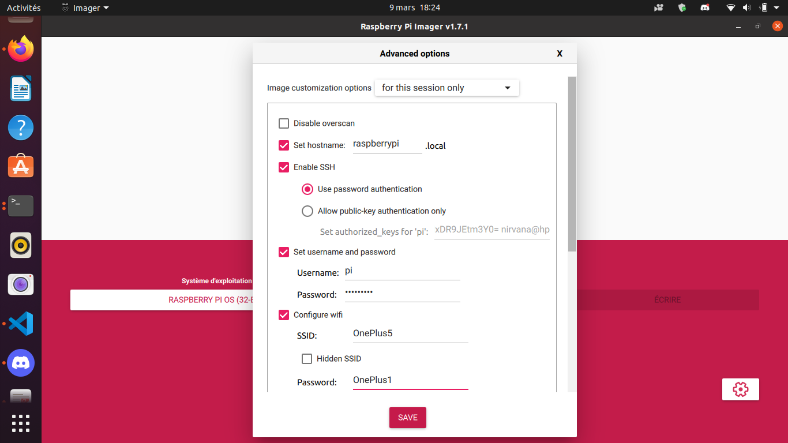](assets/options_sd_rpi.png)

Trouver le Pi sur le réseau puis s'y connecter :

```bash
nmap 192.168.1.1-254 -p 22          # ou : sudo arp -a
ssh pi@raspberrypi.local
```

### 2.2 Paquets & GPS

```bash
sudo apt update && sudo apt upgrade
sudo apt install git device-tree-compiler python3-crypto python3-nmea2 \
  python3-rpi.gpio python3-serial python3-spidev python3-configobj \
  gpsd libgps-dev gpsd-clients python3-pip
pip3 install simplecayennelpp
git clone https://github.com/bbaranoff/libgps && cd libgps && make && sudo make install && sudo ldconfig
```

Configurer **gpsd** (`/etc/default/gpsd`) sur le port série, puis activer l'UART et
le SPI dans `/boot/config.txt` :

```text
# /etc/default/gpsd
START_DAEMON="true"
DEVICES="/dev/ttyAMA0"
GPSD_OPTIONS="-n"
```

```text
# /boot/config.txt
enable_uart=1
dtoverlay=miniuart-bt
dtoverlay=spi-gpio-cs
```

Compiler l'overlay SPI du HAT Dragino :

```bash
git clone https://github.com/computenodes/dragino && cd dragino/overlay
dtc -@ -I dts -O dtb -o spi-gpio-cs.dtbo spi-gpio-cs-overlay.dts
sudo cp spi-gpio-cs.dtbo /boot/overlays/ && sudo reboot
```

### 2.3 Script d'émission — GPS → CayenneLPP → LoRaWAN

`test_cayenne.py` lit la position via **gpsd**, l'emballe au format **CayenneLPP**,
et l'émet en LoRaWAN :

```python
import gpsd, binascii
from dragino import Dragino
from simplecayennelpp import CayenneLPP

gpsd.connect()
p = gpsd.get_current()
lpp = CayenneLPP(); lpp.addGPS(1, p.lat, p.lon, p.alt)
payload = list(lpp.getBuffer())

D = Dragino("/home/pi/dragino/dragino.ini")
D.join()
while not D.registered():
    print("Waiting for JOIN ACCEPT"); sleep(2)
D.send_bytes(payload)          # position envoyée
```

Planifié chaque minute par `cron` (`* * * * * /home/pi/gpscron`).

### 2.4 Clés LoRaWAN (OTAA)

Dans `/home/pi/dragino/dragino.ini`, mode **OTAA** avec **DevEUI / AppEUI / AppKey**
(clé à **haute entropie**, attention à l'ordre MSB/LSB entre le Pi et TTN) :

```ini
auth_mode = otaa
deveui = 0xFF,0xFE,0xFD,0xFC,0xFC,0xFD,0xFE,0xFF
appeui = 0x70,0xB3,0xD5,0x00,0x00,0xD5,0xB3,0x70
appkey = 0x3D,0x83,0xC3,0x16,0x2C,0xAD,0x44,0xB7,0xB0,0x50,0x6C,0x3C,0xA1,0x54,0x36,0xB7
spreading_factor = 7
```

## 3. Enregistrer l'end-device sur TTN

Application → *Create*, puis *End devices* → **+ Add**, en reportant les mêmes
**DevEUI / AppEUI / AppKey**. Choisir le format **CayenneLPP**.

[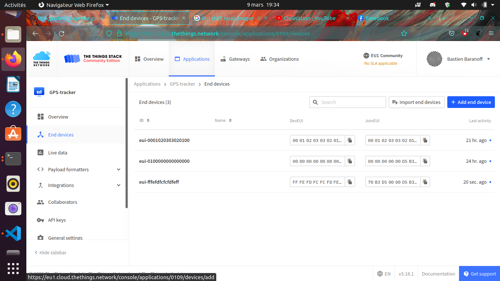](assets/add_enddevice.png)
[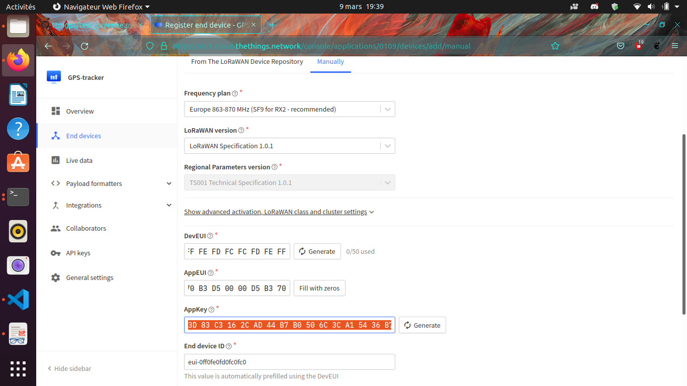](assets/register_enddevice.png)
[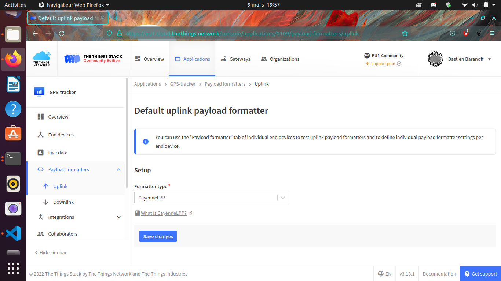](assets/format_cayenne.png)

```tip

**Faire accrocher le GPS.** Mettre le Pi à l'heure (`sudo ntpdate fr.pool.ntp.org`),
le sortir en extérieur, **retirer le jumper Tx** de la Dragino et attendre le **fix
3D** (LED verte clignotante), puis **remettre le jumper Tx**.

```

Les trames remontent alors sur TTN :

[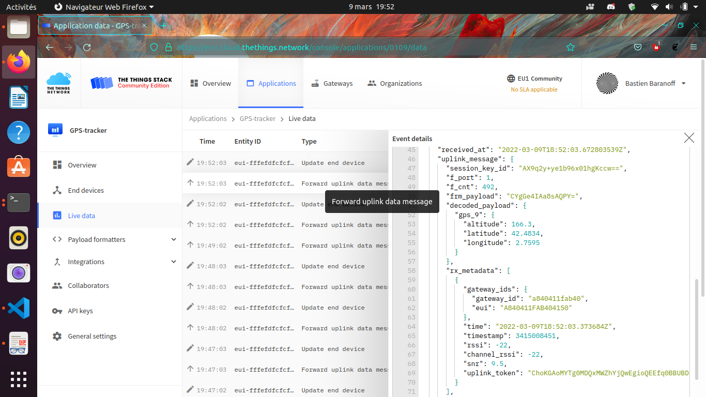](assets/coordonnees_ttn.png)

## 4. Visualiser sur Cayenne

Sur [mydevices.com](https://mydevices.com/), créer un compte Cayenne, sélectionner
**The Things Network**, ajouter un **Dragino RPi Hat** avec son **DevEUI**.

[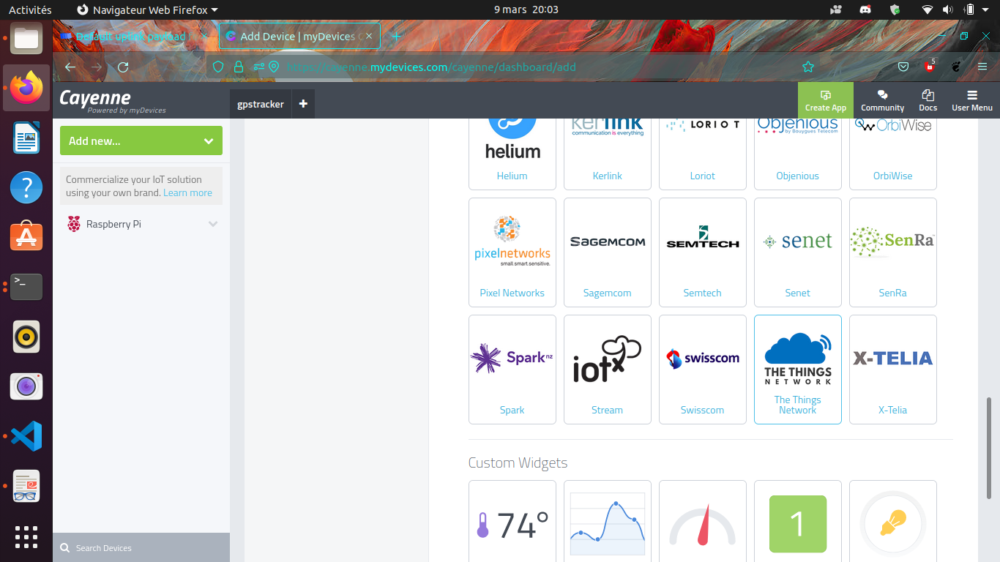](assets/add_new_cayenne.png)
[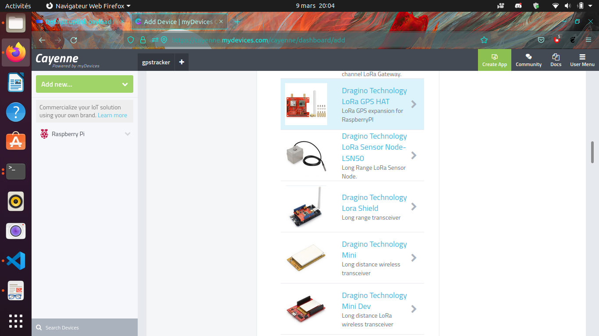](assets/dragino_cayenne.png)
[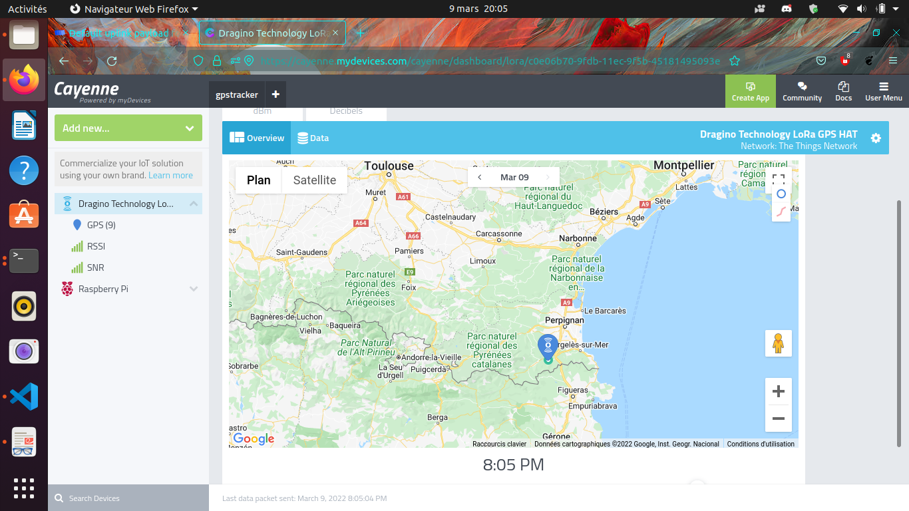](assets/gps_live.png)

**Position GPS en direct sur la carte.** 🛰️

→ Dépôts : [`ttn-gps`](https://github.com/bbaranoff/ttn-gps) ·
[`lora`](https://github.com/bbaranoff/lora) (install ChirpStack + ThingsBoard) ·
[`libgps`](https://github.com/bbaranoff/libgps).

# **ADSB**

