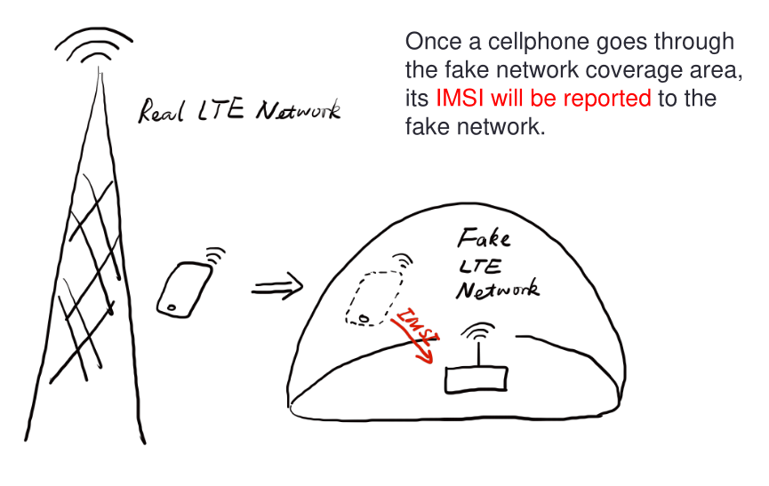
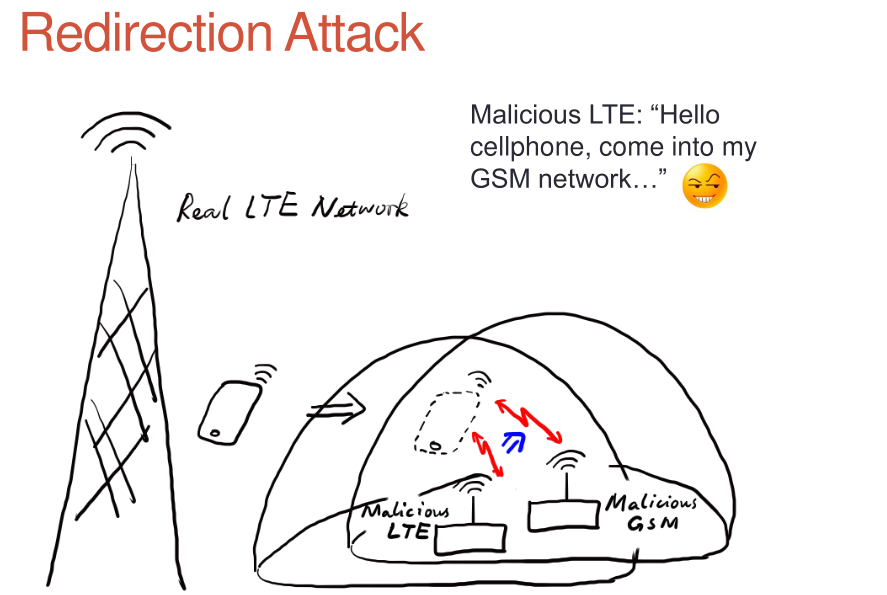
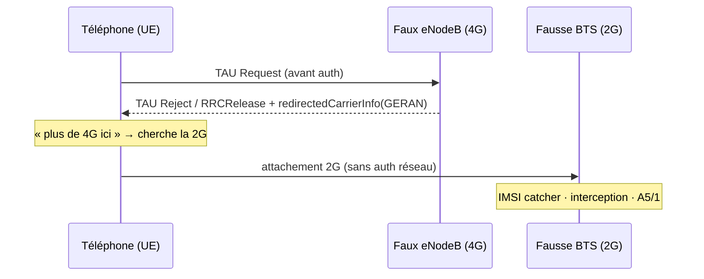
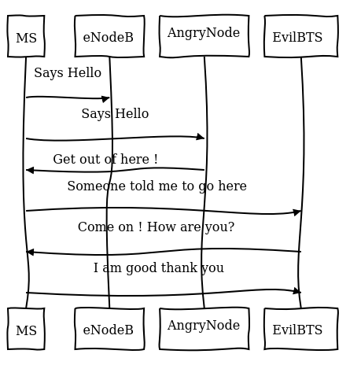
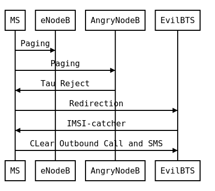
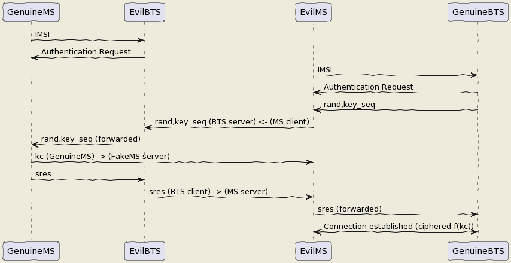
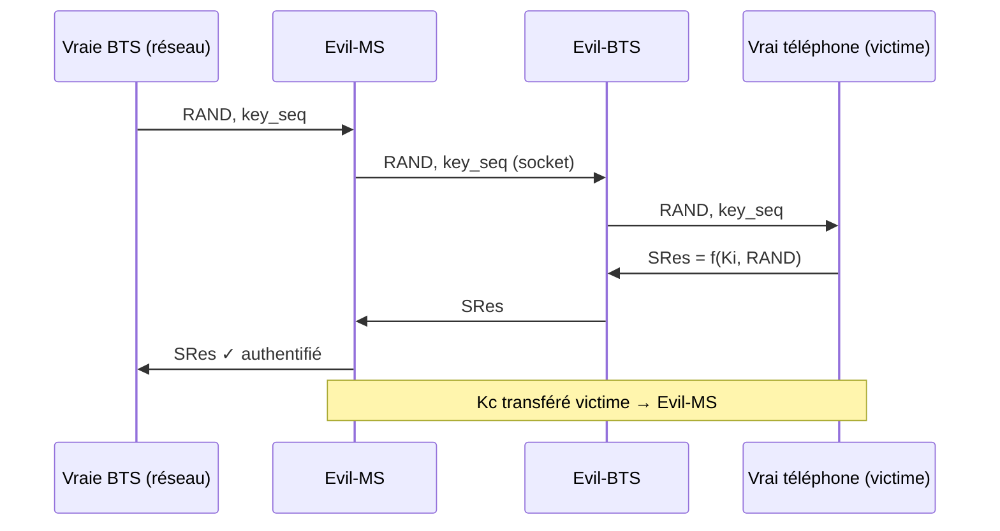

# Redirection LTE / 5G-NSA → 2G

> Forcer un téléphone d'un réseau **4G / 5G-NSA** à **redescendre en 2G**, où il
> n'authentifie plus le réseau — rouvrant la porte à l'**IMSI catcher** et au
> cassage **A5/1**. **Travail cité en recherche académique** (Gdańsk, 2021).

```danger

**Cadre légal.** Émettre sur les bandes cellulaires et manipuler le trafic d'un
abonné sont strictement encadrés. Ce projet est **pédagogique** et réservé à la
**recherche / au pentest autorisé / à la démonstration légale** (cage de Faraday,
SIM de test). Toute interception non autorisée est illégale.

```

[](assets/redir_huang1.png)
[](assets/redir_huang2.png)

## Le principe

En 2G, un téléphone s'accroche à la cellule la plus forte **sans authentifier le
réseau** — d'où l'IMSI catcher. En **4G/5G**, ce n'est plus possible : l'eNodeB doit
s'**authentifier mutuellement** avec l'UE. La faille est donc **en amont de
l'authentification** : les messages **RRC / NAS** initiaux ne sont **pas protégés
en intégrité**. On s'en sert pour **downgrader** l'UE vers la 2G.

Deux leviers, complémentaires :

- **TAU Reject** — avant de s'authentifier, l'UE envoie un *Tracking Area Update
  Request*. Un faux eNodeB répond un **TAU Reject** (« pas de 4G ici ») et pousse
  l'UE à chercher de la 2G.
- **RRCConnectionRelease + `redirectedCarrierInfo`** — on relâche la connexion RRC
  en désignant explicitement une **cellule GERAN** (ARFCN 2G) vers laquelle
  rediriger l'UE.



## Implémentation — patch OpenLTE

Le PoC d'origine est un **patch sur OpenLTE** (`openlte_v00-20-05`) qui apprend au
faux eNodeB à gérer le TAU et à injecter le `redirectedCarrierInfo` :

- **`liblte_rrc.cc`** — ajoute le `redirectedCarrierInfo` (GERAN, ARFCN 514,
  DCS1800) dans le RRC Connection Release ;
- **`LTE_fdd_enb_mme.cc`** — ajoute `send_tracking_area_update_reject()` avec
  `emm_cause = UE_IDENTITY_CANNOT_BE_DERIVED_BY_THE_NETWORK` ;
- **radio** — support **BladeRF** (`BLADERF_TX_X1`) et **SoapySDR** (`type ==
  "soapy"`).

Le cœur de la redirection — injecter la cible GERAN dans le message RRC :

```diff
 // Release cause
 liblte_value_2_bits(con_release->release_cause, &msg_ptr, 2);
+// redirectedCarrierInfo → GERAN (choice)
+liblte_value_2_bits(1,   &msg_ptr, 4);
+// ARFCN de la cellule 2G cible
+liblte_value_2_bits(514, &msg_ptr, 10);
+// bande DCS1800
+liblte_value_2_bits(0,   &msg_ptr, 1);
```

<iframe width="560" height="315" src="assets/redir.mp4" frameborder="0" allow="accelerometer; autoplay; clipboard-write; encrypted-media; gyroscope; picture-in-picture" allowfullscreen></iframe>

*…et ça marche.*

[](assets/diagram1_2G_act2.png)
[](assets/diagram1_2G_act3.png)

## Versions modernes (conteneurisées)

Le PoC OpenLTE historique ([`LTE-Redirection_Attack`](https://github.com/bbaranoff/LTE-Redirection_Attack))
a été refait sur **srsRAN_4G patché + Osmocom**, prêt à l'emploi :

| Dépôt | Cible |
|-------|-------|
| [NSA_LTE_redirect_to_EDGE](https://github.com/bbaranoff/NSA_LTE_redirect_to_EDGE) | environnement SDR **complet** LTE(4G) → EDGE(2G), conteneurisé |
| [redirect0r](https://github.com/bbaranoff/redirect0r) | redirection LTE/5G-NSA → EDGE/GSM en `docker compose` |
| [redir5Gted2Gsm](https://github.com/bbaranoff/redir5Gted2Gsm) | 5G-NSA → GSM (base srsRAN) |
| [srslte_to_gsm](https://github.com/bbaranoff/srslte_to_gsm) | downgrade d'un LTE srsLTE vers GSM |
| [openLTE2GSM](https://github.com/bbaranoff/openLTE2GSM) | workflow d'installation LTE → GSM |

## Cité en recherche académique

M. Gronau *et al.*, *« Evaluation of 4G-LTE security and realization of a test
stand for redirection attack »*, **Gdańsk University of Technology** (2021) — le
travail utilise l'image Docker publiée et cite le GitHub en référence **[29]**.
Voir aussi la [vue d'ensemble des attaques radio](0-abstract_radio.md) et le cours
[GSM étape par étape](../cours/telco/3-GSM-etape-par-etape.md).

<object data="assets/redir.pdf" type="application/pdf" width="100%" height="600px">
  <p>PDF : <a href="assets/redir.pdf">Télécharger redir.pdf</a></p>
</object>

# Impersonnate — relayer l'authentification 2G

> Se faire passer pour un abonné **sans jamais extraire son Ki** : un **relais
> MITM** entre le vrai réseau et le vrai téléphone, qui transfère le défi
> d'authentification et le **Kc**.
> Projet : [HeArTbReAkEr](https://github.com/bbaranoff/HeArTbReAkEr).

```danger

**Cadre légal.** Relayer l'authentification d'un abonné revient à usurper son
identité réseau : à réserver à la **recherche / au pentest autorisé / à la
démonstration légale** (SIM et abonné de test, cage de Faraday).

```

<iframe width="560" height="315" src="assets/Impersonnate.mp4" frameborder="0" allow="accelerometer; autoplay; clipboard-write; encrypted-media; gyroscope; picture-in-picture" allowfullscreen></iframe>

[](assets/test3.png)

## Le principe

En 2G, la BTS **n'authentifie pas** la MS — mais la MS, elle, s'authentifie auprès
du réseau : `SRes = f(Ki, RAND)` et `Kc = f(Ki, RAND, key_seq)`. Le **Ki** vit dans
la SIM et **ne s'extrait pas** (puce sécurisée). On ne le casse donc pas — on
**relaie** le défi d'authentification à travers un homme du milieu.



L'attaquant est **authentifié comme la victime** auprès du vrai réseau, **sans
connaître le Ki** : le calcul reste fait par la vraie SIM, on ne fait que
transporter défi et réponse.

## Le montage — Evil-BTS + Evil-MS

Deux conteneurs reliés par **socket** : l'**Evil-BTS** (OpenBSC patché) et
l'**Evil-MS** (osmocom-bb sur **Motorola C1xx**), aux adresses fixes
`172.17.0.3` / `172.17.0.2`.

```bash
# sur l'hôte : conflit connu avec brltty
sudo apt remove brltty

# 1) MS (172.17.0.2) — à lancer EN PREMIER
sudo docker run -it --privileged --cap-add ALL -v /dev/bus/usb:/dev/bus/usb bastienbaranoff/ms-final:hell_yeah

# 2) BTS (172.17.0.3)
sudo docker run -it --privileged --cap-add ALL -v /dev/bus/usb:/dev/bus/usb bastienbaranoff/bts-final:hell_yeah
```

Dans le conteneur **BTS** : `service pcscd start` puis `./evil-bts.sh`.
Dans le conteneur **MS** : `bash trx.sh`, puis `./evil-ms.sh` — en réglant l'IMSI
dans OpenBSC (telnet) et dans `~/.osmocom/bb/mobile.cfg`.

```note

**Matériel** : un **Motorola C1xx** (baseband Calypso, pour l'Evil-MS via
osmocom-bb) et une **SIM** de test. Voir aussi l'[émulation du baseband
Calypso](../cours/telco/2-QEMU-Calypso.md) pour faire tourner ce firmware sans
matériel.

```

→ Démo : [PoC (FR)](https://www.youtube.com/watch?v=gHKmmVZAaFo) ·
[PoC (EN)](https://www.youtube.com/watch?v=rSGA4oFsFrQ) · dépôt
[HeArTbReAkEr](https://github.com/bbaranoff/HeArTbReAkEr).
