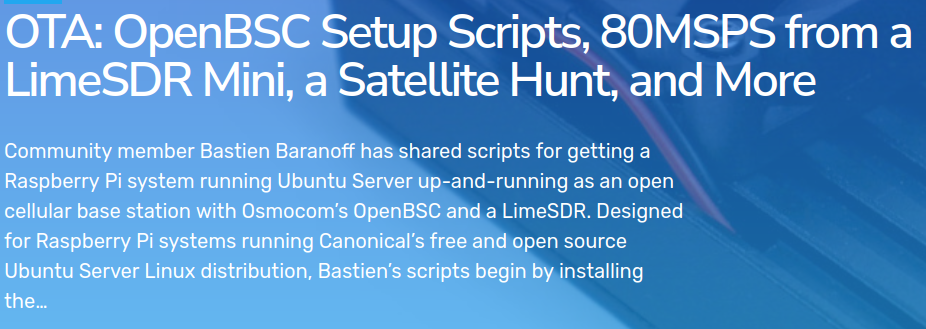
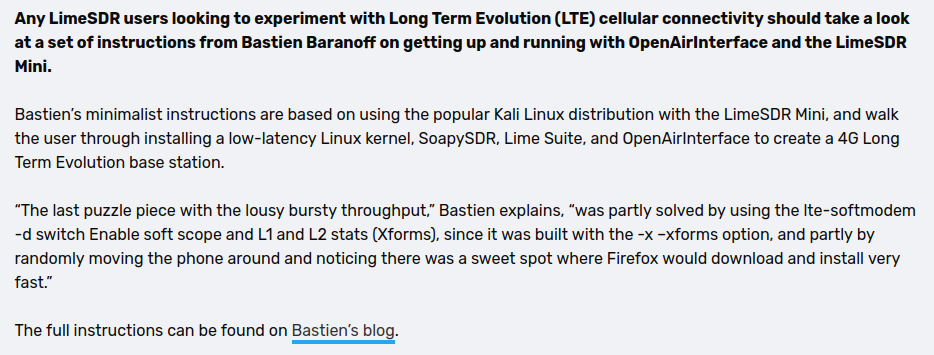

# My resume

```tip

The quieter you become the most you are able to hear

```

---

## Profile information
    
---|---
name | Bastien Baranoff
tagline | Cybersecurity in Software Defined Radio
email | bastienbaranoff@gmail.com
timezone | Paris/France
website | https://bbaranoff.github.io/
linkedin | Bastien Baranoff
github | bbaranoff
twitter | '@bastienbaranoff'
    
## Languages:

```note

  French: Native |  English: Professional

```


## Career Profile:

```warning
      Physics -> Electronics -> Computer -> Embedded -> Software Defined Radio
```


## Education:

---|---
degree |  MSc in Electronics Computers 
university | University of Perpignan via Domitia
time | 2011 - 2013

---|---
degree | Licence In Computer Science
university | University of Perpignan via Domitia
time | 2020-2021

## Experience

- CyberSecurity Research
  - time: 2024
  - company: Penthertz

- Former
  - time: 2024
  - company: University of Perpignan via Domitia

- Developper
  - time: 2021
  - company: PROMES-CNRS
  - details: LoRa(WAN) connection testing

- Developper
  - time: 2020
  - company: Tata Advanced System Limited
  - details: Mobile Security Assesment

- Former
  - time: 2017
  - company: Lycée Déodat de Séverac

- Electrical Engenering
  - time: 2013
  - company: PROMES-CNRS
  - details: Junior Research

### Developer  

<a href="https://www.tataadvancedsystems.com/"></a> 

### Junior Researcher 
  
<a href="https://www.promes.cnrs.fr/"></a>

### CyberSecurity Analyst  
  
<a href="https://penthertz.com/"></a>    
  
### Former  
  
<a href="https://univ-perp.fr/"></a>  
  
### Former (Education Nationale)  
  
<a href="https://www.education.gouv.fr/"></a>


---

---

## Quoted :

Second Time :  

[](https://myriadrf.org/news/ota-openbsc-setup-scripts-80msps-from-a-limesdr-mini-a-satellite-hunt-and-more/)

First TIme :  

[](https://myriadrf.org/news/ota-openbsc-setup-scripts-80msps-from-a-limesdr-mini-a-satellite-hunt-and-more/)

---

---

## Stuff

[](https://x.com/i/status/1763577169865826734)


## Projects:


```danger

    intro: Intrigate by A5/1 in the 2010s I searched around the internet and found a lot of interesting resources

```

