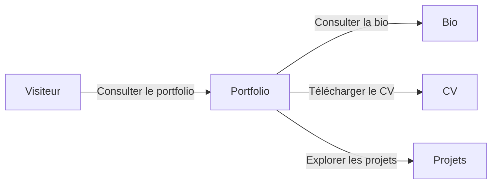
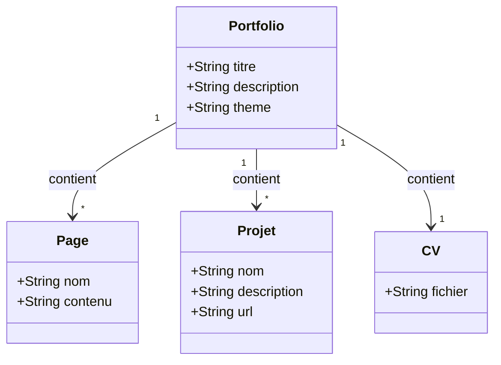
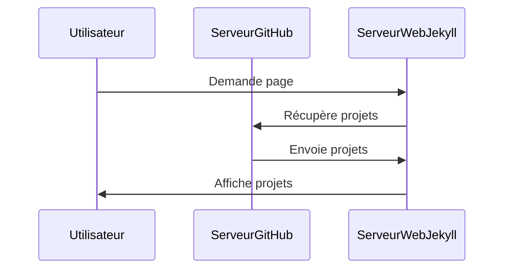
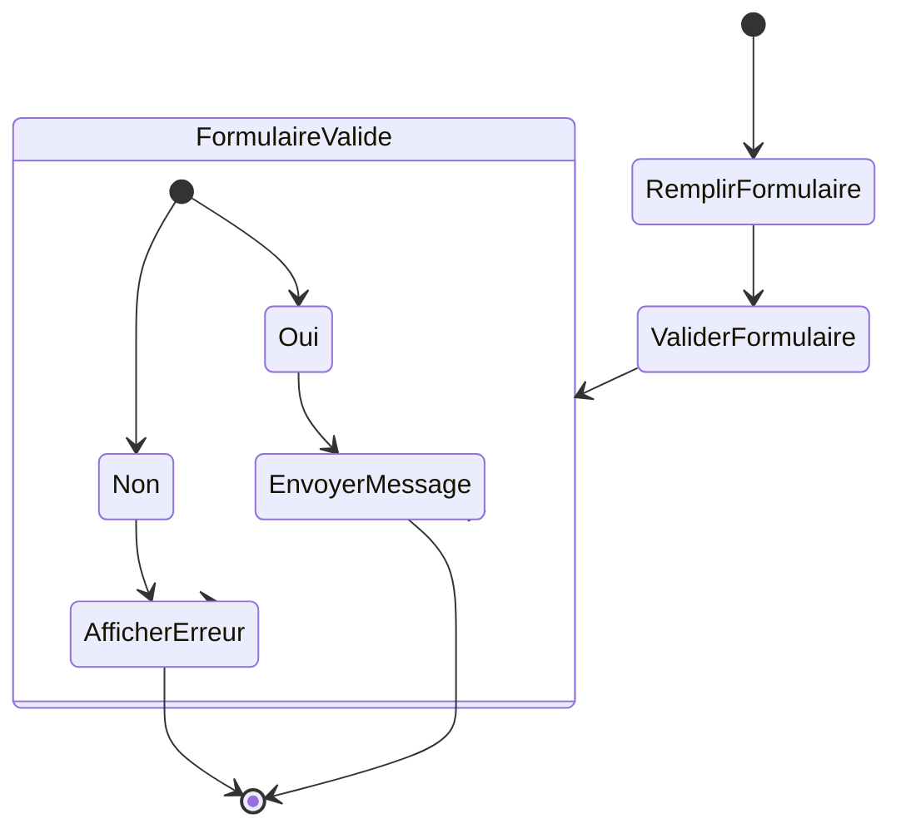

# Introduction à GIT

## Fournisseur Git


1. **GitHub**


2. **GitLab**


3. **Bitbucket**


4. **SourceForge**

  
  

5. **Azure Repos (Azure DevOps)**

## Installation de Git sur Ubuntu

Avant tout, vous devez installer Git sur votre machine Ubuntu. Suivez les étapes ci-dessous.

#### Étape 1 : Mettre à jour les dépôts
Ouvrez un terminal et mettez à jour les paquets disponibles :
```bash
sudo apt update
```

#### Étape 2 : Installer Git
Ensuite, installez Git avec la commande suivante :
```bash
sudo apt install git
```

#### Étape 3 : Vérifier l'installation
Après l'installation, vérifiez que Git a été installé correctement en vérifiant sa version :
```bash
git --version
```

Si vous voyez la version de Git, cela signifie que l'installation a réussi.

#### Étape 4 : Configurer Git
Il est important de configurer votre nom d'utilisateur et votre email, car Git les utilisera pour les commits.

```bash
git config --global user.name "Votre Nom"
git config --global user.email "votre.email@example.com"
```

## Décomposition d'un dépôt Git

1. **Espace de travail (Working Directory)** : Il s'agit de la copie locale des fichiers du projet que vous modifiez directement sur votre machine.  

2. **Index (Staging Area)** : C'est une zone intermédiaire où sont placés les fichiers modifiés avant d'être enregistrés dans le dépôt. C'est ici que vous préparez vos modifications avant de les valider avec la commande `git commit`.  

3. **Historique des commits** : Chaque commit est un instantané des modifications du projet à un moment donné. Un commit contient des informations sur ce qui a changé, qui l'a modifié, et quand ces modifications ont été faites.  

4. **Branches** : Git permet de créer des branches pour travailler sur différentes versions du projet en parallèle. Par exemple, vous pouvez avoir une branche pour les nouvelles fonctionnalités, une autre pour la correction des bugs, etc.  

5. **Remotes** : Ce sont des dépôts distants (comme GitHub, GitLab ou Bitbucket), où vous pouvez synchroniser vos modifications avec d'autres utilisateurs. Un dépôt distant permet de collaborer avec d'autres développeurs en envoyant et en récupérant des modifications à partir d'un serveur.  

## Fonctionnalités clés d'un dépôt Git

- **Suivi des versions** : Git permet de suivre chaque changement apporté aux fichiers du projet, ce qui permet de revenir à des versions antérieures si nécessaire.  

- **Collaboration** : Plusieurs personnes peuvent travailler simultanément sur le même projet, en utilisant des branches pour isoler leurs travaux et fusionner ensuite les modifications.  

- **Gestion des conflits** : Lorsque plusieurs personnes modifient les mêmes fichiers, Git aide à résoudre les conflits potentiels de manière automatique ou manuelle.  

En résumé, un dépôt Git est l'endroit où vous stockez et gérez l'historique des versions d'un projet.  

## Choix du fournisseur de gestion de code GIT dans ce cours

  

> La création d'un compte GitHub est simple et rapide. Voici les étapes pour créer un compte GitHub :

1. Accédez au site GitHub

- Ouvrez votre navigateur web et allez sur le site officiel de GitHub : [https://github.com](https://github.com).

2. Créez un compte

- Cliquez sur le bouton **Sign up** (S'inscrire) dans le coin supérieur droit de la page d'accueil.

3. Renseignez vos informations

- Vous serez redirigé vers une page de création de compte. Remplissez les champs demandés :

  - **Username** : Choisissez un nom d'utilisateur unique qui sera visible publiquement.

  - **Email address** : Entrez une adresse e-mail valide.

  - **Password** : Choisissez un mot de passe sécurisé.

4. Paramètres supplémentaires (facultatif)

- Vous pouvez être invité à répondre à des questions pour personnaliser votre expérience GitHub. Par exemple :

  - Voulez-vous recevoir des mises à jour de produits ?

  - Choisissez votre niveau d'expérience avec Git.

5. Vérification

- Il se peut que vous deviez résoudre un captcha pour vérifier que vous n'êtes pas un robot.

- GitHub peut également vous envoyer un e-mail de vérification. Ouvrez votre boîte mail et cliquez sur le lien de confirmation.

6. Choisir un plan

- GitHub propose un plan gratuit et plusieurs plans payants. Le plan gratuit est suffisant pour la majorité des projets, et vous permet de créer un nombre illimité de dépôts publics et privés.

  - Choisissez **Free** pour commencer avec le plan gratuit.

7. Finaliser l'inscription

- Une fois les étapes terminées, votre compte GitHub est créé et vous pouvez commencer à utiliser GitHub pour héberger des dépôts, collaborer sur des projets, et plus encore.

Voilà ! 🎉 Vous avez maintenant un compte GitHub, prêt à être utilisé pour vos projets.

## Choisir une licence sur GitHub

```tip
GitHub propose plusieurs options pour la gestion des licences de vos projets, qui définissent comment les autres peuvent utiliser, modifier et distribuer votre code. Pour vous aider à choisir la licence adaptée à votre projet, GitHub propose un outil appelé **Choose a License** (Choisissez une licence), qui recommande des licences populaires selon le niveau d’ouverture que vous souhaitez.

```


Voici quelques-unes des licences open-source les plus courantes :

1. **MIT License** : C’est l’une des licences les plus permissives. Elle permet aux autres d’utiliser, copier, modifier et distribuer votre code, tant qu’ils incluent une copie de la licence originale.
   
2. **GNU General Public License (GPL)** : Cette licence oblige à rendre publique toute modification du code sous la même licence. Elle est souvent utilisée pour garantir que le logiciel reste libre et open-source.


3. **Apache License 2.0** : Similaire à la licence MIT, mais avec des clauses supplémentaires, notamment une protection contre les revendications de brevets.


4. **Creative Commons (CC)** : Utilisée principalement pour des contenus autres que du code, comme des documents, des images ou des tutoriels.  

Comment ajouter une licence sur GitHub :  

	1. Lorsque vous créez un nouveau dépôt sur GitHub, il vous est proposé d’ajouter une licence.  

	2. Si vous avez déjà un dépôt sans licence, vous pouvez ajouter un fichier nommé `LICENSE` dans le répertoire racine du dépôt.  

	3. Utilisez l’outil **Choose a License** de GitHub ([chooselicense.com](https://choosealicense.com)) pour vous aider à sélectionner la licence qui correspond le mieux à vos besoins.  

Il est important de comprendre que la licence que vous choisissez affectera la manière dont les autres peuvent interagir avec votre projet, et cela peut avoir des implications juridiques, donc choisissez avec soin.  

## La syntaxe de la documentation sur GitHub : le MarkDown  

https://www.arthurperret.fr/tutomd/  


Le **Markdown** est un langage de balisage léger qui permet de formater du texte de manière simple. Il est souvent utilisé pour la documentation, les README sur GitHub, ou les blogs. Voici une explication de la syntaxe Markdown la plus courante.  

1. **Titres (Headings)**  

Vous pouvez créer des titres en utilisant des `#`. Plus vous ajoutez de `#`, plus le niveau du titre est bas.

```
# Titre de niveau 1  
## Titre de niveau 2  
### Titre de niveau 3  
#### Titre de niveau 4  
```


# Titre de niveau 1  
## Titre de niveau 2  
### Titre de niveau 3  
#### Titre de niveau 4  

2. **Texte en gras et en italique**  

```
- **Gras** : Utilisez deux astérisques `**` ou deux tirets bas `__`.  
- *Italique* : Utilisez un astérisque `*` ou un tiret bas `_`.  
- ***Gras et italique*** : Combinez les deux.  
```

**Texte en gras**  
*Texte en italique*  
***Texte en gras et italique***  

3. **Listes**  

Listes non ordonnées  

Utilisez des tirets `-`, des astérisques `*`, ou des plus `+` pour créer une liste à puces.  

- Élément 1  

- Élément 2  

  - Élément 2.1  

  - Élément 2.2  

Listes ordonnées

Utilisez des chiffres suivis d’un point.

1. Élément 1  

2. Élément 2  

   1. Sous-élément 2.1  

   2. Sous-élément 2.2  
  
4. **Liens et images**  

Liens  

Le texte du lien est placé entre crochets `[ ]`, suivi de l'URL entre parenthèses `( )`.  

[GitHub](https://github.com)  

Images  

Pour les images, ajoutez un point d’exclamation `!` avant le lien.  


5. **Blocs de code**  

Pour insérer un bloc de code, utilisez trois accents graves au début et à la fin, et précisez éventuellement le langage pour la coloration syntaxique.  


```python    
def bonjour():
    print("Bonjour le monde !")
```

6. **Citation**  

Utilisez le signe `>` pour créer une citation.  

> Ceci est une citation.  

7. **Tableaux**  

Les tableaux sont créés en utilisant des barres verticales `|` et des tirets `-` pour délimiter les colonnes.  


| Colonne 1 | Colonne 2 |
|--|--|
| Contenu 1 | Contenu 2 |

8. **Listes de tâches (Task lists)**  

Ajoutez des cases à cocher avec des crochets `[ ]` pour les tâches non complétées, et `[x]` pour celles complétées.  

- [x] Tâche 1 terminée  

- [ ] Tâche 2 non terminée  

9. **Liens vers sections**  

Si vous souhaitez lier une section d’un document à une autre, vous pouvez le faire en ajoutant un lien vers l’ancre. Par exemple, pour lier à un titre de section :  

[Aller à la section Titres](#titres-headings)  

Le Markdown est simple, mais très puissant pour formater du texte. Il est largement utilisé sur GitHub, les blogs, et bien d’autres plateformes.  

## Création d'un repository 

   - Connectez-vous à votre compte GitHub.  

   - Sur la page d'accueil, cliquez sur le bouton **"New"** à côté de la liste de vos dépôts (ou sur la page de votre profil).  

   - Ou bien, utilisez le lien direct : [Créer un nouveau dépôt](https://github.com/new).  

1. **Configurer le dépôt**  

   - **Nom du dépôt** : Entrez un nom pour votre dépôt. Ce nom doit être unique dans votre compte.  

   - **Description** (facultatif) : Ajoutez une courte description du dépôt.  

   - **Public/Private** : Choisissez si votre dépôt sera public (visible par tout le monde) ou privé (visible uniquement par vous et ceux à qui vous donnerez accès).  

2. **Initialisation du dépôt**
   - Vous pouvez cocher l'option **"Initialize this repository with a README"** si vous souhaitez ajouter un fichier README dès le départ.
   - Vous pouvez également ajouter un fichier `.gitignore` ou une licence si nécessaire.

3. **Finaliser la création**
   - Une fois les informations saisies, cliquez sur **"Create repository"** pour finaliser.

Votre dépôt GitHub est maintenant créé, et vous pouvez commencer à y ajouter des fichiers et des projets ! Si vous avez besoin d'aide pour pousser des fichiers vers votre dépôt, n'hésitez pas à demander.

## Clef API

Pour récupérer votre clé API GitHub (ou plutôt votre token d'accès personnel), suivez ces étapes :

1. **Connectez-vous à GitHub** : Accédez à [GitHub](https://github.com/) et connectez-vous à votre compte.

2. **Accédez aux paramètres de votre compte** : Cliquez sur votre photo de profil en haut à droite, puis sélectionnez **"Settings"** (Paramètres).

3. **Allez dans les paramètres des développeurs** : Dans le menu de gauche, cliquez sur **"Developer settings"** (Paramètres du développeur).

4. **Générez un nouveau token** : Sélectionnez **"Personal access tokens"** (Jetons d'accès personnel), puis cliquez sur **"Generate new token"** (Générer un nouveau jeton).

5. **Configurez votre token** :
   - Donnez un **nom** à votre token pour le reconnaître plus tard.
   - Sélectionnez les **scopes** ou permissions nécessaires pour votre token. Par exemple, pour un accès en lecture à vos dépôts, cochez "repo".
   - Vous pouvez également définir une **date d'expiration** pour le token.

6. **Générez le token** : Cliquez sur **"Generate token"** (Générer le jeton). 

7. **Copiez votre token** : Une fois le token généré, il sera affiché une seule fois. Assurez-vous de le copier et de le stocker en lieu sûr.

N'oubliez pas de garder ce token secret et de ne pas le partager, car il donne accès à votre compte GitHub selon les permissions que vous avez définies.

## Pousser un repertoire (push a repo)

Voici les étapes pour pousser un repository (repo) sur GitHub. Cela suppose que vous avez déjà installé Git sur votre machine et que vous avez un compte GitHub.

1. Cloner en local

```bash
git clone https://github.com/monuser/monrepo
```

2. Ajouter des fichiers et valider des changements
Faites les modifications souhaitées et faites un commit pour enregistrer les changements.

```bash
# Ajouter tous les fichiers dans le repo
git add .

# Faire un commit avec un message
git commit -m "Premier commit"
```

3. Pousser le repository local vers GitHub
Vous devez maintenant connecter votre repo local avec le repository GitHub.

```bash
# Ajouter le remote (remplacez l'URL par l'URL de votre repo GitHub)
git push https://monuser_apikey@github.com/monuser/monrepo
```

Note : Selon la configuration de votre repo, la branche par défaut peut être appelée `main` au lieu de `master`. Vous pouvez vérifier cela dans GitHub et ajuster la commande en conséquence.

4. Validation
Après avoir poussé, vous pourrez voir votre code sur GitHub en visitant votre repository en ligne.

## Schéma logique de fonctionnement d'un dépot

  

1. **Fork** : 
   - **Définition** : C'est une copie d'un dépôt de code source. Lorsque vous fork un projet, vous créez une version indépendante de ce dépôt sur votre propre compte ou espace. Cela vous permet de faire des modifications sans affecter l'original.
   - **Utilisation** : Généralement utilisé pour proposer des modifications à un projet sans avoir accès direct au dépôt principal. Vous pouvez développer des fonctionnalités ou corriger des bugs dans votre fork et soumettre des demandes de fusion pour que les modifications soient intégrées au dépôt principal.

2. **Push** :
   - **Définition** : Cette commande envoie les modifications locales de votre dépôt (ou branche) vers un dépôt distant (comme GitHub, GitLab, etc.).
   - **Utilisation** : Après avoir commis vos changements localement, vous utilisez `git push` pour les envoyer vers le dépôt distant afin que les autres puissent voir et récupérer vos modifications.

3. **Merge** :
   - **Définition** : C'est le processus d'intégration des changements d'une branche dans une autre. Cela peut se faire automatiquement si les changements ne sont pas en conflit, ou manuellement si des conflits doivent être résolus.
   - **Utilisation** : Par exemple, vous pouvez merger une branche de fonctionnalité dans la branche principale (`main` ou `master`) pour intégrer de nouvelles fonctionnalités ou corrections.

4. **Commit** :
   - **Définition** : C'est une opération qui enregistre les modifications dans l'historique du dépôt. Un commit est un instantané de votre projet à un moment donné.
   - **Utilisation** : Avant de pousser vos changements vers un dépôt distant, vous devez d'abord commettre ces changements localement pour les sauvegarder et les organiser.

5. **Pull** :
   - **Définition** : Cette commande récupère les dernières modifications du dépôt distant et les fusionne avec votre dépôt local.
   - **Utilisation** : Utilisé pour synchroniser votre copie locale du dépôt avec les modifications apportées par d'autres collaborateurs ou par vous-même à partir d'un autre endroit.

> Ces opérations sont essentielles pour gérer le code source et collaborer efficacement avec d'autres développeurs.

## Scénarii


Lorsque vous effectuez un **push** sur un dépôt GitHub, plusieurs scénarios peuvent survenir en fonction de l'état de votre dépôt local par rapport au dépôt distant. Voici les scénarios principaux, en fonction de si votre dépôt est **à jour**, **en avance** ou **en retard** par rapport au dépôt distant.


1. **Scénario 1 : Votre dépôt local est à jour avec le dépôt distant**
Dans ce cas, les branches locales et distantes sont synchronisées, c'est-à-dire qu'elles contiennent les mêmes commits. Le `push` se déroule alors sans problème, car il n'y a pas de divergence entre le dépôt local et le dépôt distant.

**Commande :**
```bash
git push origin <nom-branche>
```


2. **Scénario 2 : Votre dépôt local est en avance sur le dépôt distant**
Cela signifie que vous avez effectué des **commits** localement, mais que ces commits n'existent pas encore sur le dépôt distant. Dans ce cas, votre dépôt local a de nouvelles modifications que le dépôt distant n'a pas.

Cas où le dépôt distant n'a pas changé :
- **Résultat** : Le `push` est simple et fonctionne correctement. Vos nouveaux commits seront ajoutés au dépôt distant.

Cas où le dépôt distant a changé :
- **Problème potentiel** : Si des changements ont été apportés au dépôt distant, il est possible que Git refuse le `push`, car il y aurait un **conflit** entre les deux versions (locale et distante).


**Message d'erreur typique :**
```bash
! [rejected]        <nom-branche> -> <nom-branche> (non-fast-forward)
```

- **Solution** : Vous devrez d'abord **récupérer les modifications du dépôt distant** avant de pouvoir pousser vos propres changements.

**Commande :**
```bash
git pull --rebase origin <nom-branche>
# Résolvez les conflits s'il y en a
git push origin <nom-branche>
```


3. **Scénario 3 : Votre dépôt local est en retard par rapport au dépôt distant**
Votre dépôt local est "en retard" lorsqu'il manque des commits qui ont été ajoutés au dépôt distant par d'autres collaborateurs. Cela signifie que des modifications ont été faites sur le dépôt distant que vous n'avez pas encore récupérées.

Cas où vous n'avez pas encore de nouveaux commits localement :
- **Solution** : Vous pouvez simplement faire un `pull` pour récupérer les commits distants.

**Commande :**
```bash
git pull origin <nom-branche>
```
Cas où vous avez des commits locaux (en avance et en retard à la fois) :
- **Problème** : Vous ne pouvez pas effectuer de `push` tant que vous n'avez pas intégré les modifications distantes dans votre historique de commits local.

**Solution** : Faire un **pull avec rebase** pour intégrer les changements distants et placer vos commits locaux au-dessus.

**Commande :**
```bash  
git pull --rebase origin <nom-branche>
# Résolvez les conflits s'il y en a
git push origin <nom-branche>
```

4. **Scénario 4 : Conflits lors du pull**  

Lorsque vous tentez de faire un `git pull` (ou `git pull --rebase`), il peut y avoir des **conflits** si les mêmes fichiers ont été modifiés à la fois localement et sur le dépôt distant. Vous devrez résoudre ces conflits manuellement en choisissant quelles modifications garder.  

**Étapes pour résoudre un conflit :**  

	1. Git marquera les fichiers en conflit.  

	2. Ouvrez les fichiers pour voir les sections en conflit.  
	
	3. Modifiez manuellement le fichier pour résoudre le conflit.  

	4. Ajoutez les fichiers résolus (`git add`).  

	5. Continuez le rebase ou le merge (`git rebase --continue` ou `git merge --continue`).  

	6. Poussez ensuite vos modifications (`git push`).  

5. **Scénario 5 : Force Push**

Si vous avez réécrit l'historique des commits locaux, par exemple avec un **rebase** ou un **reset**, vous devrez utiliser un **force push** pour remplacer l'historique distant avec votre nouvel historique local.  

**Commande :**  

```bash
git push --force origin <nom-branche>
```

> **Attention** : Le `force push` peut être dangereux car il réécrit l'historique sur le dépôt distant, ce qui peut poser des problèmes aux autres collaborateurs.  

Résumé :  

- **Dépôt local à jour** : Le `push` est simple et réussi.  

- **Dépôt local en avance** : Si le dépôt distant n'a pas changé, le `push` est direct. Sinon, un `pull` est nécessaire.  

- **Dépôt local en retard** : Il faut d'abord faire un `pull` pour récupérer les changements distants.  
- **Conflits** : Ils doivent être résolus manuellement avant de pouvoir pousser.  

- **Force Push** : Nécessaire si l'historique a été réécrit localement.  

Ces scénarios couvrent la plupart des situations que vous pouvez rencontrer lors d'un `git push` sur GitHub.  

> Si vous avez des questions plus spécifiques ou des scénarii en tête, n'hésitez pas à demander !  

# Guide : Installer Jekyll et créer une page GitHub Pages avec `github.io`

**Jekyll** est un générateur de site statique qui fonctionne parfaitement avec GitHub Pages, une plateforme qui permet d'héberger des sites web directement depuis un dépôt GitHub. Voici un guide complet pour installer Jekyll sur Ubuntu et créer un site GitHub Pages avec une URL `github.io`.

---

### 1. Prérequis

Avant d'installer Jekyll, vous devez avoir quelques éléments installés sur votre machine Ubuntu.

#### a. Installer Ruby

Jekyll est écrit en Ruby, donc vous devez d'abord installer Ruby et les dépendances nécessaires.

Ouvrez un terminal et exécutez les commandes suivantes pour installer Ruby et les dépendances :

```bash
sudo apt update
sudo apt install ruby-full build-essential zlib1g-dev
```

#### b. Configurer les chemins d'accès à Ruby

Pour éviter des problèmes de permission lors de l'installation de Jekyll et des gems, il est recommandé de configurer un dossier spécifique pour les gems Ruby. Ajoutez ces lignes à votre fichier `.bashrc` (ou `.zshrc` si vous utilisez Zsh) pour configurer le répertoire d'installation de vos gems :

```bash
echo 'export GEM_HOME="$HOME/.gem"' >> ~/.bashrc
echo 'export PATH="$HOME/.gem/bin:$PATH"' >> ~/.bashrc
source ~/.bashrc
```

Cela crée un répertoire `~/.gem` où les gems Ruby seront installés.

#### c. Installer Jekyll et Bundler

Une fois Ruby installé, vous pouvez installer Jekyll et Bundler (un gestionnaire de dépendances pour Ruby) via la commande suivante :

```bash
gem install jekyll bundler
```

### 2. Créer un nouveau site Jekyll

#### a. Créer un nouveau projet Jekyll

Une fois Jekyll installé, vous pouvez créer un nouveau site en utilisant la commande suivante :

```bash
jekyll new mon-site
```

Cette commande crée un répertoire appelé `mon-site` avec la structure de base d'un site Jekyll, y compris les fichiers nécessaires pour démarrer. 

#### b. Accéder au répertoire du site

Accédez au dossier du site que vous venez de créer :

```bash
cd mon-site
```

#### c. Lancer le serveur local Jekyll

Vous pouvez maintenant tester votre site localement. Pour cela, lancez le serveur Jekyll :

```bash
bundle exec jekyll serve
```

Le serveur démarre par défaut sur `http://localhost:4000`. Ouvrez votre navigateur et allez à cette adresse pour voir votre site localement.

### 3. Créer un dépôt GitHub pour votre site GitHub Pages

#### a. Créer un nouveau dépôt GitHub

1. Allez sur [GitHub](https://github.com/) et connectez-vous.
2. Créez un nouveau dépôt avec un nom du type `nom-utilisateur.github.io` (remplacez `nom-utilisateur` par votre nom d'utilisateur GitHub).

**Important** : Le nom du dépôt doit être exactement `nom-utilisateur.github.io` pour que GitHub Pages fonctionne.

#### b. Initialiser un dépôt Git dans votre répertoire local

Dans le répertoire du site Jekyll (`mon-site`), initialisez un dépôt Git :

```bash
git init
```

#### c. Ajouter le dépôt distant

Ajoutez l'URL de votre dépôt GitHub comme dépôt distant :

```bash
git remote add origin https://github.com/nom-utilisateur/nom-utilisateur.github.io.git
```

#### d. Ajouter et valider les fichiers

Ajoutez tous les fichiers de votre projet au dépôt Git et faites un commit :

```bash
git add .
git commit -m "Premier commit de mon site Jekyll"
```

#### e. Pousser les fichiers sur GitHub

Enfin, poussez les fichiers sur GitHub :

```bash
git push -u origin master
```

### 4. Configurer GitHub Pages

Une fois les fichiers poussés, vous devez activer **GitHub Pages** pour que votre site soit accessible en ligne.

1. Allez sur la page de votre dépôt GitHub (`https://github.com/nom-utilisateur/nom-utilisateur.github.io`).
2. Allez dans les **Paramètres** du dépôt.
3. Dans la section **GitHub Pages**, sélectionnez la branche `master` (ou `main` selon votre configuration) comme source pour GitHub Pages.
4. Enregistrez les modifications.

### 5. Accéder à votre site

Une fois que vous avez poussé le site sur GitHub et activé GitHub Pages, votre site sera accessible à l'URL suivante :

```
https://nom-utilisateur.github.io/
```

### 6. Personnaliser votre site Jekyll

#### a. Modifier la page d'accueil

La page d'accueil de votre site se trouve généralement dans le fichier `index.md` ou `index.html` dans le répertoire racine de votre projet Jekyll. Modifiez ce fichier pour personnaliser le contenu de votre page d'accueil.

#### b. Modifier la configuration du site

Le fichier `_config.yml` dans votre projet Jekyll est le fichier principal de configuration du site. Vous pouvez y modifier des paramètres comme le titre du site, la description, les liens de navigation, etc.

Exemple de fichier `_config.yml` :

```yaml
title: Mon Super Site
description: C'est mon site personnel construit avec Jekyll.
author: nom-utilisateur
theme: minima
```

### 7. Mettre à jour votre site

À chaque fois que vous apportez des modifications à votre site, vous devez valider ces modifications dans Git et les pousser vers GitHub.

1. Modifiez les fichiers sur votre machine.
2. Ajoutez les fichiers modifiés à Git :
   ```bash
   git add .
   ```
3. Faites un commit avec un message approprié :
   ```bash
   git commit -m "Mise à jour du site"
   ```
4. Poussez les modifications sur GitHub :
   ```bash
   git push origin master
   ```

### 8. Aller plus loin

- **Ajouter des pages supplémentaires** : Créez de nouvelles pages en ajoutant des fichiers `.md` ou `.html` dans le répertoire racine de votre projet.
- **Installer un thème Jekyll** : Jekyll dispose de nombreux thèmes que vous pouvez installer pour personnaliser l'apparence de votre site. Par exemple, vous pouvez installer le thème "Minima" qui est le thème par défaut, ou vous pouvez en choisir un autre depuis [Jekyll Themes](https://jekyllthemes.io/).

### Conclusion

En suivant ces étapes, vous avez installé Jekyll sur Ubuntu, créé un site localement, et l'avez déployé sur GitHub Pages. Vous avez désormais un site web accessible via l'URL `github.io`. N'hésitez pas à personnaliser et ajouter des fonctionnalités pour développer davantage votre site !

# Methodes Agiles

Les méthodes agiles sont des approches de gestion de projet et de développement qui mettent l'accent sur la flexibilité, la collaboration et l'itération rapide pour mieux répondre aux 
besoins changeants des clients. Elles sont particulièrement populaires dans le développement de logiciels mais peuvent être appliquées dans d'autres domaines. Voici les principales mét
hodes agiles et leurs caractéristiques :

1. **Scrum**
   - **Cadre de travail le plus populaire** pour la gestion de projets agiles, surtout dans les équipes de développement logiciel.
   - Organisation en **sprints** (cycles courts de 1 à 4 semaines) avec des objectifs définis.
   - Rôles spécifiques : **Product Owner** (priorise les tâches), **Scrum Master** (facilite le processus) et **Équipe de développement**.
   - Réunions clés : **Daily Stand-up** (réunion quotidienne), **Sprint Planning**, **Sprint Review**, et **Sprint Retrospective**.

[](https://www.scrum.org/res
ources/what-is-scrum)

2. **Kanban**
   - Inspiré des méthodes de production Toyota, il est visuel et permet une **gestion des tâches en continu**.
   - Utilisation d'un **tableau Kanban** avec des colonnes représentant les étapes (ex. : À faire, En cours, Terminé).
   - Pas de sprints fixes : les équipes travaillent de manière fluide et font progresser les tâches selon leur disponibilité.
   - Idéal pour des projets sans planning rigide et avec un flux de travail continu.
[](https://kissflow.com/project/agile/kanban-methodology/)

3. **Extreme Programming (XP)**
   - Conçu pour les **développeurs logiciels**, XP met l’accent sur des pratiques techniques rigoureuses comme le **développement piloté par les tests (TDD)**, la **programmation en bi
nôme** et les **révisions fréquentes du code**.
   - Livraisons fréquentes pour réduire les risques et obtenir des retours rapides des clients.
   - XP favorise une forte collaboration avec le client et des ajustements fréquents en fonction de ses besoins.  

[](https://www.planzone.fr/blog/quest-ce-que-la-methodologie-extreme-programm
ing)

4. **Lean**
   - Méthode dérivée du Lean Manufacturing qui vise à **minimiser les gaspillages** et à optimiser la valeur pour le client.
   - Mise en œuvre d'un flux de travail qui réduit les étapes inutiles et se concentre sur les activités à forte valeur ajoutée.
   - **Optimisation continue** et amélioration constante des processus.
   - Souvent associée à Kanban dans la gestion de projet.  

[](https://www.my-clic.fr/guide-complet-sur-le-lean-management/)


5. **Crystal**
   - Ensemble de méthodologies ajustables (Crystal Clear, Crystal Yellow, Crystal Orange, etc.), chacune adaptée en fonction de la taille de l'équipe et de la criticité du projet.
   - Favorise la **communication et la simplicité**, en adaptant la rigueur des processus selon les besoins du projet.
   - Encouragement de la collaboration, tout en maintenant une certaine flexibilité dans l'application des processus agiles.

[](https://fastercapital.com/topics/crystal-methodology.html
)  

6. **Feature-Driven Development (FDD)**
   - Méthode centrée sur le développement de **fonctionnalités spécifiques**.
   - Les projets sont divisés en **petites fonctionnalités** développées rapidement pour obtenir des livraisons fréquentes.
   - Idéal pour des projets nécessitant un cadre structuré et des développements incrémentaux.
[](htt
ps://www.dsdm.org/)

7. **Disciplined Agile (DA)**
   - Un **cadre méthodologique hybride** qui combine plusieurs approches agiles (Scrum, Kanban, Lean, etc.).
   - Offre un ensemble d’outils pour aider les équipes à choisir les meilleures pratiques en fonction du contexte spécifique du projet.
   - DA se concentre sur l’agilité à l’échelle et sur l’alignement avec les stratégies de l’entreprise.

[](https://www.agilealliance.org/agile101/disciplined-agile/)

8. **SAFe (Scaled Agile Framework)**
   - Conçu pour **appliquer l'agilité à grande échelle**, dans les grandes organisations avec plusieurs équipes.
   - Structure de gestion incluant plusieurs niveaux (équipe, programme, grande solution et portfolio) pour aligner l’ensemble des équipes sur des objectifs stratégiques communs.
   - Facilite la coordination entre différentes équipes Scrum ou Kanban, pour des projets complexes et à grande échelle.
Voici un lien vers une image illustrant la méthode **SAFe (Scaled Agile Framework)**, ainsi que des informations sur la source :

[](https://www.scaledagileframework.com/)

## Méthode Scrum

La méthode **Scrum** est l'une des méthodes agiles les plus populaires, particulièrement dans le domaine du développement logiciel. Elle repose sur une approche itérative et incrémentale pour maximiser l'efficacité, favoriser la collaboration et s’adapter aux besoins changeants des clients. Voici une présentation détaillée de Scrum, ses rôles, ses événements et ses artefacts :

1. **Les Rôles dans Scrum**

Dans Scrum, trois rôles principaux définissent les responsabilités et assurent une bonne coordination :

- **Product Owner** :
  - Responsable de la **vision du produit** et de la gestion du backlog (liste priorisée des fonctionnalités à développer).
  - Il établit les **priorités** en fonction des besoins des clients et de l’entreprise, garantissant que l’équipe travaille en priorité sur ce qui apporte le plus de valeur.
  - Le Product Owner est en **contact direct avec les parties prenantes** et agit comme intermédiaire pour transmettre les besoins et ajuster les priorités.

- **Scrum Master** :
  - **Facilitateur** du processus Scrum, il aide l’équipe à adopter et respecter les principes agiles.
  - Il supprime les obstacles (ou “impediments”) qui pourraient freiner l’avancement de l’équipe.
  - Le Scrum Master encourage les pratiques de collaboration et d’amélioration continue au sein de l’équipe et protège cette dernière des distractions externes.

- **Équipe de développement** :
  - Elle est **auto-organisée et pluridisciplinaire**, avec les compétences nécessaires pour transformer les éléments du backlog en fonctionnalités livrables.
  - L’équipe de développement est responsable de son propre travail et organise sa charge pour atteindre les objectifs définis pour chaque sprint.
  - En Scrum, chaque membre de l’équipe de développement collabore de manière égale, et il n’y a pas de hiérarchie interne dans les rôles.

2. **Les Événements Scrum**

Scrum se compose de plusieurs événements structurés qui organisent le travail et favorisent la transparence et l’inspection :

- **Sprint** :
  - C’est le **cycle de développement** de base en Scrum, d’une durée fixe (généralement de 1 à 4 semaines).
  - Chaque sprint commence par une planification et se termine par une rétrospective.
  - À la fin de chaque sprint, une **version fonctionnelle du produit** doit être livrée, permettant aux équipes et aux parties prenantes d’avoir un aperçu du progrès.

- **Sprint Planning** :
  - Cette réunion a lieu au début de chaque sprint. Elle est destinée à **définir le travail à accomplir pendant le sprint**.
  - L’équipe, avec le Product Owner, choisit les éléments les plus prioritaires du backlog pour le sprint.
  - L’objectif de sprint est établi, c’est-à-dire un but global que l’équipe doit atteindre.

- **Daily Stand-up (ou Daily Scrum)** :
  - Réunion quotidienne de 15 minutes maximum où chaque membre de l’équipe partage ce qu’il a fait la veille, ce qu’il compte faire aujourd’hui et les éventuels obstacles.
  - Cette réunion permet à l’équipe de rester **alignée et informée des progrès de chacun**.

- **Sprint Review** :
  - Elle a lieu à la fin du sprint pour **présenter le travail accompli** aux parties prenantes et recevoir des feedbacks.
  - C’est l’occasion pour le Product Owner et les parties prenantes de valider les fonctionnalités et de proposer des ajustements.

- **Sprint Retrospective** :
  - Elle est organisée après la Sprint Review et permet à l’équipe de **réfléchir aux améliorations possibles** pour les futurs sprints.
  - L’équipe discute de ce qui a bien fonctionné, des défis rencontrés, et propose des solutions pour améliorer le processus Scrum et la collaboration.

3. **Les Artefacts Scrum**

Les artefacts sont les outils et documents utilisés pour gérer et suivre le travail de l’équipe :

- **Product Backlog** :
  - Il s’agit d’une **liste de toutes les fonctionnalités**, idées et améliorations possibles pour le produit, priorisée par le Product Owner.
  - Chaque élément du backlog est un **product backlog item (PBI)**, qui décrit une fonctionnalité ou tâche de manière suffisamment détaillée pour être prise en charge par l’équipe.
  - Ce backlog est **vivant** et peut évoluer en fonction des retours des clients et des besoins de l’entreprise.

- **Sprint Backlog** :
  - C’est une **sous-liste** du Product Backlog, contenant les éléments sélectionnés pour être développés durant le sprint en cours.
  - Le Sprint Backlog inclut également le plan de travail de l’équipe et permet de visualiser le **progrès réalisé durant le sprint**.

- **Incrément** :
  - À la fin de chaque sprint, l’équipe doit livrer une **incrément fonctionnelle du produit**.
  - Cet incrément représente l’ensemble des éléments du backlog complétés durant le sprint et constitue une étape tangible vers la version finale du produit.

4. **Les Valeurs et Principes Scrum**

Scrum repose sur cinq valeurs fondamentales qui guident le comportement et la collaboration de l’équipe :
   - **Engagement** : chaque membre s’engage pleinement dans les objectifs et responsabilités du sprint.
   - **Courage** : l’équipe doit avoir le courage de poser des questions, de proposer des changements et de relever les défis.
   - **Focus** : la concentration sur les objectifs du sprint aide à éviter les distractions et à maintenir la productivité.
   - **Ouverture** : l’équipe est transparente sur ses progrès, ses défis et ses besoins.
   - **Respect** : chaque membre respecte les autres, leurs contributions et les idées proposées.

5. **Avantages de la Méthode Scrum**

- **Flexibilité et adaptabilité** : Scrum permet d’intégrer les changements en cours de projet, favorisant une adaptation rapide aux besoins.
- **Livraisons fréquentes et feedbacks continus** : les sprints permettent de livrer des versions régulières du produit, permettant de recevoir des retours fréquents.
- **Meilleure collaboration et communication** : grâce aux rôles bien définis et aux réunions structurées, Scrum favorise la communication et l’engagement de l’équipe.
- **Réduction des risques** : en travaillant par itérations courtes, les équipes réduisent les risques de développement.

Scrum est une méthode puissante qui convient bien aux équipes de taille moyenne dans des environnements dynamiques. Elle est particulièrement efficace dans les projets complexes où les besoins peuvent évoluer rapidement et où le retour du client est essentiel pour ajuster les développements.

# **Détail du Sprint de 20 heures**

**Jour 1 (6 heures)**

1. **Créer le dépôt GitHub pour le portfolio** (1h)  
   - Créez un dépôt GitHub avec le nom `nom-utilisateur.github.io`.
   - Initialisez le dépôt, configurez-le pour GitHub Pages et poussez-le sur GitHub.

2. **Initialiser le projet Jekyll** (2h)  
   - Utilisez la commande `jekyll new nom-utilisateur.github.io` pour créer un site de base Jekyll.
   - Liez le dépôt GitHub au dépôt local, effectuez un commit initial et poussez-le sur GitHub.

3. **Configurer GitHub Pages** (1h)  
   - Allez dans les paramètres du dépôt GitHub et activez **GitHub Pages** en sélectionnant la branche `main` (ou `master`) pour la publication du site.

4. **Choisir et installer un thème Jekyll** (2h)  
   - Explorez les thèmes Jekyll disponibles (par exemple, **Minima** ou un autre thème plus personnalisé).
   - Installez le thème dans votre projet Jekyll et personnalisez-le légèrement si nécessaire (par exemple, modification de la couleur de fond, du logo, etc.).

**Jour 2 (6 heures)**

1. **Créer les pages principales du portfolio** (3h)  
   - Créez des pages de base pour le portfolio : **"À propos"**, **"Projets"**, et **"Compétences"**.
   - Chaque page doit avoir une structure simple avec un titre, une petite description et des liens de navigation.

2. **Rédiger le contenu pour les pages** (3h)  
   - Remplissez chaque page avec du contenu textuel pertinent :  
     - **À propos** : brève présentation de vous-même, vos expériences, vos valeurs.
     - **Projets** : liste des projets avec des descriptions et des liens vers des dépôts GitHub ou des démonstrations.
     - **Compétences** : vos compétences techniques et autres compétences pertinentes pour votre domaine.

**Jour 3 (4 heures)**

1. **Personnaliser le design CSS du thème** (2h)  
   - Modifiez les styles CSS pour personnaliser l'apparence du portfolio : changez les couleurs, la typographie, les marges, ou ajoutez des éléments de design qui vous correspondent.
   - Si nécessaire, modifiez les fichiers CSS associés au thème ou créez un fichier CSS personnalisé dans le répertoire `assets/css`.

2. **Ajouter des projets et des images** (2h)  
   - Ajoutez des projets spécifiques dans la section **"Projets"** en incluant des liens vers les repos GitHub, des descriptions, des images ou des captures d'écran de vos projets.
   - Vous pouvez aussi ajouter des liens vers des projets personnels ou des projets réalisés dans le cadre de votre formation ou de votre travail.

**Jour 4 (4 heures)**

1. **Tester le site localement** (1h)  
   - Lancez le serveur local avec la commande `jekyll serve` pour tester les pages du site en local.  
   - Vérifiez que les liens fonctionnent et que le contenu est correctement affiché.

2. **Déployer le site sur GitHub Pages** (1h)  
   - Effectuez un dernier commit de vos changements et poussez-les sur GitHub.  
   - Assurez-vous que le site est visible en ligne via `https://nom-utilisateur.github.io/`.

3. **Vérification finale et ajustements** (2h)  
   - Testez l'affichage du site sur GitHub Pages et effectuez les derniers ajustements nécessaires.
   - Par exemple, modifiez des éléments de design, corrigez les fautes de frappe, ajustez le contenu si nécessaire.

### Résumé du Sprint de 20 heures :

| **Tâche**                                            | **Estimation (temps)** | **Jour**     |
|------------------------------------------------------|------------------------|--------------|
| Créer le dépôt GitHub pour le portfolio              | 1h                     | Jour 1       |
| Initialiser le projet Jekyll                         | 2h                     | Jour 1       |
| Configurer GitHub Pages                              | 1h                     | Jour 1       |
| Choisir et installer un thème Jekyll                 | 2h                     | Jour 1       |
| Créer les pages principales du portfolio             | 3h                     | Jour 2       |
| Rédiger le contenu pour les pages                    | 3h                     | Jour 2       |
| Personnaliser le design CSS du thème                 | 2h                     | Jour 3       |
| Ajouter des projets et des images                    | 2h                     | Jour 3       |
| Tester le site localement                            | 1h                     | Jour 4       |
| Déployer le site sur GitHub Pages                    | 1h                     | Jour 4       |
| Vérification finale et ajustements                   | 2h                     | Jour 4       |

---

### Conclusion

Cette répartition permet de travailler de manière **incrémentale** et de livrer un **portfolio fonctionnel** à la fin du sprint. En suivant ce plan de 20 heures sur 4 jours, vous allez pouvoir créer un portfolio propre, professionnel et bien structuré, en vous concentrant sur les fonctionnalités principales (pages de contenu, design et déploiement).

Assurez-vous que chaque jour, vous effectuez un suivi de votre progression, et ajustez les priorités si nécessaire pour respecter les délais du sprint.

# Modélisation du projet

### 1. **Diagramme de cas d'utilisation (Use Case Diagram)**


### 2. **Diagramme de classes (Class Diagram)**



### 3. **Diagramme de séquence (Sequence Diagram)**



### 4. **Diagramme d'activités (Activity Diagram)**



### Explication des Diagrammes :

1. **Diagramme de cas d'utilisation (Use Case)** :
   - Ce diagramme montre les différentes actions que le **Visiteur** peut entreprendre sur votre site, comme consulter votre **bio**, télécharger votre **CV** et explorer vos **projets**.
   
2. **Diagramme de classes (Class Diagram)** :
   - Ce diagramme représente les entités principales de votre portfolio (**Portfolio**, **Page**, **Projet**, **CV**) et leurs relations. Le **Portfolio** contient plusieurs **Pages** et plusieurs **Projets**, ainsi qu'un **CV**.
   
3. **Diagramme de séquence (Sequence Diagram)** :
   - Ce diagramme montre l'interaction chronologique entre un **Utilisateur**, le **Serveur Web Jekyll** et le **Serveur GitHub** lorsque l'Utilisateur demande à voir les projets. Le serveur GitHub récupère et envoie les projets, qui sont ensuite affichés par le serveur Jekyll.

4. **Diagramme d'activités (Activity Diagram)** :
   - Ce diagramme montre le flux de travail de la soumission d'un **formulaire de contact**. Si le formulaire est validé, le message est envoyé, sinon une erreur est affichée.

5. **Diagramme de composants (Component Diagram)** :
   - Ce diagramme représente l'architecture de votre site web. Il montre les composants majeurs, y compris le **Serveur Web** (hébergé sur GitHub Pages), le **Site Jekyll** qui génère le contenu HTML/CSS, et les composants JavaScript (pour les interactions et animations). Les **Liens externes** (comme GitHub ou LinkedIn) sont aussi connectés à votre portfolio.

---
