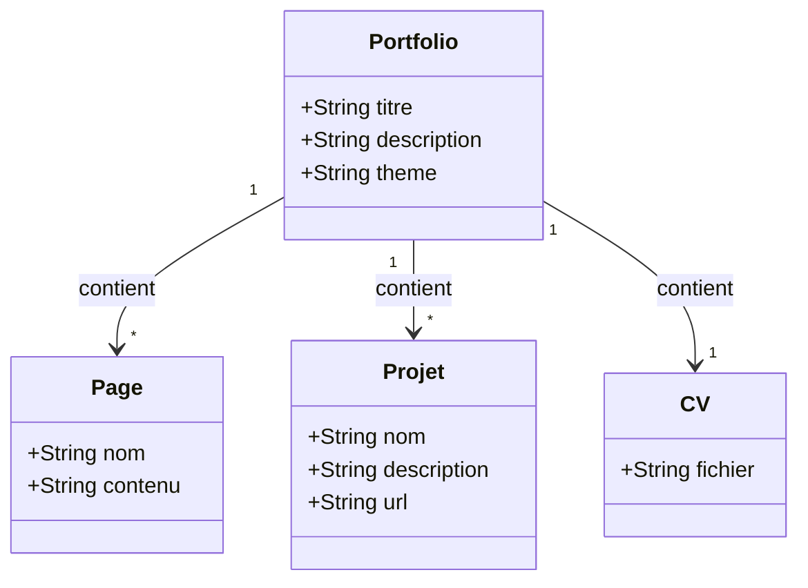
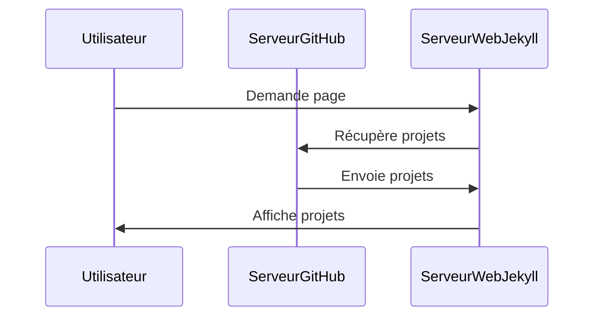
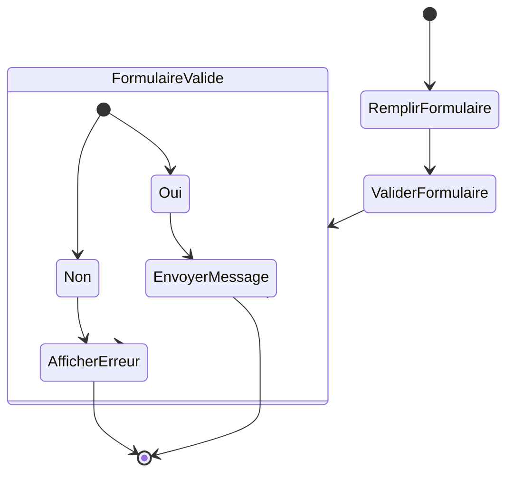

### 1. **Diagramme de cas d'utilisation (Use Case Diagram)**

```mermaid
graph LR
    Visiteur -->|Consulter le portfolio| Portfolio
    Portfolio -->|Consulter la bio| Bio
    Portfolio -->|Télécharger le CV| CV
    Portfolio -->|Explorer les projets| Projets

    classDef acteur fill:#f9f,stroke:#333,stroke-width:2px;
    class Visiteur acteur;
    class Projets, CV, Bio acteur;
```

### 2. **Diagramme de classes (Class Diagram)**



### 3. **Diagramme de séquence (Sequence Diagram)**



### 4. **Diagramme d'activités (Activity Diagram)**



### 5. **Diagramme de composants (Component Diagram)**

```mermaid
graph LR
    A[Serveur Web] --> B[Site Jekyll (HTML/CSS)]
    B --> C[Composants JS (Formulaires, Animations)]
    C --> D[Liens externes (GitHub, LinkedIn, etc.)]
    
    A[Serveur Web] -->|hébergé sur GitHub Pages| D
```

---

### Explication des Diagrammes :

1. **Diagramme de cas d'utilisation (Use Case)** :
   - Ce diagramme montre les différentes actions que le **Visiteur** peut entreprendre sur votre site, comme consulter votre **bio**, télécharger votre **CV** et explorer vos **projets**.
   
2. **Diagramme de classes (Class Diagram)** :
   - Ce diagramme représente les entités principales de votre portfolio (**Portfolio**, **Page**, **Projet**, **CV**) et leurs relations. Le **Portfolio** contient plusieurs **Pages** et plusieurs **Projets**, ainsi qu'un **CV**.
   
3. **Diagramme de séquence (Sequence Diagram)** :
   - Ce diagramme montre l'interaction chronologique entre un **Utilisateur**, le **Serveur Web Jekyll** et le **Serveur GitHub** lorsque l'Utilisateur demande à voir les projets. Le serveur GitHub récupère et envoie les projets, qui sont ensuite affichés par le serveur Jekyll.

4. **Diagramme d'activités (Activity Diagram)** :
   - Ce diagramme montre le flux de travail de la soumission d'un **formulaire de contact**. Si le formulaire est validé, le message est envoyé, sinon une erreur est affichée.

5. **Diagramme de composants (Component Diagram)** :
   - Ce diagramme représente l'architecture de votre site web. Il montre les composants majeurs, y compris le **Serveur Web** (hébergé sur GitHub Pages), le **Site Jekyll** qui génère le contenu HTML/CSS, et les composants JavaScript (pour les interactions et animations). Les **Liens externes** (comme GitHub ou LinkedIn) sont aussi connectés à votre portfolio.

---

